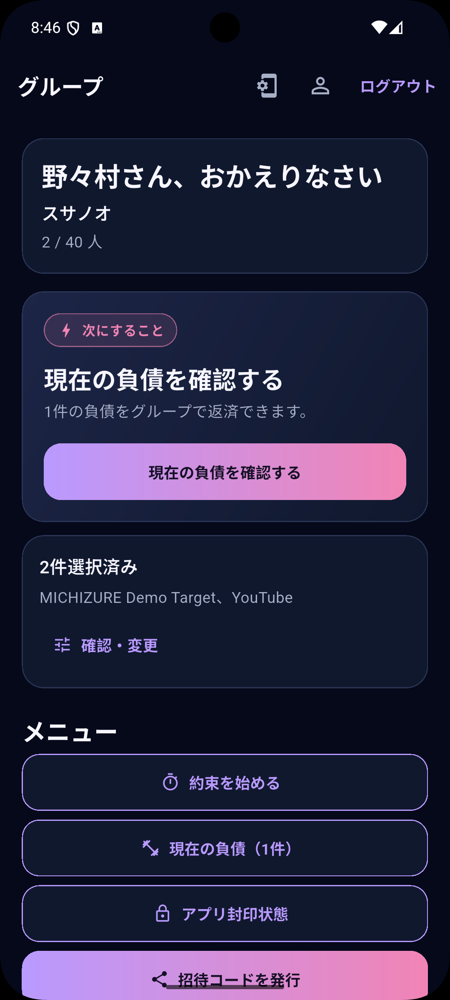
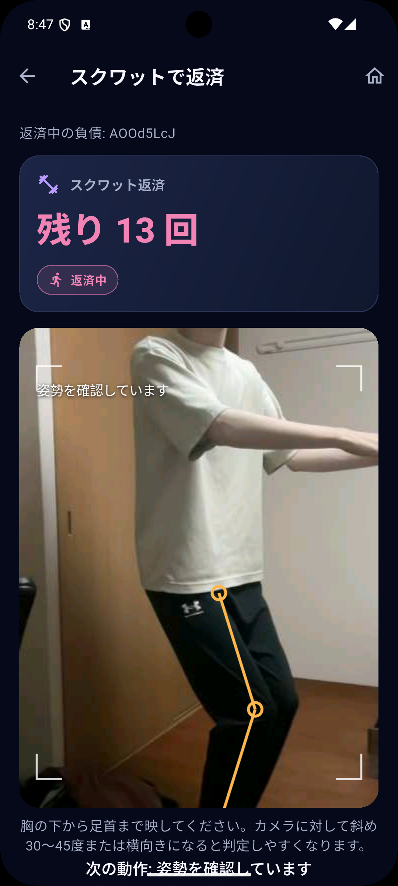
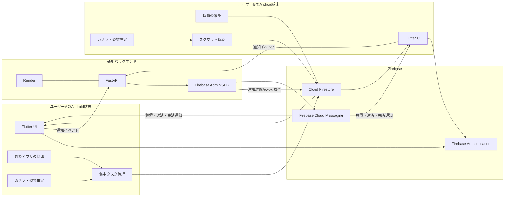

# MICHIZURE

> 約束を破ると、仲間に「スクワット負債」が発生する。
> 仲間と一緒に返済する、連帯責任型の集中支援Androidアプリ。

本プロジェクトは、**[【技育CAMP2026】ハッカソン Vol.4](https://talent.supporterz.jp/events/b96e07e6-6e17-4c2b-89c5-36e162b7ea20/)** で開発したプロダクトです。

<p align="center">
  
  &nbsp;&nbsp;
  
</p>

## 概要

MICHIZUREは、集中したい時間と使用を制限するAndroidアプリを設定し、約束を守れなかった場合に、所属グループへスクワット負債を発生させるアプリです。

発生した負債は、自分だけでなくグループの仲間もスクワットによって返済できます。

単にアプリを制限するのではなく、失敗を仲間とのコミュニケーションや協力に変えることで、継続的な集中を支援します。

## 主な機能

### 集中タスク

集中する時間と、期間中に封印するAndroidアプリを選択します。

タスク中に対象アプリを開いた場合、集中失敗としてスクワット負債が発生します。

### グループによる共同返済

ユーザーはグループへ参加し、メンバー間で負債と返済状況を共有します。

仲間に発生した負債もスクワットで返済できるため、失敗を個人だけの問題にしません。

### スクワットの自動判定

Android端末のカメラ映像から姿勢を推定し、スクワットの動作を自動でカウントします。

姿勢推定とスクワット判定は端末上で実行し、カメラ映像や身体のランドマーク情報はFirestoreへ保存しません。

### リアルタイム同期

負債の発生、返済回数、完済状態はCloud Firestoreを介してメンバー間で同期されます。

複数のユーザーが同じ負債を返済した場合も、最新の状態が各端末へ反映されます。

### プッシュ通知

次のイベントをFirebase Cloud Messagingで通知します。

* 仲間に負債が発生したとき
* 仲間がスクワットで返済したとき
* 負債が完済したとき

通知をタップすると、対象となる負債の詳細画面または返済画面を直接開きます。

## システム構成



### 処理の流れ

1. ユーザーが集中タスクと封印対象アプリを設定する
2. タスク中に対象アプリを開くと負債が発生する
3. 負債がFirestoreを通してグループへ共有される
4. グループメンバーへFCM通知が送信される
5. メンバーがカメラの前でスクワットする
6. Android端末上で姿勢推定とスクワット判定を行う
7. 返済回数がFirestoreへ保存され、各端末へ同期される
8. 返済または完済が関係ユーザーへ通知される

## 技術スタック

### モバイルアプリ

* Flutter
* Dart
* Riverpod
* GoRouter

### Android

* Kotlin
* CameraX
* MediaPipe
* Android Device Policy API
* DataStore

### Firebase

* Firebase Authentication
* Cloud Firestore
* Firebase Cloud Messaging
* Firebase Admin SDK
* Firebase Emulator Suite

### 通知バックエンド

* Python
* FastAPI
* Uvicorn
* Render

### テスト・開発環境

* Flutter Test
* Firebase Rules Test
* Android Unit Test
* Android Instrumentation Test
* GitHub Actions

## ディレクトリ構成

```text
MICHIZURE/
├── android/                    # Android固有実装
├── assets/                     # 画像などのアセット
├── docs/                       # 設計資料・ADR・デモ手順
├── firebase/                   # Firestore RulesとRules Test
├── integration_test/           # Flutter統合テスト
├── lib/                        # Flutterアプリ本体
├── scripts/demo/               # デモ環境のセットアップ
├── services/
│   └── notification_api/       # FastAPI通知バックエンド
├── tools/                      # デモ用ツール
└── tool/                       # 品質確認スクリプト
```

## ローカル起動

### 必要な環境

* Flutter 3.44.0
* Dart 3.12.0
* Android SDK
* Java 21
* Android API 23以上の端末またはEmulator

Firebase EmulatorとRules Testを使用する場合は、Node.js 22も必要です。

### 依存関係のインストール

```bash
flutter pub get
```

### Androidアプリの起動

共有Firebaseの設定をGit管理外の次のファイルへ用意します。

```text
.dart_defines/firebase-demo.json
```

設定ファイルを指定して起動します。

```bash
flutter run \
  --dart-define-from-file=.dart_defines/firebase-demo.json
```

FirebaseのAPIキー、Service Account、FCMトークンなどの秘密情報は、リポジトリへコミットしないでください。

## デモ環境

### 1台で起動

```bash
./scripts/demo/setup_one_device.sh
```

### 2台で起動

```bash
./scripts/demo/setup_two_devices.sh
```

2台デモでは、異なるユーザーでログインして同じグループへ参加します。

一方の端末で負債を発生させ、もう一方の端末で通知の受信とスクワット返済を確認できます。

同じカメラ入力を使用するデモ環境では、複数端末で同時に返済画面を開かないでください。

## 通知バックエンド

通知APIは`services/notification_api/`にあります。

ローカルで起動する場合は、次のコマンドを使用します。

```bash
uv run --project services/notification_api \
  uvicorn notification_api.main:app \
  --host 0.0.0.0 \
  --port 8080
```

本番デモでは、DockerイメージをRender Web Serviceとして実行します。

必要な環境変数は次のとおりです。

```text
FIREBASE_PROJECT_ID
FIREBASE_SERVICE_ACCOUNT_JSON
```

`FIREBASE_SERVICE_ACCOUNT_JSON`の実値はRenderの環境変数として設定し、ファイルとしてリポジトリへ保存しません。

## テスト

Flutter、Firestore Rules、Android実装を含む主要な品質確認は、次のスクリプトから実行できます。

```bash
./tool/check_all.sh
```

Flutterのみを確認する場合は、次を実行します。

```bash
dart format --output=none --set-exit-if-changed .
flutter analyze
flutter test
```

Firestore Rules Testを実行する場合は、次を使用します。

```bash
npm --prefix firebase/rules-tests ci
npm --prefix firebase/rules-tests test
```

Android側のテストは次のコマンドで実行します。

```bash
cd android

./gradlew :app:testDebugUnitTest
./gradlew :app:connectedDebugAndroidTest
```

## デモの基本フロー

1. 2台のAndroid端末で別ユーザーとしてログインする
2. 同じグループへ参加する
3. ユーザーAが集中タスクを開始する
4. ユーザーAが対象アプリを開き、集中に失敗する
5. グループにスクワット負債が発生する
6. ユーザーBに負債発生通知が届く
7. ユーザーBが通知から返済画面を開く
8. ユーザーBがスクワットして負債を返済する
9. ユーザーAへ返済通知が届く
10. 完済するとグループへ完済通知が届く

詳しいデモ手順は[docs/demo-plan.md](docs/demo-plan.md)を参照してください。

## 既知の制約

* 任意のAndroidアプリを強制的に封印するには、Device OwnerまたはAndroid Enterpriseによって管理された端末が必要です。
* 一般的な個人所有端末へインストールしただけでは、すべてのアプリを強制的に制限できません。
* 姿勢推定の精度や処理速度は、端末性能、カメラ位置、照明、全身の映り方によって変化します。
* Android Emulatorを利用したデモと、物理端末上での動作性能は異なる場合があります。
* 通知の表示方法は、Android端末側の通知権限や通知チャンネル設定の影響を受けます。

## セキュリティ

* Firestore Rulesはdefault denyを基本としています。
* Firebase ID Tokenを用いて通知APIを認証します。
* 通知イベントは重複送信を防ぐように処理します。
* Service Account JSON、FCMトークン、Firebase設定値をGitへ保存しません。
* カメラフレームや姿勢ランドマークをFirestoreへ保存しません。


