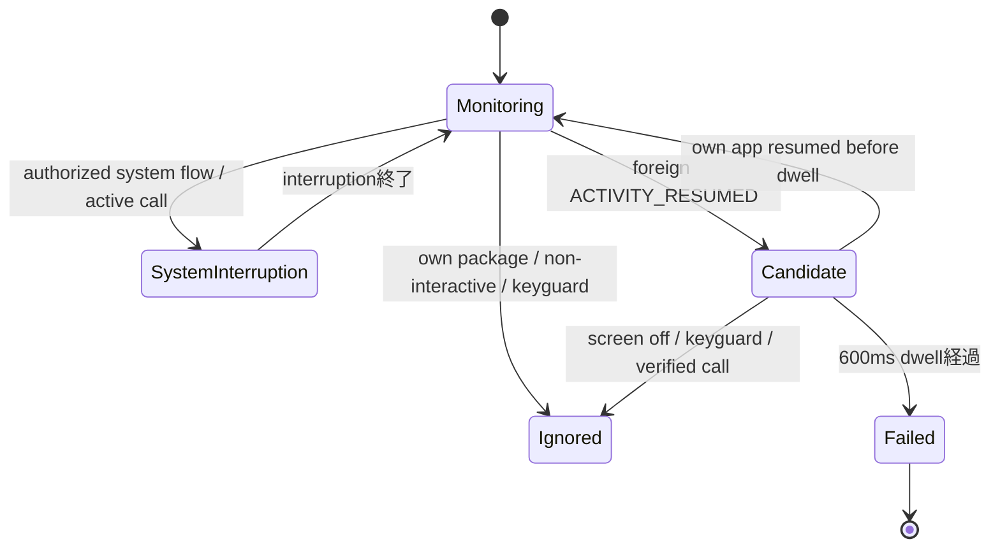
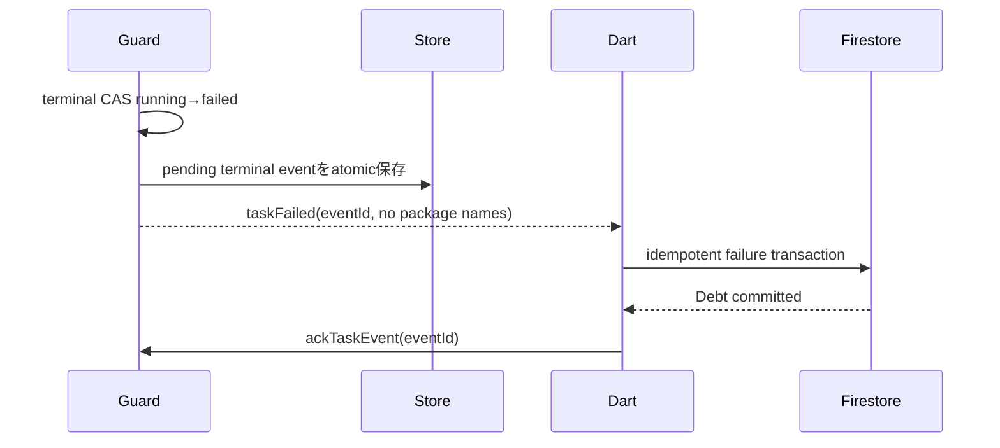

# Android離脱検知・アプリ封印設計

## 1. 結論

ハッカソンMVPはMICHIZURE APK自身をAndroid EmulatorのDevice Owner（DPC）としてprovisionする。

- 離脱検知: `UsageStatsManager.queryEvents()` の `ACTIVITY_RESUMED` を、Device OwnerのForeground Serviceから監視
- 封印: `DevicePolicyManager.setPackagesSuspended()`
- 復元: Kotlin DataStoreのTask / obligation snapshotとDPM実状態をreconcile
- Flutter連携: MethodChannel command + EventChannel event
- AccessibilityService: 不採用
- Lock Task Mode: 主方式として不採用

通常の個人端末へPlay StoreからインストールしただけのアプリはDevice Ownerになれず、任意の他アプリを強制suspendできない。一般公開構成は別製品として扱う。

## 2. 方式比較

| 方式 | foreign app検知 | 任意アプリ封印 | 権限 / 制約 | 判定 |
|---|---|---|---|---|
| `DevicePolicyManager.setPackagesSuspended` | なし | 強い。Activity起動不可、通知等も抑止 | Device/Profile Ownerまたはdelegate | **封印に採用** |
| `setApplicationHidden` | なし | アプリを利用不可・非表示 | Device/Profile Owner | 効果が強すぎ、UX・復元診断が悪い |
| Lock Task Mode | userが他アプリへ行くこと自体を防止 | allowlist外を利用不可 | DPC allowlist、kiosk向け | failureを発生させる要件と衝突 |
| Screen pinning | なし | userが解除可能 | 通常アプリ可 | 強制力不足 |
| `UsageStatsManager` | Activity foreground event | なし | Usage Access special access | **検知に採用** |
| Activity lifecycle | 自アプリがtopでない兆候だけ | なし | 通常API | system dialog等の理由不明。補助信号のみ |
| `ActivityManager.getRunningTasks` | 現代Androidで不可 | なし | API 21以降第三者情報を制限 | 不採用 |
| AccessibilityService | window event取得可能 | overlay等の迂回 | disability支援目的に限定 | 目的外利用のため不採用 |
| overlay / VPN / notification listener | 間接的 | 真のsuspend不可 | 各種special permission | 要件を満たさない |

`setPackagesSuspended`は一部OS重要packageをsuspendできず、APIは適用できなかったpackage配列を返す。active launcher、Device Admin、installer/uninstaller/verifier、default dialer、permission controller等は選択不可として扱う。

## 3. MVPサポートmatrix

| 項目 | 値 |
|---|---|
| Android UI minSdk | 23 |
| hard enforcement保証 | API 29以上 |
| 基準Emulator | API 35、Google APIsまたはFirebase対応Google Play image |
| provisioning | fresh emulator + `adb shell dpm set-device-owner` |
| distribution | debug/demo APKのsideload |
| Usage Access | Settingsまたはdebug adb app-op |
| package visibility | `LauncherApps.getActivityList()` + scoped launcher `<queries>`。debug / releaseとも`QUERY_ALL_PACKAGES`なし |
| background execution | Device Owner要件を満たす`systemExempted` Foreground Service |

ML KitとFlutterFireの現行要件もminSdk 23で整合するが、Task GuardのMVPは`ACTIVITY_RESUMED`が明確なAPI 29以上に限定する。

## 4. Native component

```text
admin/
  MichizureDeviceAdminReceiver
  DeviceOwnerCapabilities
monitoring/
  TaskGuardService
  UsageEventSource
  ForegroundTransitionClassifier
  AndroidInterruptionProbe
  SystemFlowLease
  TaskGuardTimePolicy
enforcement/
  PackageCatalog
  PackageSuspender
  LockObligationStore
  LockReconciler
  LockDeadlineScheduler
persistence/
  NativeStateStore
  NativeOutbox
platform/
  DeviceControlMethodHandler
  TaskEventStreamHandler
```

### `TaskGuardService`

- Task開始をユーザーがMICHIZURE Activity内から行った直後にstartする。
- `startForegroundService`後に直ちにforegroundへ昇格し、監視中であることをongoing notificationに表示する。
- Task running中はUsageEventsをpollする。
- Phase 5ではsuccess / failure terminalをoutboxへ保存した時点でserviceを停止する。Phase 6のlock guardianは別責務として追加する。
- `START_STICKY`だけを復元保証にせず、永続snapshotからidempotentに再構築する。

### `PackageSuspender`

`DevicePolicyManager`を薄くwrapし、次を返す。

```text
SuspensionResult
  requestedPackages
  changedPackages
  failedPackages
  capabilityError
```

booleanだけを返さず、部分成功をUIとreconcilerが扱えるようにする。

### `LockReconciler`

入力:

- unresolved obligationと各package snapshot
- current wall / elapsed / boot identity
- MICHIZUREが所有するsuspension記録
- DPMの現在suspended状態

出力:

- apply set
- release set
- protected / unavailable package
- next deadline

## 5. Task開始preflight

順序:

1. `isDeviceOwnerApp(applicationId)`
2. Usage Accessが実際にquery可能
3. notification permission / FGS起動可能
4. user unlocked
5. lock targetが1件以上かつlaunchable
6. targetがprotected denylistにない
7. target packageが現在install済み
8. localに未回復Task矛盾がない
9. Firestore onlineでTask start transactionがcommit可能

Task開始時点で選択package一覧をnative TaskRecordへsnapshotする。Task中に設定を変更しても、そのTaskがfailureした場合は開始時snapshotを使用する。

preflight中に必要なSettings画面へ移動し、Activity復帰後にもう一度確認する。running開始後に権限取得dialogを出さない。

## 6. Usage event監視

### 6.1 Event source

- 250msごとに `queryEvents(lastCursor - overlap, now)`。
- API 29+の `ACTIVITY_RESUMED` だけをforeground候補に使用する。
- `(timestamp, package, class, eventType)` を短期dedupeする。
- cursorはevent timestampで進め、wall clock jumpを検出したら安全な短いwindowを再queryする。
- Phase 5実装は1秒overlapを再queryし、短期signature setで重複を除去する。開始時wall/elapsedの進行差が60秒を超えた場合は履歴を推測せず`recovery_detected_violation`へfail-closedする。
- eventは数日しか保持されないため、長期監査には使わない。
- Usage Accessが失われqueryできなければ `monitor_capability_lost` failure。

250msはbatteryと検知速度のMVP値であり、実機profile後に調整する。画像解析とは別executorを使う。

### 6.2 Activity lifecycle

FlutterActivityの `onUserLeaveHint`, `onPause`, `onStop`, `onTopResumedActivityChanged` はsupporting evidenceとして記録するが、それ単独でfailureにしない。

理由:

- permission dialog
- configuration change
- multi-window
- keyguard
- incoming call
- system overlay

でも同じlifecycle callbackが発生するため。

## 7. Foreground transition classifier



判定順:

1. event timestampがTask startより前ならignore
2. MICHIZURE packageならcandidate cancel
3. `PowerManager.isInteractive == false` ならignore / pause candidate
4. `KeyguardManager.isKeyguardLocked == true` ならignore / pause
5. 明示的なSystem Flow Leaseに一致するOS packageならignore
6. verified incoming/active call中のdefault dialerならignore
7. その他のpackageをcandidateとする
8. 600ms以内に自アプリresumeまたはsystem gate成立ならcancel
9. それ以外はfailureを一度だけ確定

Home launcher、Recents経由で起動したアプリ、Settings、notificationから開いた他アプリは除外しない。ユーザーが意図的にHomeへ戻った場合もlauncherのresumeでfailureとなる。

### 7.1 System Flow Lease

blanketなsystem package allowlistは抜け道になる。MICHIZUREが自ら開始する必要のあるOS flowに、短命なleaseを発行する。

```text
SystemFlowLease
  flowType
  expectedPackageSet
  issuedElapsedMs
  expiresElapsedMs
  singleUse
```

running Task中は原則leaseを発行しない。Task開始前のpermission/setupだけに使用する。permission controllerを常時ignoreしない。

### 7.2 画面OFF / Keyguard

- `SCREEN_NON_INTERACTIVE` event、`PowerManager.isInteractive`、`KeyguardManager`を併用する。
- 画面OFF中もcountdownは進む。
- unlock後にMICHIZUREへ戻らずforeign appがresumeした場合、そのresumeからcandidateを開始する。
- ambient displayはnon-interactiveとして扱う。

### 7.3 着信

実機Production候補:

- default dialer packageをRole / Telecomから取得
- runtime consentを得たcall state signalが `RINGING` / `OFFHOOK` の間だけdialerをsystem interruption扱い
- call終了後の短いgrace内にMICHIZUREへ戻らなければ、次のforeign app resumeをfailureにする

READ_PHONE_STATE等の追加権限とPlay policyを実装時に再確認する。Emulator MVPのacceptanceには着信を含めず、synthetic interruption testでclassifierを検証する。call stateを確認できない場合、dialerを常時ignoreせずcandidateとする。

Phase 5の`AndroidInterruptionProbe`はcall stateを常に未確認として返し、電話関連permissionを追加しない。従って実dialerは常時allowlistせず、通常のforeign candidateになる。classifier自体のverified call branchだけをsynthetic JVM testで固定する。

### 7.4 OS dialog

- runtime permissionはTask開始前に完了
- ANR / crash dialogはTask継続不能としてrecovery failure
- notification shadeを開くだけでは他Activity resumeがなければfailureにしない
- shadeからforeign appを開けばfailure
- arbitrary Settings遷移はfailure

## 8. Deadline競合

native TaskRecord:

```text
taskId
startedWallMs
expectedEndWallMs
startedElapsedMs
expectedEndElapsedMs
bootCount
lockTargetsAtStart
terminalEvent
```

同一boot中:

- `elapsedRealtime` をauthorityにする。
- foreign event timestamp相当を取得時elapsedへ写像する。
- candidateのoriginが `expectedEndElapsedMs` 未満ならfailure。
- deadline以上ならsuccessを一度だけ確定。

再boot後:

- wall `expectedEndWallMs` を使う。
- boot count変更を検出する。
- clock rollback / 大幅jumpをdiagnosticに記録し、安全側のpolicyを適用する。
- Phase 5 MVPはTask期間中にboot countが変わり、wall deadline前なら`recovery_detected_violation` failureとする。再起動時点ですでにwall deadline以後ならdeadline terminalへ収束させる。このwall clock依存はMVP trust boundaryであり、二重terminal防止を優先する。

UI Timerはnative terminal判定を上書きしない。

Phase 5のnative recordはPreferences DataStore（credential-protected app sandbox）へ保存する。通常のprocess recreationとActivity再生成は復元対象だが、user unlock前のboot receiver復元と`am force-stop`はPhase 10まで保証しない。

## 9. Failure処理順序



Phase 5はDPMを呼ばず、Firestoreがofflineでもterminal eventをstable UUID付きoutboxに保持して再配送する。Phase 6では今回の明示要件を優先し、Firestoreのfailure transactionとsame-ID Debt取得が成功した後、native eventのack前にlock obligationをlocal保存・適用する。offline中はoutbox再送を続け、cloud terminal未確定の段階ではDPMを呼ばない。

### 9.1 Phase 5 channel contract

MethodChannel `com.kren.michizure/device_control/v1`:

```text
startTaskGuard(taskSessionId, startedAtEpochMs, expectedEndAtEpochMs, guardConfigVersion)
stopTaskGuard(taskSessionId)
getTaskGuardState()
ackTaskEvent(eventId)
```

EventChannel `com.kren.michizure/task_events/v1`:

```text
contractVersion
eventId
taskSessionId
eventType: taskFailed | deadlineReached
occurredAtEpochMs
reason: foreign_app_foreground | monitor_capability_lost |
        recovery_detected_violation | null
```

unknown fieldを含むpayload、unknown reason、package名を含むpayloadはDart adapterが拒否する。EventChannel再購読と`getTaskGuardState`で未ack eventを同じIDのまま再送し、Firestore transaction成功後のackだけがnative Task recordを削除する。

### 9.2 Phase 6 lock contract

同じMethodChannelへ次を追加する。

```text
applyLockObligation(debtId, taskSessionId, createdAtEpochMs, expiresAtEpochMs)
getLockState()
reconcileLocks()
releaseLockObligation(debtId, resolution: completed | expired)
```

package snapshotはDart引数で渡さず、ack前の`NativeTaskStore`から取得する。responseはobligation ID、期限、state、target/enforced/failed件数だけを返し、package名を含めない。partial failureは成功response内のdegraded state、Device Owner喪失やsnapshot欠落はtyped `PlatformException`とする。

### 9.3 Foreground Service permission

Phase 5で追加するpermissionは次の2つだけである。

```xml
android.permission.FOREGROUND_SERVICE
android.permission.FOREGROUND_SERVICE_SYSTEM_EXEMPTED
```

serviceは`android:foregroundServiceType="systemExempted"`かつ`exported=false`である。MVPのDevice Owner appは`systemExempted`の許可条件を満たす。`POST_NOTIFICATIONS`と`PACKAGE_USAGE_STATS`はPhase 3 preflightで既に導入済みで、Task開始前に確認する。Camera permissionはPhase 9で追加済みだが、Accessibility、phone state、`QUERY_ALL_PACKAGES`は追加しない。一般Play公開版ではDevice Ownerを前提にできないため、このFGS構成をそのまま提供しない。

## 10. Lock obligation

local record:

```text
debtId
taskId
packageNamesAtFailure
createdWallMs
lockExpiresWallMs
createdElapsedMs
lockExpiresElapsedMs
bootCount
remoteStatus: pending | active | completed | expired
localState: applyPending | enforced | degraded | releasePending | released
ownedSuspensions
lastErrorCode
```

`packageNamesAtFailure` はnative localだけに保存する。複数obligation:

```text
effectivePackages(now) =
  union(obligation.packageNamesAtFailure
        where unresolved && now < lockExpiresAt)
```

Debt Aの完済時はAをresolvedにし、再計算後の差分だけunsuspendする。Debt Bが同じpackageを参照していれば残す。

## 11. Suspension apply / release

### Apply

1. denylistとinstalled状態を再検査
2. effective setとowned suspension stateの差を作る
3. `setPackagesSuspended(admin, applySet, true)`
4. returned failed packagesをdegraded stateへ記録
5. 成功packageをowned setに記録
6. package launchをMVP instrumentation testで確認

### Release

1. obligationをresolvedに更新
2. remaining effective setを再計算
3. MICHIZUREが所有し、もう要求されないpackageだけrelease setへ
4. `setPackagesSuspended(admin, releaseSet, false)`
5. failureはretry対象。成功分だけowned setから除去

他adminやユーザーが設定した状態を無条件に解除しない。MVPのfully managed emulatorではMICHIZUREが唯一のDPCであることをpreflightする。

## 12. Lock deadline scheduling

exact alarm permissionをMVP必須にしない。

- `AlarmManager.setAndAllowWhileIdle(ELAPSED_REALTIME_WAKEUP)`で最短deadlineをinexact scheduleする。
- process restart時はpersistent obligationから再scheduleする。
- `BOOT_COMPLETED`, `MY_PACKAGE_REPLACED`, app start、手動reconcileでdesired stateを再評価する。
- 同一bootではelapsed deadline、boot変更後はabsolute wall deadlineを使用する。
- `SCHEDULE_EXACT_ALARM`、WorkManager dependency、常駐lock用FGSはPhase 6で追加しない。

Android 12以降のinexact alarmはdeadlineより前には発火しない一方、OS最適化で最大約1時間遅延し得る。アプリを開けば即時reconcileする。厳密な秒単位解除が必要なProduction fleetでは、DPC常駐性または適格なexact alarm用途を別途設計する。

## 13. Package catalog

表示対象:

- launcher intentを持つuser-facing app
- label、icon、package name（package nameはUI詳細でのみ）
- current selected / suspended capability

除外:

- MICHIZURE
- Device Admin / active launcher
- default dialer
- permission controller
- package installer / uninstaller / verifier
- non-launchable system component
- DPM testでfailedを返したpackage

Android 11+ package visibilityを考慮し、installed package全件は列挙しない。現在userの`LauncherApps.getActivityList(null, Process.myUserHandle())`からLauncher起動可能activityだけを取得し、package単位へdedupeする。debug / releaseとも`QUERY_ALL_PACKAGES`は宣言せず、manifestのlauncher intent `<queries>`だけを維持する。

### 13.1 Phase 3実装境界

Phase 3ではpackage suspensionを呼ばず、次だけを実装する。

- `LauncherApps.getActivityList()`のactivityをuser-facing catalogとして取得し、uninstall / disableとのraceはactivity enabled確認時に除外する。
- 自app、active Device Admin、active launcher、default dialer、Settings、permission controller、installer / uninstaller / verifierをAndroid APIから動的に特定し、理由付きで選択不可にする。
- debug / releaseとも`QUERY_ALL_PACKAGES`を宣言せず、launcher intentの`<queries>`に限定する。
- labelとpackage nameをversion 1 MethodChannelでFlutterへ返す。icon転送はPhase 11のpolishまで行わず、Flutterのgeneric iconを使う。
- 選択package nameをPreferences DataStore `selected_lock_apps`のkey `selected_package_names_v1`へ保存する。app backupは無効化する。
- 読込時に現在のcatalogと再照合し、uninstall済みまたは保護対象になったpackageをローカル選択から除去する。

catalogの`isSelectable`は静的な事前診断である。Phase 6で実際に`setPackagesSuspended()`を呼ぶ際は、DPMが返すfailed package配列を最終authorityとして扱い、catalog判定だけで成功を仮定しない。

## 14. Reboot / app update / process death

- backup無効のcredential-protected Preferences DataStoreをlock obligationの完全stateとする。
- Phase 10は更新ごとにactive obligationとMICHIZURE-owned suspensionだけをdevice-protected snapshotへmirrorする。`LOCKED_BOOT_COMPLETED`はunlock前もこの最小snapshotからeffective setを再適用する。
- `BOOT_COMPLETED` / `USER_UNLOCKED` / `MY_PACKAGE_REPLACED`はTask snapshotとpending eventを確認し、pending eventがなければTask Guardを冪等に復元する。
- Firebase状態はuser unlock / Flutter bootstrap後にreconcileする。
- app update後もDevice OwnerとDPM suspensionは残る前提で差分確認する。
- package add / remove / replace broadcastはlock unionを再検査する。uninstall済みpackageをowned setから除外し、active obligationは期限内保持してreinstall時に再適用する。
- app data clear、Device Owner解除、emulator wipeはMVP trust boundary外。
- logoutやFirebase token expirationでlockを解除しない。
- 通常process killとboot後unlockは復元対象だが、`am force-stop`後はAndroidのstopped stateが解除されるまでreceiver / service自動復元を保証しない。既存DPM suspensionは残し、次回明示起動でreconcileする。

credential state破損時はvalidなdevice-protected mirrorから修復する。両stateを消去するfallbackは行わず、復元不能なら`nativeStateCorrupt`へ縮退する。codec versionは1を維持し、未知versionを黙って読み替えない。詳細は [Recovery / Reconciliation設計](recovery-reconciliation.md) を参照する。

## 15. Capability / error codes

```text
notDeviceOwner
usageAccessMissing
notificationPermissionMissing
foregroundServiceStartDenied
packageVisibilityLimited
packageProtected
packageNotInstalled
suspensionPartialFailure
unsuspensionPartialFailure
nativeStateCorrupt
clockDiscontinuity
usageQueryUnavailable
channelContractMismatch
```

UIはerror codeから復旧操作を出し、Kotlin exception messageを直接表示しない。

## 16. ハッカソン構成と一般公開構成

### Hackathon

- fresh emulatorをadb provision
- same APKがFlutter app + mini DPC
- Usage Accessを明示付与
- sideload前提
- debug FakeSquatDetector可
- strong package visibility可

### Consumer Play app

- Device Owner化できない
- hard suspensionを削除
- Usage Accessによるfailure検知もprominent disclosureとconsentが必要
- penaltyはMICHIZURE内表示・通知に縮退
- LauncherApps / scoped queryで見えない管理対象が必要なら、Play policy reviewを伴う別配布設計

### Android Enterprise product

- fully managed / dedicated deviceの正式provisioning
- DPC approval、managed Google Play、admin console
- policy backend、attestation、audit
- user個人端末向けではなく組織管理端末向け

## 17. テスト観点

- Activity lifecycleだけでfailureしない
- Home / Recents / notification経由のforeign app
- screen off / on / keyguard
- permission controller leaseあり / なし
- call interruption synthetic state
- usage access revoke
- app process kill / boot / update
- 2つのobligationが同packageを参照
- DPM partial failure
- package uninstall / reinstall
- deadlineとDebt completionの競合
- Device Ownerでない端末のfail-fast

## 18. 公式資料

- [DevicePolicyManager.setPackagesSuspended](https://developer.android.com/reference/android/app/admin/DevicePolicyManager#setPackagesSuspended(android.content.ComponentName,%20java.lang.String%5B%5D,%20boolean))
- [UsageStatsManager](https://developer.android.com/reference/android/app/usage/UsageStatsManager)
- [UsageEvents.Event.ACTIVITY_RESUMED](https://developer.android.com/reference/android/app/usage/UsageEvents.Event#ACTIVITY_RESUMED)
- [ActivityManager.getRunningTasks limitations](https://developer.android.com/reference/android/app/ActivityManager#getRunningTasks(int))
- [Foreground service types](https://developer.android.com/develop/background-work/services/fgs/service-types)
- [Lock task mode](https://developer.android.com/work/dpc/dedicated-devices/lock-task-mode)
- [AccessibilityService purpose](https://developer.android.com/reference/android/accessibilityservice/AccessibilityService)
- [Package visibility](https://developer.android.com/training/package-visibility)
