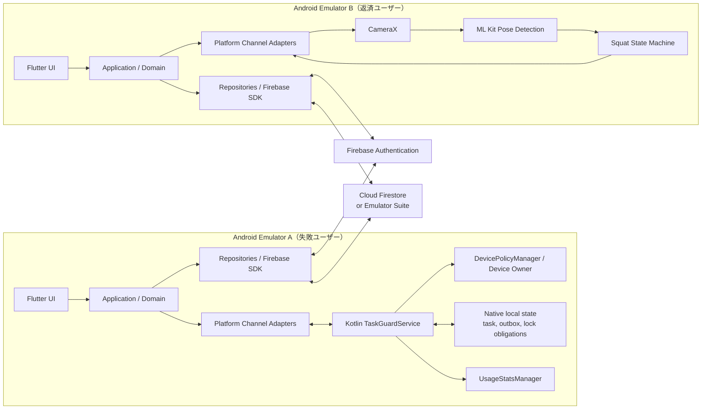
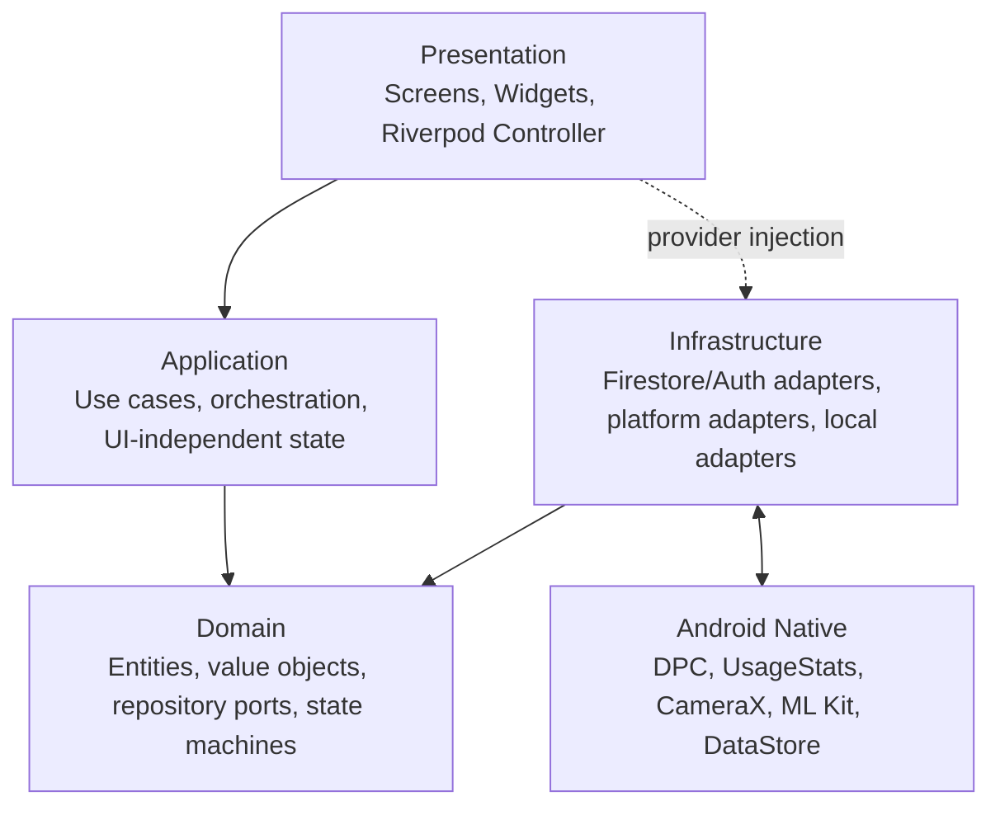
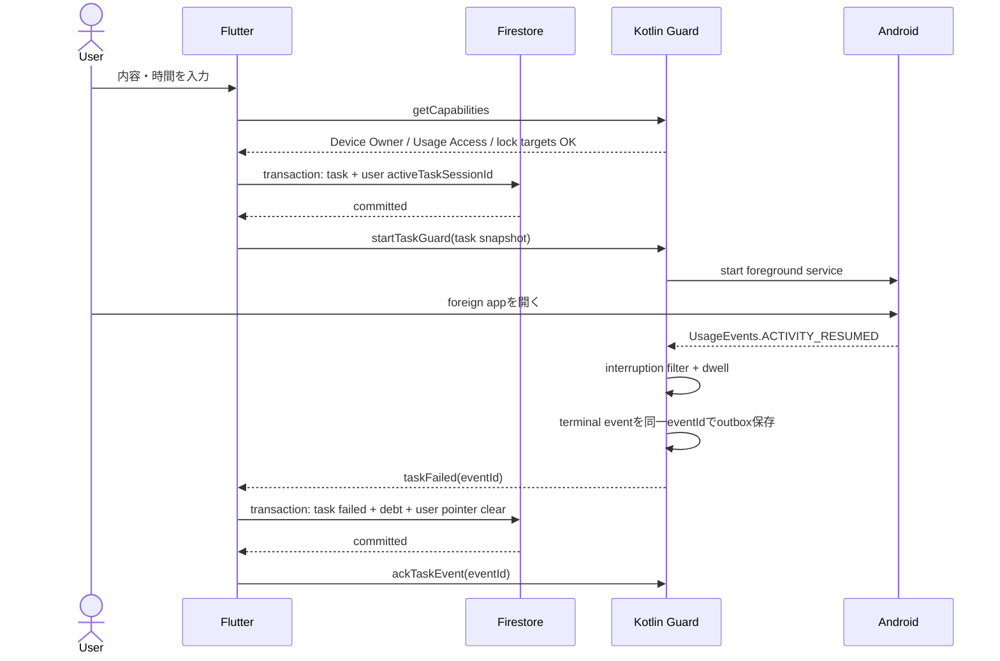
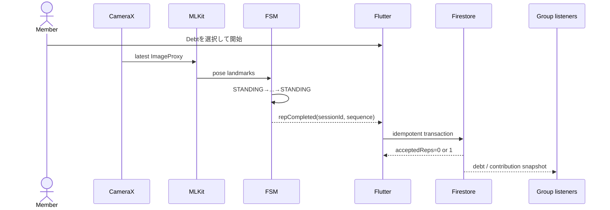
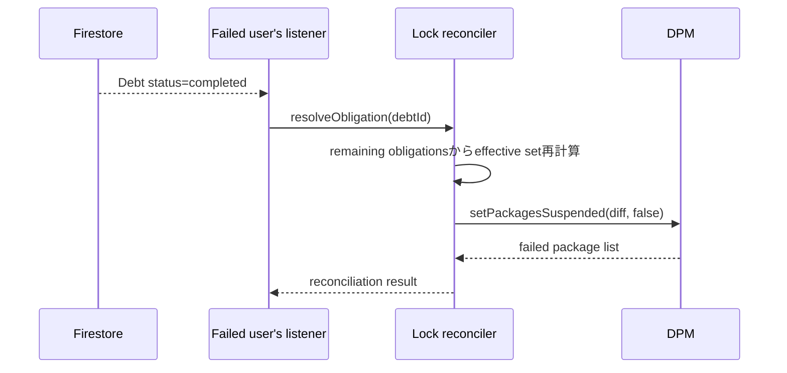

# システムアーキテクチャ

## 1. 結論

FlutterをUIとアプリケーションの主実装とし、Androidの権限・管理API・カメラ処理だけをKotlinへ隔離する。共有状態はCloud Firestore、強制封印に必要な即時・復元状態はAndroidローカルストアを正とする。

Cloud FunctionsをMVPの実行経路に含めない。信頼できるサーバーがないことによる不正耐性の限界は、Security Rulesで可能な整合性検証と、明示したclient trustに分ける。

## 2. システム構成



## 3. 技術スタック

| 領域 | 採用 | 理由 |
|---|---|---|
| UI / 通常ロジック | Flutter / Dart | 画面実装速度とテスト容易性 |
| 状態管理 / DI | Riverpod（manual provider） | Stream、非同期状態、fake差し替えを統一 |
| Navigation | `go_router` | 認証・group・running taskのredirectを宣言的に扱う |
| Auth | Firebase Authentication（email/password） | SparkでMVP規模を満たす |
| Realtime DB | Cloud Firestore | listener、transaction、offline cache |
| Android native | Kotlin | DPC、UsageStats、CameraX、ML Kitの公式API |
| Flutter ↔ Kotlin | MethodChannel + EventChannel + PlatformView | command、イベントstream、camera previewを役割分離 |
| Camera | CameraX Preview + ImageAnalysis | lifecycle統合、backpressure |
| Pose | ML Kit Pose Detection base SDK / STREAM_MODE | 端末内・低遅延。画像送信不要 |
| ローカル復元 | Kotlin DataStore + device-protected最小snapshot | Flutter UI不在でもlockを復元 |
| テストbackend | Firebase Local Emulator Suite | Auth / Firestore / Rulesを無料・決定的に検証 |

依存バージョンはPhase 0開始時に公式compatibilityを確認してlockfileへ固定する。設計書に将来の「latest」を固定値として書かない。

## 4. レイヤーと依存方向



ルール:

- DomainはFlutter widget、Firebase、MethodChannelをimportしない。
- PresentationはFirestore documentやKotlin payloadを直接解釈しない。
- Applicationは複数Repositoryをまたぐ処理、Task開始/失敗、Contribution確定、復元を扱う。
- 単一Repositoryの単純CRUDに空のUseCaseクラスを作らない。
- Infrastructureは明示converterでFirestoreとDomainを変換する。Firestore `Timestamp` をDomainへ漏らさない。
- Kotlinは認証・group・Debtの業務ルールを複製しない。端末ポリシーと画像解析だけを担当する。

## 5. 推奨ディレクトリ

```text
lib/
  app/
    app.dart
    router.dart
    bootstrap.dart
  core/
    error/
    time/
    observability/
    platform/
  features/
    auth/
      presentation/
      application/
      domain/
      infrastructure/
    group/
    task/
    enforcement/
    debt/
    squat/
android/app/src/main/kotlin/com/kren/michizure/
  admin/
  enforcement/
  monitoring/
  pose/
  platform/
  persistence/
firebase/
  rules-tests/
test/
integration_test/
```

feature間で共用するのは安定したDomain value objectまたは`core`の技術非依存要素だけとする。便利という理由で巨大な`utils.dart`を作らない。

## 6. Source of Truth

| 状態 | Primary source | Replica / cache | 理由 |
|---|---|---|---|
| auth user | Firebase Auth SDK | Riverpod auth stream | token lifecycleをSDKへ委譲 |
| profile / group | Firestore | SDK offline cache | 共有・Rules対象 |
| running Task metadata | Firestore | native Preferences DataStore | Firestore pointerと同一Task IDで照合 |
| UI countdown | Firestore `expectedEndAt` と注入Clockのwall time | 1秒tickerで再描画 | 保存counterをauthorityにしない |
| native guard deadline | Firestore deadlineを起点にした`SystemClock.elapsedRealtime` | native DataStore | 同一bootのwall clock変更耐性 |
| Debt / Contribution | Firestore | SDK offline cache | transactionとrealtime |
| 選択パッケージ | native DataStore | Flutter view state | installed-app inventoryをcloudへ出さない |
| lock obligation | native DataStore + Firestore Debt | OS suspended state | failure直後の即時強制と共有解除 |
| effective lock | lock reconcilerの導出値 | DevicePolicyManager | 複数Debtをreason別に管理 |
| pose frame | memory only | なし | 保存・送信禁止 |
| squat sequence | Kotlin state machine | UI current count | 低遅延・frameをDartへ転送しない |
| pending failure / rep | native/Dart outbox | Firestore event | offline retryと冪等性 |

`users/{uid}.activeTaskSessionId`を起動時routingの入口にし、該当TaskをFirestoreから購読する。残り時間は毎回`max(0, expectedEndAt - wallNow)`で導出する。Phase 5では開始直後に同じTask ID、wall/elapsed deadline、boot count、開始時lock target snapshotをnative DataStoreへ保存する。native terminal eventがTask成功・失敗の入口となり、UI Timerは表示更新以外の権威を持たない。

## 7. Platform Channel契約

channel名はapplicationId配下でversionを含める。

| 種別 | channel | 主な操作 |
|---|---|---|
| MethodChannel | `com.kren.michizure/device_control/v1` | Phase 3操作に加え、`startTaskGuard`, `stopTaskGuard`, `getTaskGuardState`, `ackTaskEvent`; Phase 6以降でlock操作を追加 |
| EventChannel | `com.kren.michizure/task_events/v1` | terminal eventだけを送る: `taskFailed`, `deadlineReached` |
| EventChannel | `com.kren.michizure/squat_events/v1` | `calibrating`, `stateChanged`, `repCompleted`, `qualityWarning`, `detectorError` |
| PlatformView | `com.kren.michizure/pose_preview/v1` | native camera preview overlay |

payload共通規約:

- 全payloadに `contractVersion: 1`、eventには `eventId` と `occurredAtEpochMs` を含める。
- commandはDart側でtimeoutを設定し、Kotlinはtyped error codeを返す。
- package名はTask failureイベントでDartやFirestoreへ返さない。ローカル監査が必要な場合もdebug logに限定してマスクする。
- `taskFailed` は同一Taskにつき同一 `eventId` を再送し、Application層で冪等処理する。
- frame/bitmap/landmark配列をPlatform Channelで毎frame送らない。Kotlinで判定し、低頻度の状態とrepだけを送る。

## 8. 主要データフロー

### 8.1 Task開始からfailure



Firestore開始が失敗した場合はGuardを開始しない。failure後のFirestore transactionが失敗した場合は、native outboxから同一IDで再送する。Phase 5はpackageをsuspendしない。Phase 6がterminal eventを起点にlocal obligationを作成し、cloud同期より先に封印する境界を追加する。

### 8.2 スクワット返済



UIのローカルrep表示とDebtへの確定は区別する。画面には `検出 7 / 確定 6 / 同期中 1` のように表現でき、Firestore ack前のrepを完済として見せない。

### 8.3 Debt完済から解除



解除は「完済したDebtのパッケージを全解除」ではなく、全obligationの参照を再計算した差分だけに行う。

## 9. 復元と収束

起動時の `RecoveryCoordinator` は次の順序を守る。

1. native DataStoreからrunning Task、pending outbox、lock obligationsを読む。
2. DevicePolicyManagerの現在状態とeffective lockを照合し、不足する封印を先に適用する。
3. Firebase Authを復元する。
4. pending failure / Contribution Eventを同一IDで再送する。
5. `users/{uid}.activeTaskSessionId` のTaskと対象Debtをserver sourceで再取得する。
6. Task deadline、Debt status、lock deadlineを評価する。
7. resolved obligationを除去し、余分なsuspensionだけを解除する。
8. snapshot listenerを画面・foreground serviceの必要範囲で登録する。

解除に必要なremote stateを取得できない場合は、期限内はfail-closed、期限後はローカルdeadlineで解除する。ネットワーク復帰後にFirestoreの `expired` へ収束させる。

## 10. デプロイ構成の分離

### 10.1 ハッカソンMVP

- sideloadしたdebug APK
- fresh Android EmulatorをDevice Owner化
- Usage Accessをadbまたは設定画面で許可
- `QUERY_ALL_PACKAGES` はdebug/demo flavorだけで使用
- foreground service `systemExempted` はDevice Owner要件を満たす構成
- Firebase Emulator Suiteを第一選択、Sparkのlive projectをbackup
- App CheckはEmulatorでは無効、live debugでは登録済みdebug token

### 10.2 一般コンシューマー公開版

通常権限で`setPackagesSuspended`は利用できない。したがって次のどちらか。

1. 強制封印を廃止し、Usage Accessによる検知、通知、MICHIZURE内ペナルティだけにする。
2. 組織所有端末向けAndroid Enterprise製品としてDPCを正式提供する。

AccessibilityServiceを封印の抜け道として採用しない。Digital Wellbeingの内部制御相当APIを一般アプリが利用できる前提も置かない。

### 10.3 Production Android Enterprise

- 正式なprovisioningとEMM/DPC承認
- policy backendと監査ログ
- managed Google Play配布
- trusted backendでDebt生成とContribution検証
- fleet単位のpolicy reconciliation

## 11. 実現可能性判定

| 要件 | MVP | 一般権限アプリ | 判定 |
|---|---|---|---|
| 他アプリのforeground検知 | Usage Access + FGS | ユーザー許可があれば可 | 理由推定には限界 |
| 任意アプリの強制封印 | Device Ownerなら可 | 不可 | MVPのみhard enforcement |
| lock task mode | Device Ownerなら可 | screen pinningのみ | 今回の主方式には不適 |
| 再起動後の封印 | local obligation + DPM reconcile | hard lock自体不可 | MVP可 |
| 端末内pose判定 | 可 | 可 | ML Kit beta更新リスク |
| 複数ユーザー同期 | 可 | 可 | network依存 |
| Sparkでbackend | 可 | 可 | 不正防止とquotaに制約 |

## 12. 公式資料

- [Flutter platform channels](https://docs.flutter.dev/platform-integration/platform-channels)
- [Flutter architecture guide](https://docs.flutter.dev/app-architecture/guide)
- [FlutterFire setup](https://firebase.google.com/docs/flutter/setup)
- [Cloud Firestore realtime listeners](https://firebase.google.com/docs/firestore/query-data/listen)
- [Foreground service types](https://developer.android.com/develop/background-work/services/fgs/service-types)
