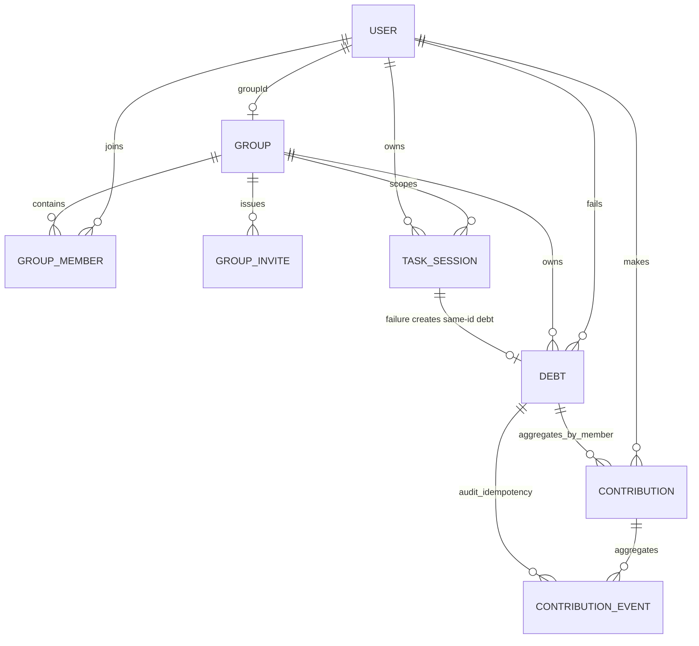

# Cloud Firestoreデータモデル

## 1. 設計方針

- groupのbounded dataはgroup docとmembers subcollectionに置く。
- Task、Debtはユーザー・group単位でqueryするためroot collectionに置く。
- Debt残回数はDebt docの `completedReps` からO(1)で導出し、Contribution全件を集計しない。
- member別返済状況はDebt配下の最大40 summary docとしてlistener対象にする。
- repの冪等性はimmutable Contribution Eventで担保し、event全件はlistenerしない。
- installed package名とカメラ情報はFirestoreへ保存しない。
- document IDはFirestoreの自動IDまたはランダムUUIDを使い、単調増加IDを避ける。
- 全documentに `schemaVersion` を置き、破壊的変更は段階migrationする。

## 2. Collection構成

```text
users/{uid}
users/{uid}/devices/{deviceId}
groups/{groupId}
groups/{groupId}/members/{uid}
groupInvites/{tokenHash}
taskSessions/{taskSessionId}
debts/{debtId}
debts/{debtId}/contributions/{uid}
debts/{debtId}/contributionEvents/{eventId}
notificationEvents/{eventId}
```

`debtId == failedTaskSessionId` とする。これにより1 failureからDebtを二重生成できない。

## 3. 関係図



## 4. Document schema

型表記は `string`, `int`, `bool`, `timestamp`, `map`, `null` を用いる。時刻はUTCのFirestore Timestampで保存し、UIだけJSTへ変換する。

### 4.1 `users/{uid}`

| field | type | 必須 | 説明 |
|---|---|---:|---|
| `displayName` | string | yes | trim後1〜40 Unicode scalar values、前後空白・制御文字・改行なし |
| `photoUrl` | string/null | yes | MVPではnull可 |
| `groupId` | string/null | yes | 単一group制約 |
| `activeTaskSessionId` | string/null | yes | running Taskへのpointer |
| `createdAt` | timestamp | yes | server timestamp |
| `updatedAt` | timestamp | yes | server timestamp |
| `schemaVersion` | int | yes | 初期値1 |

emailはFirebase Authを正としFirestoreへ複製しない。本人以外に見せる表示名はmember docのsnapshotを使う。

### 4.1.1 `users/{uid}/devices/{deviceId}`

| field | type | 必須 | 説明 |
|---|---|---:|---|
| `token` | string | yes | FCM registration token |
| `platform` | string | yes | 現在は`android`のみ |
| `updatedAt` | timestamp | yes | server timestamp |
| `enabled` | bool | yes | 無効tokenは通知APIがfalseへ更新 |

`deviceId`は端末内へ永続化するランダムIDで、同じuidへ複数端末を登録できる。client Rulesは本人のsubcollectionだけを許可する。

`notificationEvents/{eventId}`は通知API専用の冪等予約documentである。`eventType`とsource IDから決定的に作り、Admin SDK以外のclient read/writeはdefault denyとする。

### 4.2 `groups/{groupId}`

| field | type | 必須 | 説明 |
|---|---|---:|---|
| `name` | string | yes | 1〜50文字 |
| `ownerUid` | string | yes | member role=ownerと一致 |
| `memberCount` | int | yes | 1〜40、transaction更新 |
| `createdAt` | timestamp | yes | server timestamp |
| `updatedAt` | timestamp | yes | server timestamp |
| `schemaVersion` | int | yes | 初期値1 |

`memberCount` はDebt算出とmax 40のためdenormalizeする。正確性はmember docとuser docを含むtransaction / Rulesで守る。

### 4.3 `groups/{groupId}/members/{uid}`

| field | type | 必須 | 説明 |
|---|---|---:|---|
| `userId` | string | yes | document IDと一致 |
| `displayNameSnapshot` | string | yes | member list用 |
| `role` | string | yes | `owner` / `member` |
| `inviteTokenHash` | string/null | yes | join認可に使った招待hash。owner作成時はnull |
| `joinedAt` | timestamp | yes | server timestamp |
| `updatedAt` | timestamp | yes | profile名同期 |
| `schemaVersion` | int | yes | 初期値1 |

メンバー一覧を表示するためusers collectionへのN+1 readを行わない。表示名変更時は自分のmember docもatomic batchで更新する。

### 4.4 `groupInvites/{tokenHash}`

| field | type | 必須 | 説明 |
|---|---|---:|---|
| `groupId` | string | yes | 招待先 |
| `groupNameSnapshot` | string | yes | join前確認用 |
| `createdByUid` | string | yes | 発行member |
| `createdAt` | timestamp | yes | server timestamp |
| `expiresAt` | timestamp | yes | MVPは24時間 |
| `revokedAt` | timestamp/null | yes | 失効時刻 |
| `schemaVersion` | int | yes | 初期値1 |

clientは128 bit以上の暗号学的乱数tokenを生成し、共有するのはbase64url raw token、document IDはSHA-256 hexとする。Firestoreにはraw tokenを保存しない。招待は再利用可能だがgroup max 40で制限される。

### 4.5 `taskSessions/{taskSessionId}`

| field | type | 必須 | 説明 |
|---|---|---:|---|
| `ownerUid` | string | yes | Task実行者 |
| `groupId` | string | yes | 開始時group |
| `content` | string | yes | 1〜100文字 |
| `durationSec` | int | yes | 60〜10,800 |
| `startedAt` | timestamp | yes | client observed wall time、request.time近傍 |
| `serverRecordedAt` | timestamp | yes | server timestamp |
| `expectedEndAt` | timestamp | yes | `startedAt + durationSec` |
| `status` | string | yes | `running` / `succeeded` / `failed` |
| `endedAt` | timestamp/null | yes | terminal時 |
| `failureReason` | string/null | yes | allowlistされたenum |
| `failureEventId` | string/null | yes | native冪等event |
| `groupMemberCountAtFailure` | int/null | yes | failure transaction時snapshot |
| `debtId` | string/null | yes | failure時はTask IDと同値 |
| `lockDurationSec` | int | yes | MVP 1,800 |
| `guardConfigVersion` | int | yes | filter設定の追跡 |
| `schemaVersion` | int | yes | 初期値1 |

`failureReason`:

- `foreign_app_foreground`
- `user_aborted`
- `monitor_capability_lost`
- `recovery_detected_violation`
- `debug_demo`

foreground package名は保存しない。

create時に`serverRecordedAt=server timestamp`を必須とし、`startedAt`を`request.time ± 60秒`、`expectedEndAt`を`startedAt + durationSec`としてRulesでも検証する。Phase 5では`user_aborted`に加え、厳密なnative event contractから変換した`foreign_app_foreground`、`monitor_capability_lost`、`recovery_detected_violation`を許可する。`debug_demo`は予約値のままRulesで拒否する。

### 4.6 `debts/{debtId}`

| field | type | 必須 | 説明 |
|---|---|---:|---|
| `groupId` | string | yes | 返済group |
| `failedUserId` | string | yes | lock obligation owner |
| `failedTaskSessionId` | string | yes | document IDと一致 |
| `memberCountAtFailure` | int | yes | 1〜40 |
| `repsPerMember` | int | yes | MVP 10 |
| `totalReps` | int | yes | `memberCountAtFailure * repsPerMember` |
| `completedReps` | int | yes | 0〜totalReps |
| `status` | string | yes | `active` / `completed` / `expired` |
| `createdAt` | timestamp | yes | failure transactionのserver time |
| `lockExpiresAt` | timestamp | yes | task endedAt + lockDurationSec |
| `closedAt` | timestamp/null | yes | completed / expired時 |
| `lastContributionAt` | timestamp/null | yes | active更新表示 |
| `lastContributionEventId` | string/null | yes | Rulesのatomic link、UI queryには不使用 |
| `schemaVersion` | int | yes | 初期値1 |

`remainingReps` は `max(0, totalReps - completedReps)` としてclientで導出し、重複保存しない。

### 4.7 `debts/{debtId}/contributions/{uid}`

| field | type | 必須 | 説明 |
|---|---|---:|---|
| `userId` | string | yes | document IDと一致 |
| `totalReps` | int | yes | このDebtへの確定rep |
| `lastEventId` | string | yes | 直近event |
| `lastContributedAt` | timestamp | yes | server timestamp |
| `schemaVersion` | int | yes | 初期値1 |

最大40 docで、Debt detailを表示中だけlistenerする。

### 4.8 `debts/{debtId}/contributionEvents/{eventId}`

| field | type | 必須 | 説明 |
|---|---|---:|---|
| `userId` | string | yes | authenticated contributor |
| `squatSessionId` | string | yes | random UUID |
| `sequence` | int | yes | session内1始まり |
| `acceptedReps` | int | yes | MVPでは常に1 |
| `detectorType` | string | yes | Production writeは`mlkit`のみ |
| `detectorVersion` | string | yes | algorithm設定version |
| `clientObservedAt` | timestamp | yes | 診断用、権威時刻ではない |
| `createdAt` | timestamp | yes | server timestamp |
| `schemaVersion` | int | yes | 初期値1 |

event IDは `${uid}_${squatSessionId}_${sequence}` の安全な文字列とする。同じeventが再送された場合、transactionは既存eventを見てno-opを返す。eventはupdate/delete不可。

## 5. Atomic workflow

### 5.1 ユーザー初期化

batch:

1. `users/{uid}` をcreate

Auth userが存在し、doc IDがauth uidと一致することをRulesで検証する。

### 5.2 group作成

transaction / atomic batch:

1. `groups/{newGroupId}` create、`ownerUid=uid`, `memberCount=1`
2. `groups/{groupId}/members/{uid}` create、`role=owner`
3. `users/{uid}.groupId = groupId`

preconditionは `users.groupId == null`。

### 5.3 group参加

transactionのread:

1. user
2. invite

write:

1. member doc create
2. group `memberCount = FieldValue.increment(1)`
3. user `groupId = groupId`

条件:

- user.groupId null
- invite未失効かつ `request.time < expiresAt`
- Rulesがgroupのbefore/afterを比較し、before `memberCount < 40` かつ正確に+1
- member createに保存した `inviteTokenHash` がinvite document IDと一致
- member docがcreateであること

参加前ユーザーにgroup documentのreadを許可しないため、client transactionはgroupを事前readしない。user docのtransaction競合で同一ユーザーの同時join/createを直列化し、groupへのatomic incrementとRulesのafter-state検証で39人への同時参加を最大40人に制限する。

### 5.4 group退出

transaction:

1. 自分がownerでないこと、running Taskがないことを確認
2. member doc delete
3. group `memberCount - 1`
4. user `groupId = null`

active Debtの返済権は失うが、既存Contributionは履歴として残る。失敗ユーザー自身に未解決lock obligationがある場合、group退出を拒否する。owner移譲はowner member更新、new owner member更新、group owner更新を同一transactionにする。ownerは移譲前に退出できず、最後の1人は移譲先がないため退出できない。group削除はMVP対象外とする。

### 5.5 Task開始

transaction:

1. user、group membershipをread
2. user `activeTaskSessionId == null` を確認
3. task create `status=running`
4. user `activeTaskSessionId=taskId`

commit後だけnative guardを開始する。guard開始に失敗した場合は同じTaskを `failed/monitor_capability_lost` にしてDebtを作るか、guardが一度も有効にならなかったことを確認できる場合だけ開始補償transactionでTaskをfailedにせず無効化する。MVPではpreflightで失敗を防ぎ、commit後failureとして安全側に倒す。

### 5.6 Task成功

transaction:

1. taskがrunning、ownerがauth user、`request.time >= expectedEndAt`
2. taskをsucceeded、endedAtを設定
3. user `activeTaskSessionId = null`

Debt writeはない。

### 5.7 Task失敗とDebt生成

transaction read:

1. task
2. user
3. current group
4. Debt同一IDが不存在

write:

1. taskをfailed、failure fieldsとcurrent `group.memberCount` snapshotを設定
2. user `activeTaskSessionId = null`
3. `debts/{taskId}` をcreate

`totalReps = group.memberCount * 10`。再送時にtaskが既に同じfailureEventIdでfailedかつDebtが存在すれば成功済みとして扱う。

Phase 4の手動失敗event IDはcommandごとに暗号学的乱数を含み、同一event IDによるtransaction retryではterminal Taskとsame-ID Debtをreadしてno-opへ収束する。missing Debtのtransaction readは、同じIDのTask ownerにだけRulesで許可する。

### 5.8 1 rep確定

transactionはすべてのreadを先に行う。

read:

1. Debt
2. Contribution Event
3. member Contribution summary（不存在可）

既存eventならaccepted 0で終了。新規の場合の条件:

- contributorが現在group member
- Debt active
- client observed timeではなくcommit時刻が `lockExpiresAt` 未満
- `completedReps < totalReps`

write:

1. immutable event create、`acceptedReps=1`
2. contribution totalを `+1`
3. Debt completedを `+1`、`lastContributionEventId` をevent IDへ更新
4. new totalがtotalRepsならDebt status completed、closedAt設定

これにより並行transactionはFirestore SDKにより再実行され、total超過しない。

Phase 8実装は1 eventを常に1 repとするため、overpayを部分acceptしない。残り1 repへ2 clientが同時送信した場合、一方だけが1 repを確定し、後発はterminal/fullとしてrejectされる。summaryへは実際にacceptされたeventだけを加算する。

Firestore transactionはofflineで実行できないため、送信前に同じ`ContributionRequest`をAndroid DataStore-backed local outboxへ保存する。保存内容はDebt ID、uid、event ID、session/sequence、1 rep、detector metadata、観測時刻だけで、server ackまたはterminal reject後に削除する。画像、landmark、package情報は保存しない。

### 5.9 Debt期限切れ

transaction:

1. Debtがactiveかつ `request.time >= lockExpiresAt`
2. status expired、closedAt server timestamp

Cloud Functionsがないため、group / lock画面でoverdue active Debtを検出したclientが実行する。ローカルlock解除はFirestore status更新を待たずdeadlineで行える。

## 6. QueryとIndex

`firestore.indexes.json` へ最初から明示するmanual composite index:

| Query | fields |
|---|---|
| group active debts drain | `groupId ASC, status ASC, lockExpiresAt ASC` |
| group debt history | `groupId ASC, status ASC, closedAt DESC` |
| failed user's obligations | `failedUserId ASC, status ASC, lockExpiresAt ASC` |
| user task history | `ownerUid ASC, startedAt DESC` |

query:

```text
active debts:
  debts
  where groupId == currentGroup
  where status == active
  orderBy lockExpiresAt asc
  limit 20

lock obligations:
  debts
  where failedUserId == uid
  where status == active
  orderBy lockExpiresAt asc
  limit 20

task history:
  taskSessions
  where ownerUid == uid
  orderBy startedAt desc
  limit 20
```

overdue docからexpire transactionを行うとlistenerのwindowが進み、次のactive Debtが入る。active Debtが20件を超える場合はearliest deadlineを優先し、Debt Listからページングする。

automatic index exemption候補:

- `taskSessions.content`
- `failureEventId`
- `guardConfigVersion`
- `debts.lastContributionEventId`
- Contribution Eventの `detectorVersion`, `clientObservedAt`
- URLや将来追加する大きなmap/string

indexを免除したfieldではqueryしない。

## 7. Listenerとread cost

| UI | initial documents（最大） | update |
|---|---:|---|
| app shell | user 1 | user変更時 |
| group dashboard | group 1 + members 40 + active debts 20 | changed docのみ |
| debt detail | debt 1 + contributions 40 | debt + changed member summary |
| running task | user cache + task 1 | task変更時 |
| history | page 20、non-realtime | user action時 |

平均group 5ではgroup dashboard初回約7 docs。Contribution Eventsは監査・冪等用であり画面listener対象にしない。

## 8. Firestore offline behavior

- Android/iOS native-backed FlutterFireではoffline persistenceを利用する。
- snapshotの `isFromCache` / pending writeをUI stateへ反映する。
- Transactionはofflineで失敗するため、failure eventとrep eventはローカルoutboxへ残す。
- rep eventはackされるまで「検出済み・未確定」。Debt aggregateをローカルincrementして確定表示しない。
- logout前にpending outboxがあれば同期を促す。強制logoutでもobligationはnative localへ残す。
- Emulator testではcacheの前回データ混入を避けるためtestごとにclearする。

## 9. データ保持

MVP:

- Task、Debt、Contribution summary/eventは削除しない。
- inviteは失効後も残り得る。SparkではFirestore TTL deletesが無料枠対象外のためTTLを使わない。
- package選択とlock obligationはresolved後30日以内に端末から削除する方針。

Production:

- Contribution Eventの保持期間を90日等に定め、backend archive/deleteを検討する。
- アカウント削除時のgroup整合性、監査保持、法的要件を定義する。
- server-side TTL / scheduled cleanupはBlazeコストを評価する。

## 10. 公式資料

- [Firestore data model](https://firebase.google.com/docs/firestore/data-model)
- [Transactions and batched writes](https://firebase.google.com/docs/firestore/manage-data/transactions)
- [Index overview](https://firebase.google.com/docs/firestore/query-data/index-overview)
- [Offline data](https://firebase.google.com/docs/firestore/manage-data/enable-offline)
- [Firestore best practices](https://firebase.google.com/docs/firestore/best-practices)
