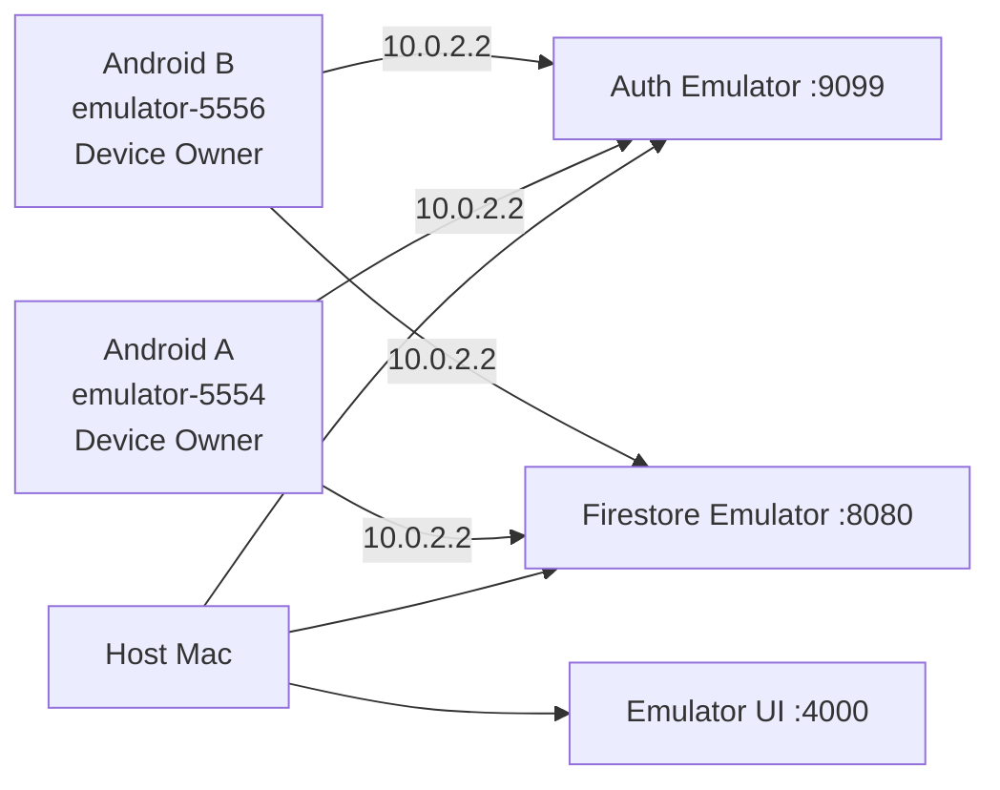

# Android Emulatorデモ計画

## 1. デモの成功条件

2台のAndroid EmulatorとFirebase Local Emulator Suiteで、次を一続きに再現する。

1. Aログイン
2. Aがgroup作成
3. Bログイン・join
4. AがTask開始
5. Aがforeign appを開く
6. failure
7. Debt 20 reps生成
8. Aのdemo target appをsuspend
9. BへDebtをrealtime表示
10. BがDebt選択
11. cameraまたはdebug pose inputでsquat
12. A/Bへ残数をrealtime反映
13. Debt完済
14. Aのtarget appをunsuspend

## 2. 推奨構成



- project ID: `demo-michizure`
- Auth port: 9099
- Firestore port: 8080
- Emulator UI: 4000
- Androidからhost: `10.0.2.2`
- AVD: API 35、同じdevice profile、snapshotではなくfresh dataから準備

Firebase Emulator Suiteは本番性能の代替ではないが、デモのinternet依存と費用を除去できる。live Spark projectはbackupとする。

## 3. Demo build構成

```text
現在のdebug source set（Phase 3）
  Firebase demo project
  cleartextをdebug applicationだけで許可
  QUERY_ALL_PACKAGES

将来のdebugDemo（Phase 11）
  FakeSquatDetector / SyntheticLandmark source
  debug banner
  short lock duration override option

release
  live config injected
  no fake source
  no cleartext emulator config
  production detector only
```

デモ中は実要件と同じ30分lockでもDebt完済で解除できる。時間切れを見せる予備scenarioだけdebug overrideを使う。

## 4. Deterministic demo target（Phase 11予定）

preinstalled appはAVD imageごとにpackage名・suspend可否が違うため、別applicationIdの小さなdebug target APKを用意する。

```text
tools/demo-target/
  applicationId: com.kren.michizure.demotarget
  one Activity
  label: MICHIZURE Demo SNS
  no permission / no data
```

これはMICHIZURE本体の実装ではなくデモfixtureであり、release artifactへ含めない。Device Owner app自身はsuspendできないため別packageが必要である。

## 5. AVD準備

各AVDは次の条件にする。

- 他user / work profileなし
- Google accountを追加しない
- screen lockなし、またはデモ手順で管理
- MICHIZUREをDevice Ownerにする前にアプリを起動しない
- Phase 11以降はdemo targetをinstall
- animation scaleを通常または固定値に揃える
- host webcamを使う場合はBだけcamera mapping

Device Ownerは通常の既存個人端末へ後付けする手順ではない。失敗したAVDはpolicyを継ぎ足さずfresh AVDへ戻す。

## 6. APK installとDevice Owner provisioning

Phase 3時点のartifact:

```text
build/app/outputs/flutter-apk/app-debug.apk
```

Phase 11で予定する`tools/demo-target`はまだ未実装であり、このPhaseではChrome等の選択可能な既存launcher appを選択復元テストに使う。実際のsuspendは行わない。

Device Owner設定はfactory reset済みで、Google account、他user、work profile、既存Device OwnerがないAVDでのみ行う。Device Ownerは通常アプリのruntime permissionではなく、アプリ自身が取得することもできない。

A（Phase 3の1台構成）:

```bash
flutter build apk --debug
adb -s emulator-5554 install -r \
  build/app/outputs/flutter-apk/app-debug.apk
adb -s emulator-5554 shell dpm set-device-owner \
  com.kren.michizure/.admin.MichizureDeviceAdminReceiver
```

B（後続Phaseの2台構成）:

```bash
adb -s emulator-5556 install -r \
  build/app/outputs/flutter-apk/app-debug.apk
adb -s emulator-5556 shell dpm set-device-owner \
  com.kren.michizure/.admin.MichizureDeviceAdminReceiver
```

確認:

```bash
adb -s emulator-5554 shell dpm list-owners
adb -s emulator-5556 shell dpm list-owners
adb -s emulator-5554 shell dumpsys device_policy
```

公式手順と同じく、no accounts / no other usersのfully managed test deviceで実行する。component名は実装manifestと一致させる。

## 7. Demo permission

Usage AccessをUIから付与するのが本来の説明可能なflow。時間短縮用debug setup:

```bash
adb -s emulator-5554 shell appops set \
  com.kren.michizure GET_USAGE_STATS allow
adb -s emulator-5556 shell appops set \
  com.kren.michizure GET_USAGE_STATS allow
```

API 33+ notification:

```bash
adb -s emulator-5554 shell pm grant \
  com.kren.michizure android.permission.POST_NOTIFICATIONS
adb -s emulator-5556 shell pm grant \
  com.kren.michizure android.permission.POST_NOTIFICATIONS
```

Bでreal cameraを使う場合はUIからcamera permissionを付与する。permissionをadbで隠すより、最初のデモ説明で端末内処理とともに同意画面を見せる。

capability診断画面で次をgreenにする。

- Device Owner
- Usage Access
- Notification / FGS
- package visibility
- target suspendable（Phase 6以降）
- Firebase Emulator connected

### 7.1 Phase 3 smoke test

1. Home右上の「端末セットアップ」を開く。
2. Device Owner、Usage Access、通知、アプリ一覧、Android APIがgreenであることを確認する。
3. 「封印対象アプリを選ぶ」を開く。
4. Chrome等の選択可能なlauncher appを2件選び、保存する。
5. MICHIZURE、launcher、dialer、Settings等が表示される場合は理由付きdisabledであることを確認する。
6. app processを終了して再起動し、2件の選択が復元されることを確認する。

Native contractの自動smoke:

```bash
flutter test integration_test/device_setup_flow_test.dart \
  -d emulator-5554 \
  --no-uninstall
```

Kotlin instrumentation:

```bash
cd android
./gradlew :app:connectedDebugAndroidTest
```

`--no-uninstall`はDevice Owner appのtest cleanupによるアンインストール失敗を避けるために必要である。Device Owner解除やAVD wipeはデモ端末の管理操作であり、このsmoke testでは行わない。

## 8. Firebase Emulator Suite

Phase 0で予定する`firebase.json`:

```json
{
  "firestore": {
    "rules": "firestore.rules",
    "indexes": "firestore.indexes.json"
  },
  "emulators": {
    "auth": { "port": 9099 },
    "firestore": { "port": 8080 },
    "ui": { "enabled": true, "port": 4000 },
    "singleProjectMode": true
  }
}
```

起動:

```bash
firebase emulators:start \
  --project demo-michizure \
  --only auth,firestore
```

debug app:

```text
FirebaseAuth.useAuthEmulator("10.0.2.2", 9099)
FirebaseFirestore.useFirestoreEmulator("10.0.2.2", 8080)
```

Emulator接続はFirebase initialize直後、Auth / Firestore instanceの最初の使用前に設定する。起動画面へ接続先project IDを表示し、live誤接続を防ぐ。

## 9. Demo data

手入力を短くし再現可能にする。

| User | Email | Display | Role |
|---|---|---|---|
| A | `alice@example.test` | Alice | owner / failed user |
| B | `bob@example.test` | Bob | contributor |

credentialはdemo-only固定値を発表資料へ載せず、当日runbookのlocal fileで管理する。Firebase EmulatorをresetするたびUIから登録するか、Phase 11のseed scriptを使用する。

Group:

```text
name: MICHIZURE Demo Team
memberCount: 2
Debt after failure: 20 reps
lock target: MICHIZURE Demo SNS
```

## 10. Main demo script

### Scene 1: Group

1. Aでregister/loginしgroup作成。
2. invite raw token / QR代替表示。
3. Bでregister/loginしinvite参加。
4. A/B両方でmember 2人を確認。

### Scene 2: Task failure

1. AでDemo SNSをlock targetに選択。
2. Aで「勉強する / 5分」を開始。
3. Foreground Service notificationとcountdownを示す。
4. AでHomeからDemo SNSを開く。
5. 600ms前後でfailure、Demo SNS Activityが停止 / 起動不可になる。
6. Aへfailure resultと20 reps Debtを表示。
7. BのGroup dashboardへ1秒以内にDebtが現れる。

### Scene 3: Repayment

1. BでDebtを選択。
2. camera setupで「画像は保存・送信しない」を示す。
3. 当日のcameraが安定ならreal CameraX + ML Kit。
4. 不安定ならSyntheticLandmark sourceを選択し、DEBUG表示を見せる。
5. repごとにBのconfirmed count、Aのremainingが更新される。
6. 20 repsでDebt completed。

### Scene 4: Unlock

1. Aのlock statusでDebt completed / effective lock empty。
2. Demo SNSを再度開き、起動できることを示す。
3. B側でもcompletedを確認。

## 11. Camera fallback ladder

1. physical Android + real cameraをBとして使用
2. host webcam passthrough
3. Android Emulator Virtual Sceneで人物入力が可能なら使用
4. `SyntheticLandmarkPoseSource`で本番FSMを動かす
5. `FakeSquatDetector`でcloud / UI / unlock flowだけを動かす

4と5を区別して説明する。Syntheticは本番FSMをtestし、Fakeはrep eventを直接生成する。FakeでML精度を実証したと主張しない。

## 12. False-positive mini demo

時間があればAのrunning Taskで示す。

- power button相当でscreen off → failureしない、timer継続
- screen onでMICHIZUREへ復帰 → running
- Home / Demo SNS → failure

permission dialogとincoming callは自動test結果を提示し、当日の本番flowへ無理に入れない。

## 13. Backup live Spark project

Local Emulatorに問題がある場合:

- Japanに近いregional Firestore
- email/password Auth
- deployed Rules / Index
- registered App Check debug tokens、またはdemo時間だけenforcement設定を明示
- A/B internet接続
- live project IDを大きく表示

実行前:

- test user / group data reset
- quota確認
- Rules version確認
- clock / network確認

Cloud Functionsは不要。

## 14. Reset

Firebase Emulator:

- process停止でデータがclearされるのを基本とする。
- export/importを使う場合はrunbookでversion固定。

Device Owner:

- debug/test-only adminで対応可能なOSでは `dpm remove-active-admin --user 0 COMPONENT` を使用できる場合がある。
- policyが残る、commandが拒否される、状態が不明な場合はAVDのWipe Dataでfresh deviceへ戻す。
- Wipe Dataは端末データを削除する破壊操作なので、デモ専用AVDにだけ行う。

## 15. Rehearsal checklist

前日:

- clean cloneからPhase 0〜11 build
- 2 fresh AVD provisionをrunbookだけで再現
- Rules Test / Android test成功
- fake sourceがreleaseにない
- main scenarioを3回連続成功
- screen off false-positive test
- network切断 / reconnect
- live backup確認

直前:

- hostのsleep無効化
- AVD device IDs確認
- Firebase Emulator ports空き
- camera source確認
- Demo SNS installed / selectable
- A/B battery / screen orientation
- notification permission
- terminal font / zoom
- recordingしてもcredential / debug tokenが映らない

## 16. 失敗時の説明

- Device Owner不可: fresh AVDのsetup条件を満たしていない。一般端末で不可なのは仕様。
- Usage Accessなし: setup gateでTaskを開始しない。
- camera不安定: synthetic sourceへ切替え、MLデモではなく状態機械 / realtime flowと説明。
- Firestore offline: Aはlocal lockを維持、BへのDebt反映はreconnect後。
- partial suspension: protected packageではなくdeterministic Demo SNSを使う。
- completion後unlock遅延: Aのlistener / reconciler診断を表示し手動reconcile、原因を隠さない。

## 17. 公式資料

- [Provision a fully managed test device](https://developer.android.com/work/guide#fully_managed_device)
- [Firebase Emulator Suite](https://firebase.google.com/docs/emulator-suite)
- [Connect Android to Firestore Emulator](https://firebase.google.com/docs/emulator-suite/connect_firestore#android_apple_platforms_and_web_sdks)
- [App Check debug provider](https://firebase.google.com/docs/app-check/flutter/debug-provider)
