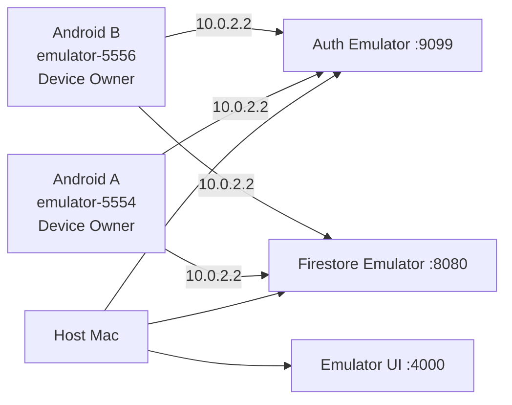

# Android Emulatorデモ計画

## 1. デモの成功条件

2台のAndroid EmulatorとFirebase Local Emulator Suiteで、次を一続きに再現する。

1. Aログイン
2. Aがgroup作成
3. Bログイン・join
4. AがTask開始
5. Aがforeign appを開く
6. failure
7. Debt 20 reps生成
8. Aのdemo target appをsuspend
9. BへDebtをrealtime表示
10. BがDebt選択
11. cameraまたはdebug pose inputでsquat
12. A/Bへ残数をrealtime反映
13. Debt完済
14. Aのtarget appをunsuspend

## 2. 推奨構成



- project ID: `demo-michizure`
- Auth port: 9099
- Firestore port: 8080
- Emulator UI: 4000
- Androidからhost: `10.0.2.2`
- AVD: API 35、同じdevice profile、snapshotではなくfresh dataから準備

Firebase Emulator Suiteは本番性能の代替ではないが、デモのinternet依存と費用を除去できる。live Spark projectはbackupとする。

## 3. Demo build構成

```text
現在のdebug source set（Phase 3）
  Firebase demo project
  cleartextをdebug applicationだけで許可
  LauncherApps + scoped launcher queries

現在のPhase 11 debug
  productionと同じCameraX / MediaPipe Lite / One-Euro / FSM
  任意Debt・Contribution・failure・unlock commandなし
  scoped package visibilityとFirebase Emulator接続

release
  live config injected
  no fake source
  no cleartext emulator config
  production detector only
```

デモ中は実要件と同じ30分lockでもDebt完済で解除できる。期限やContributionを短縮・偽装するdebug overrideは用意しない。

## 4. Deterministic demo target（Phase 11実装済み）

preinstalled appはAVD imageごとにpackage名・suspend可否が違うため、別applicationIdの小さなdebug target APKを用意する。

```text
tools/demo-target/
  applicationId: com.kren.michizure.demotarget
  one Activity
  label: MICHIZURE Demo Target
  no permission / no data
```

これはMICHIZURE本体の実装ではなくデモfixtureであり、release artifactへ含めない。Device Owner app自身はsuspendできないため別packageが必要である。

## 5. AVD準備

各AVDは次の条件にする。

- 他user / work profileなし
- Google accountを追加しない
- screen lockなし、またはデモ手順で管理
- MICHIZUREをDevice Ownerにする前にアプリを起動しない
- Phase 11以降はdemo targetをinstall
- animation scaleを通常または固定値に揃える
- host webcamを使う場合はCamera確認用AVDのfrontへ`webcam0`をmapping

Device Ownerは通常の既存個人端末へ後付けする手順ではない。失敗したAVDはpolicyを継ぎ足さずfresh AVDへ戻す。

host webcamをfront cameraへ割り当てる場合、既存AVDをwipeせず停止してから次で起動する。`<AVD_NAME>`は`emulator -list-avds`の既存名を使う。

```bash
"$ANDROID_HOME/emulator/emulator" -webcam-list
"$ANDROID_HOME/emulator/emulator" @<AVD_NAME> \
  -camera-front webcam0 \
  -no-snapshot-load
```

## 6. APK installとDevice Owner provisioning

MICHIZURE artifact:

```text
build/app/outputs/flutter-apk/app-debug.apk
```

`tools/demo-target`をbuildしてAへinstallする。

```bash
./android/gradlew -p tools/demo-target assembleDebug
adb -s emulator-5554 install -r \
  tools/demo-target/app/build/outputs/apk/debug/app-debug.apk
```

Device Owner設定はfactory reset済みで、Google account、他user、work profile、既存Device OwnerがないAVDでのみ行う。Device Ownerは通常アプリのruntime permissionではなく、アプリ自身が取得することもできない。

A（Phase 3の1台構成）:

```bash
flutter build apk --debug
adb -s emulator-5554 install -r \
  build/app/outputs/flutter-apk/app-debug.apk
adb -s emulator-5554 shell dpm set-device-owner \
  com.kren.michizure/.admin.MichizureDeviceAdminReceiver
```

B（後続Phaseの2台構成）:

```bash
adb -s emulator-5556 install -r \
  build/app/outputs/flutter-apk/app-debug.apk
adb -s emulator-5556 shell dpm set-device-owner \
  com.kren.michizure/.admin.MichizureDeviceAdminReceiver
```

確認:

```bash
adb -s emulator-5554 shell dpm list-owners
adb -s emulator-5556 shell dpm list-owners
adb -s emulator-5554 shell dumpsys device_policy
```

公式手順と同じく、no accounts / no other usersのfully managed test deviceで実行する。component名は実装manifestと一致させる。

## 7. Demo permission

Usage AccessをUIから付与するのが本来の説明可能なflow。時間短縮用debug setup:

```bash
adb -s emulator-5554 shell appops set \
  com.kren.michizure GET_USAGE_STATS allow
adb -s emulator-5556 shell appops set \
  com.kren.michizure GET_USAGE_STATS allow
```

API 33+ notification:

```bash
adb -s emulator-5554 shell pm grant \
  com.kren.michizure android.permission.POST_NOTIFICATIONS
adb -s emulator-5556 shell pm grant \
  com.kren.michizure android.permission.POST_NOTIFICATIONS
```

Bでreal cameraを使う場合はUIからcamera permissionを付与する。permissionをadbで隠すより、最初のデモ説明で端末内処理とともに同意画面を見せる。

capability診断画面で次をgreenにする。

- Device Owner
- Usage Access
- Notification / FGS
- package visibility
- target suspendable（Phase 6以降）
- Firebase Emulator connected

### 7.1 当日preflight

preflightは状態を変更せず、Firebase Emulatorへの到達、端末接続、Device Owner、Usage Access、通知、user unlock、demo targetのinstall / unsuspendedだけを確認する。

```bash
MICHIZURE_DEVICE_SERIAL=emulator-5554 ./tool/demo_preflight.sh
MICHIZURE_DEVICE_SERIAL=emulator-5556 \
  MICHIZURE_REQUIRE_CAMERA=1 ./tool/demo_preflight.sh
```

Auth user、Group、封印対象件数、active Task / Debt / obligationはprivacyとstorage境界を保つためshellから抜き出さず、アプリUIで確認する。失敗項目はUIまたは既存adb provisioning手順で修正してから再実行する。

### 7.2 Device setup smoke test

1. Home右上の「端末セットアップ」を開く。
2. Device Owner、Usage Access、通知、アプリ一覧、Android APIがgreenであることを確認する。
3. 「封印対象アプリを選ぶ」を開く。
4. Chrome等の選択可能なlauncher appを2件選び、保存する。
5. MICHIZURE、launcher、dialer、Settings等が表示される場合は理由付きdisabledであることを確認する。
6. app processを終了して再起動し、2件の選択が復元されることを確認する。

Native contractの自動smoke:

```bash
flutter test integration_test/device_setup_flow_test.dart \
  -d emulator-5554 \
  --no-uninstall
```

Kotlin instrumentation:

```bash
cd android
./gradlew :app:connectedDebugAndroidTest
```

`--no-uninstall`はDevice Owner appのtest cleanupによるアンインストール失敗を避けるために必要である。Device Owner解除やAVD wipeはデモ端末の管理操作であり、このsmoke testでは行わない。

## 8. Firebase Emulator Suite

現在の`firebase.json`:

```json
{
  "firestore": {
    "rules": "firestore.rules",
    "indexes": "firestore.indexes.json"
  },
  "emulators": {
    "auth": { "port": 9099 },
    "firestore": { "port": 8080 },
    "ui": { "enabled": true, "port": 4000 },
    "singleProjectMode": true
  }
}
```

起動:

```bash
firebase emulators:start \
  --project demo-michizure \
  --only auth,firestore
```

debug app:

```text
FirebaseAuth.useAuthEmulator("10.0.2.2", 9099)
FirebaseFirestore.useFirestoreEmulator("10.0.2.2", 8080)
```

Emulator接続はFirebase initialize直後、Auth / Firestore instanceの最初の使用前に設定する。起動画面へ接続先project IDを表示し、live誤接続を防ぐ。

## 9. Demo data

手入力を短くし再現可能にする。

| User | Email | Display | Role |
|---|---|---|---|
| A | `alice@example.test` | Alice | owner / failed user |
| B | `bob@example.test` | Bob | contributor |

credentialはdemo-only固定値を発表資料へ載せず、当日runbookの追跡外local fileで管理する。Firebase Emulatorをresetした場合はUIの正規フローから登録する。Rulesを迂回するseed APIや固定credentialはProduction / debug appへ追加しない。

Group:

```text
name: MICHIZURE Demo Team
memberCount: 2
Debt after failure: 20 reps
lock target: MICHIZURE Demo Target
```

## 10. Main demo script

### Phase 4 smoke（monitor導入前）

1. Auth / Firestore EmulatorとDevice Owner設定済み`emulator-5554`を起動する。
2. ログインし、Group所属とDevice Setup全項目、封印対象1件以上を確認する。
3. Task画面で「勉強する / 1分」を開始し、Running画面のcountdownを確認する。
4. process終了相当の`adb shell am force-stop com.kren.michizure`を実行する。
5. `adb shell monkey -p com.kren.michizure 1`またはlauncherから再起動し、保存counterではなく`expectedEndAt`から短くなった残時間が復元されることを確認する。
6. 期限後にTaskがsucceededへ収束し、Homeへ戻れることを確認する。
7. 別Taskを開始し「失敗として中断」を選び、失敗結果と`group人数 × 10`回のDebt生成を確認する。

foreign app自動検知、Foreground Service、package suspensionは実装済みである。`am force-stop`は通常のprocess killより強くreceiver/serviceも停止するため、START_STICKYによるprocess recreation保証とは分けて記録する。

### Phase 5 Task Guard smoke

1. Firebase Emulator、`emulator-5554`、debug APKを起動し、Device Owner / Usage Access / notification / lock targetがReadyであることを確認する。
2. 1分以上のTaskを開始し、notification shadeで「Taskを監視中」が表示されることを確認する。
3. 次でserviceがforeground実行中であることを確認する。

   ```bash
   adb shell dumpsys activity services com.kren.michizure
   ```

4. MICHIZURE内に1秒以上留まり、Taskがrunningのままであることを確認する。
5. HomeまたはChromeを開いて600ms以上留まり、MICHIZUREへ戻る。Taskがfailed、同じTask IDのDebtが1件、active pointerがnullであることをFirestore Emulator UIで確認する。
6. 同じeventの再配送後もDebtが増えず、serviceが停止してnotificationが消えることを確認する。
7. 別Taskでは次を実行し、画面OFF中にfailureにならないことを確認する。

   ```bash
   adb shell input keyevent KEYCODE_SLEEP
   adb shell input keyevent KEYCODE_WAKEUP
   ```

8. notification shadeを開閉するだけではfailureにならず、shadeからforeign appを開いた場合はfailureになることを確認する。
9. Task開始後にUsage Accessをrevokeし、crashせず`monitor_capability_lost`へ収束することを確認する。

Phase 5のincoming call gateは追加permissionを持たないsynthetic classifier testだけである。実着信の除外はProduction permission / Play policy判断後の課題とする。

### Phase 6 App Lock smoke

1. `adb shell dpm list-owners`でMICHIZUREがDevice Ownerであることを確認する。
2. Device SetupでChrome等の選択可能なlauncher appを1件選択する。
3. Taskを開始し、foreign appへ移動する。
4. Firestore Emulator UIでTask `failed` とsame-ID Debt `active`を確認する。
5. Lock Statusでobligation、30分期限、封印成功件数を確認する。
6. launcherから選択対象を起動し、Androidのsuspended app案内になることを確認する。
7. app processを通常killして再起動し、Lock Statusとsuspend状態が維持されることを確認する。
8. `adb shell dumpsys package <target-package>`と`adb shell dumpsys device_policy`を診断に使用する。package名を共有ログやanalyticsへ転送しない。
9. Debt完済ではPhase 7 terminal listenerからobligationを解除し、他のactive obligationがなければunsuspendされることを確認する。

instrumentation:

```bash
cd android
./gradlew :app:connectedDebugAndroidTest
```

`AndroidPackageSuspenderTest`は選択可能なlauncher appを一時suspendし、`finally`でunsuspendする。テスト中にEmulatorを終了しない。

### Phase 7 Debt realtime smoke

1. Firebase EmulatorとA/BのAndroid Emulatorを起動し、A/Bを同一groupへ所属させる。
2. AでTaskを失敗させ、same-ID Debtが作成されることを確認する。
3. A/B双方のGroup画面で「現在の負債」が1件になり、Debt一覧へdeadline順で表示されることを確認する。
4. failed user名、残回数、発生時刻、期限がGroup member snapshotから表示され、Task内容やpackage名が表示・保存されないことを確認する。
5. Aでもう1件Taskを失敗させ、同一failed userのDebtが上書きされず2件表示されることを確認する。
6. Firestore Emulatorで期限後に正規expire transactionを実行し、Aのnative obligationが解除されることを確認する。他のactive obligationが同じpackageを参照する場合は封印が継続する。
7. Bを別groupまたは未所属状態にし、旧group Debtが残らずRulesでdirect get/queryも拒否されることを確認する。

自動2 client確認:

```bash
firebase emulators:exec \
  --project demo-michizure \
  --only auth,firestore \
  "flutter test integration_test/debt_realtime_test.dart \
    -d emulator-5554 \
    --no-uninstall"
```

### Scene 1: Group

1. Aでregister/loginしgroup作成。
2. invite raw token / QR代替表示。
3. Bでregister/loginしinvite参加。
4. A/B両方でmember 2人を確認。

### Scene 2: Task failure

1. AでApp Selectionを開き、MICHIZURE Demo Targetをlock targetに選択して明示的に保存する。
2. Aで「勉強する / 5分」を開始。
3. Foreground Service notificationとcountdownを示す。
4. AでHomeからMICHIZURE Demo Targetを開く。
5. 600ms前後でfailure、MICHIZURE Demo Target Activityが停止 / 起動不可になる。
6. Aへfailure resultと20 reps Debtを表示。
7. BのGroup dashboardへ1秒以内にDebtが現れる。

### Scene 3: Repayment

1. BでDebtを選択。
2. Phase 8画面で選択中のDebt ID、残回数、pending / confirmedを示す。
3. camera setupで「画像は保存・送信しない」を示す。
4. 当日のcameraが安定ならreal CameraX + MediaPipe Lite。
5. cameraが不安定なら実カメラScenario Cを未達として記録し、数値fixtureのinstrumentation結果をML精度の代用として説明しない。
6. repごとにBのconfirmed count、Aのremainingが更新される。
7. 20 repsでDebt completed。

`integration_test/debt_contribution_test.dart`では3 clientのatomic Contribution、realtime summary、Outbox復元を検証する。Production UIのrep生成はCameraX + MediaPipe Liteだけを使用する。

## 10. Phase 10 Recovery smoke

AVD wipe、app data clear、Device Owner解除、対象appのuninstallは行わない。

### 通常process kill

```bash
adb shell am kill com.kren.michizure
adb shell monkey -p com.kren.michizure 1
```

running Taskでは`expectedEndAt`由来の残時間、Foreground Service notification、native Task IDを確認する。active lockでは対象packageのsuspend状態とLock UIが復元されることを確認する。

### package replace

```bash
adb install -r build/app/outputs/flutter-apk/app-debug.apk
adb shell dumpsys device_policy
```

`MY_PACKAGE_REPLACED`後もDevice Ownerを維持し、active obligationのeffective unionが再適用されることを確認する。

### reboot

```bash
adb reboot
adb wait-for-device
adb shell dumpsys device_policy
adb shell monkey -p com.kren.michizure 1
```

`LOCKED_BOOT_COMPLETED`ではdevice-protected最小snapshotからlockを照合し、user unlock後にTask GuardとFirestoreを照合する。Firebase Emulator hostへ再接続できない間はlogout / unlockを行わず`degraded`表示とする。

### network復帰

Task failure / Contribution pendingを作った後にnetworkを戻し、same event IDで1回だけTask / Debt / Contributionへ収束することを確認する。Debt terminal snapshot再配信ではobligationがreleaseされる。

`adb shell am force-stop com.kren.michizure`は通常killとは異なる。実行した場合、receiver / serviceはユーザーがappを再起動するまで復元されないため、常時自動復元のAcceptanceには数えない。既存DPM suspensionは維持され、次回明示起動でreconcileされることを確認する。

### Phase 9 Camera / Squat smoke

1. Bでactive Debt詳細から「この負債を返済する」を開く。
2. 端末内処理・非保存の説明を確認してcamera permissionを許可する。
3. 「スクワット返済を開始」を押し、native previewとcalibration表示を確認する。
4. host webcamを使う場合は胸の下から足首までをframeへ入れ、斜め30〜45度または横向きで1秒以上直立する。
5. Emulatorでは`Delegate: CPU`であることを確認する。「姿勢判定を準備しています」の後、debug diagnosticsでanalyzer / submit / callback数、callback age、callback未到達とcallback到達・poseなしの区別、analysis FPS、drop / busy数、選択side、hip/knee/ankle confidence、knee angle、hip drop、reject reason、preprocess / inference / pipeline p50・p95を確認する。
6. Squat Labの「既知画像でMediaPipeを確認」を1回実行し、callback=true、pose count 1以上、hip/knee/ankle=trueを確認する。これは推論配線の診断であり、実Camera精度やスクワット成功の代替ではない。
7. 深くしゃがんで完全に立ち、端末検出、送信待ち、Firestore確定、負債残数の順に更新されることを確認する。
8. 浅い屈伸はcountされず、正常1 squatがexactly 1 repであることを確認する。
9. 画面を離れ、camera privacy indicatorが消えてanalyzerが停止することを確認する。
10. 最終repではDebt completed後にsessionが停止し、Phase 7→6経路でobligationが解除されることを確認する。

Camera画面では胸の下から足首までをportrait 3:4 guide内へ入れ、カメラへ斜め30〜45度または横向きになる。debug buildではHomeの「Squat Lab」からFirebase / Debtを使わずCamera→Pose→FSMだけを確認できる。Labのaccepted countはProduction Contributionではない。

Emulator cameraで人体入力が安定しない場合、debug source setの数値synthetic sequenceをAndroid instrumentationで検証し、実際のCameraX/MediaPipe精度とp95はhost webcamまたは物理Androidで測定する。合成入力だけを性能達成の根拠にしない。manual gateではPreview/guideのbounds一致、GPU 12 FPSまたはCPU 8 FPS近傍、正常3回=3、浅い3回=0、過深動作=0を記録する。

camera permissionを再試験する場合はDevice Ownerやapp dataを消去せず、permission flagsだけを操作する。

```bash
adb -s emulator-5554 shell pm revoke \
  com.kren.michizure android.permission.CAMERA
adb -s emulator-5554 shell pm clear-permission-flags \
  com.kren.michizure android.permission.CAMERA user-set user-fixed
```

### Scene 4: Unlock

1. Aのlock statusでDebt completed / effective lock empty。
2. MICHIZURE Demo Targetを再度開き、起動できることを示す。
3. B側でもcompletedを確認。

## 11. Camera確認順

1. physical Android + real cameraをBとして使用
2. host webcam passthrough
3. Android Emulatorで人物入力が現実的な場合のみ使用
4. camera E2Eができない場合はKotlin synthetic numeric fixtureでFSM回帰だけ確認

4はProduction UIの代替入力ではなくtest laneである。実カメラ精度、latency、Scenario Cを成功したとは報告しない。

## 12. False-positive mini demo

時間があればAのrunning Taskで示す。

- power button相当でscreen off → failureしない、timer継続
- screen onでMICHIZUREへ復帰 → running
- Home / MICHIZURE Demo Target → failure

封印対象アプリからLauncherへ戻る操作はEmulator右側toolbarのHome button、または次を使う。MICHIZURE本体へ特殊なHome操作を追加しない。

```bash
adb -s emulator-5554 shell input keyevent KEYCODE_HOME
```

permission dialogとincoming callは自動test結果を提示し、当日の本番flowへ無理に入れない。

## 13. Backup live Spark project

Local Emulatorに問題がある場合:

- Japanに近いregional Firestore
- email/password Auth
- deployed Rules / Index
- registered App Check debug tokens、またはdemo時間だけenforcement設定を明示
- A/B internet接続
- live project IDを大きく表示

実行前:

- test user / group data reset
- quota確認
- Rules version確認
- clock / network確認

Cloud Functionsは不要。

## 14. Reset

Firebase Emulator:

- process停止でデータがclearされるのを基本とする。
- export/importを使う場合はrunbookでversion固定。

Device Owner:

- debug/test-only adminで対応可能なOSでは `dpm remove-active-admin --user 0 COMPONENT` を使用できる場合がある。
- policyが残る、commandが拒否される、状態が不明な場合はAVDのWipe Dataでfresh deviceへ戻す。
- Wipe Dataは端末データを削除する破壊操作なので、デモ専用AVDにだけ行う。

## 15. Rehearsal checklist

前日:

- clean cloneからPhase 0〜11 build
- 2 fresh AVD provisionをrunbookだけで再現
- Rules Test / Android test成功
- fake sourceがreleaseにない
- main scenarioを3回連続成功
- screen off false-positive test
- network切断 / reconnect
- live backup確認

直前:

- hostのsleep無効化
- AVD device IDs確認
- Firebase Emulator ports空き
- camera source確認
- MICHIZURE Demo Target installed / selectable
- A/B battery / screen orientation
- notification permission
- terminal font / zoom
- recordingしてもcredential / debug tokenが映らない

## 16. 失敗時の説明

- Device Owner不可: fresh AVDのsetup条件を満たしていない。一般端末で不可なのは仕様。
- Usage Accessなし: setup gateでTaskを開始しない。
- camera不安定: synthetic sourceへ切替え、MLデモではなく状態機械 / realtime flowと説明。
- Firestore offline: Aはlocal lockを維持、BへのDebt反映はreconnect後。
- partial suspension: protected packageではなくdeterministic MICHIZURE Demo Targetを使う。
- completion後unlock遅延: Aのlistener / reconciler診断を表示し手動reconcile、原因を隠さない。

## 17. 公式資料

- [Provision a fully managed test device](https://developer.android.com/work/guide#fully_managed_device)
- [Firebase Emulator Suite](https://firebase.google.com/docs/emulator-suite)
- [Connect Android to Firestore Emulator](https://firebase.google.com/docs/emulator-suite/connect_firestore#android_apple_platforms_and_web_sdks)
- [App Check debug provider](https://firebase.google.com/docs/app-check/flutter/debug-provider)
