# Feature branch単位の実装計画

## 1. 運用原則

すべてのPhaseは、直前Phaseが統合された最新`dev`から新しいbranchを作り、PRで`dev`へ戻す。

```bash
git fetch origin
git switch dev
git pull --ff-only origin dev
git switch -c <branch-name>
```

- `main`へ直接commit / mergeしない。
- `dev`へ直接機能commitしない。
- 1 branchで複数Phaseを実装しない。
- architecture変更は実装に混ぜずADRを追加する。
- Firestore schema変更にはRules Testとindex差分を含める。
- Android native contract変更にはDart/Kotlin両側のcontract testを含める。
- 各commit前にformat、対象test、`git diff`、`git status`を確認する。

## 2. 依存順

```mermaid
flowchart LR
    P0["0 Bootstrap"] --> P1["1 Auth"]
    P1 --> P2["2 Group"]
    P2 --> P3["3 Device Setup"]
    P3 --> P4["4 Task Session"]
    P4 --> P5["5 Task Monitor"]
    P5 --> P6["6 App Lock"]
    P6 --> P7["7 Debt Realtime"]
    P7 --> P8["8 Contributions"]
    P8 --> P9["9 Squat Detection"]
    P9 --> P10["10 Recovery"]
    P10 --> P11["11 Demo Polish"]
```



Phase 1以降はdev統合を待って順に開始するのが安全である。並行化する場合でも、同じFirestore Rules、router、Platform Channel bootstrapを触るbranchは同時に進めない。

---

## Phase 0 — `chore/project-bootstrap`

### 目的

Android専用Flutter project、品質gate、Firebase Local Emulator Suite、default-deny Rulesの最小基盤を作る。ユーザー向け機能は実装しない。

### 実装対象ファイル

```text
pubspec.yaml
pubspec.lock
analysis_options.yaml
lib/main.dart
lib/app/app.dart
lib/app/bootstrap.dart
lib/app/router.dart
lib/core/
android/
firebase.json
.firebaserc
firestore.rules
firestore.indexes.json
firebase/rules-tests/
.github/workflows/ci.yml
.gitignore
README.md
```

### Dependency

- runtime: Flutter SDK、`firebase_core`, `firebase_auth`, `cloud_firestore`, `firebase_app_check`, `flutter_riverpod`, `go_router`
- dev: `flutter_test`, `integration_test`、Rules Test用Node dependencies
- Android minSdk 23、applicationId `com.kren.michizure`
- 追加packageは目的と公式compatibilityをPRへ記載し、lockfileをcommitする。

### Firestore変更

- `firestore.rules`: `rules_version = '2'`、全path default deny
- `firestore.indexes.json`: 空のbaseline
- Auth / Firestore Emulator portsを固定
- live Firebase configは作成・commitしない

### UI

- bootstrap成功を表示する最小placeholder
- debug buildだけproject ID / emulator接続先を表示
- navigation shellだけ。Login等は未実装

### Native Kotlin

- Flutter generated shellのみ
- DPC、UsageStats、CameraX、ML Kit、MethodChannelは未実装

### 完了条件

- Android debug buildが起動
- `demo-michizure`へprogrammatic FirebaseOptionsで初期化
- Androidから`10.0.2.2`のAuth / Firestore Emulatorへ接続可能
- default-deny Rules Testが成功
- format / analyze / Flutter test / Rules Testを1 commandずつ実行可能
- CIが同じgateを実行
- 既存docsを上書きしない

### テスト

- app smoke widget test
- bootstrap project ID guard
- unauthenticated / authenticated双方のFirestore read/write deny
- Firebase configがlive projectへ向かないtest
- `flutter analyze`, `flutter test`, Rules Test

### 推奨commit分割

1. `chore: Flutter Androidプロジェクトを初期化`
2. `chore: Firebase Emulator Suite基盤を追加`
3. `test: default-deny Firestore Rulesを検証`
4. `ci: FlutterとRulesの品質ゲートを追加`
5. `docs: ローカルbootstrap手順を追記`

---

## Phase 1 — `feature/auth-profile`

### 目的

email/password登録、login、logout、profile作成・表示を実装する。

### 実装対象ファイル

```text
lib/features/auth/{domain,application,infrastructure,presentation}/
lib/features/profile/{domain,application,infrastructure,presentation}/
lib/app/router.dart
firestore.rules
firebase/rules-tests/users.test.*
test/features/auth/
test/features/profile/
```

### Firestore変更

- `users/{uid}` schema
- create/read/profile update Rules
- unknown field、他user read/write deny
- profile更新と将来member snapshot同期のinterfaceを定義

### UI

- Login、Register、Profile Setup、Profile
- validation、loading、Firebase Auth errorのtyped表示
- router auth redirect

### Native Kotlin

- なし

### 完了条件

- Auth Emulatorでregister→profile→logout→login
- auth userなし / profileなし / readyのrouter分岐
- passwordをアプリstorage / logへ保存しない
- user docを本人以外が読めない

### テスト

- AuthRepository unit / emulator integration
- form widget test
- auth state redirect
- Rules allow/deny matrix
- logout時に将来のnative lockを消さないport contract

### 推奨commit分割

1. `feat: 認証ドメインとrepositoryを追加`
2. `feat: 登録とログイン画面を実装`
3. `feat: ユーザープロフィールを追加`
4. `test: 認証とusers Rulesを検証`

---

## Phase 2 — `feature/group`

### 目的

group作成、invite発行、join、member list、owner移譲、leave制約を実装する。

### 実装対象ファイル

```text
lib/features/group/
lib/app/router.dart
firestore.rules
firebase/rules-tests/groups.test.*
test/features/group/
integration_test/group_flow_test.dart
```

### Firestore変更

- `groups`, `groups/{id}/members`, `groupInvites`
- group create 3-doc transaction
- joinはuser/inviteをreadするtransactionとgroup atomic increment、leave / owner transferもtransaction
- max 40、single group、invite expiry / revoke Rules
- raw invite tokenを保存しない

### UI

- Group Onboarding、Create、Join、Dashboard、Invite、Member list
- current member数とowner表示
- owner leave時の移譲導線

### Native Kotlin

- なし

### 完了条件

- Aがgroup作成、Bがtokenでjoin
- member listがrealtime更新
- 41人目、2 group目、expired inviteを拒否
- group dashboard初回readが1 + member数を基本としN+1なし

### テスト

- token entropy / SHA-256 utility
- transaction raceでmax 40
- group Rules全matrix
- 2 client listener integration
- owner transfer / leave

### 推奨commit分割

1. `feat: groupドメインとFirestore repositoryを追加`
2. `feat: group作成と参加を実装`
3. `feat: member一覧と招待管理を実装`
4. `feat: owner移譲と退出制約を実装`
5. `test: group transactionとRulesを検証`

---

## Phase 3 — `feature/device-setup-app-selection`

### 目的

Device Owner、Usage Access、notification、package visibilityを診断し、lock可能アプリを選択・ローカル保存する。

### 実装対象ファイル

```text
lib/features/enforcement/domain/
lib/features/enforcement/infrastructure/device_control_channel.dart
lib/features/enforcement/presentation/device_setup/
lib/features/enforcement/presentation/app_selection/
android/app/src/main/kotlin/com/kren/michizure/admin/
android/app/src/main/kotlin/com/kren/michizure/enforcement/PackageCatalog.kt
android/app/src/main/kotlin/com/kren/michizure/platform/
android/app/src/main/AndroidManifest.xml
android/app/src/main/res/xml/device_admin_receiver.xml
android/app/src/debug/AndroidManifest.xml
```

### Firestore変更

- なし。package inventoryはcloudへ書かない。

### UI

- Device Setup checklist
- SettingsへのUsage Access導線
- app icon / label / capabilityを持つselection
- protected appは理由付きdisabled

### Native Kotlin

- `MichizureDeviceAdminReceiver`
- `getCapabilities`, `openUsageAccessSettings`, `listLockableApps`
- debug/demo flavorのpackage visibility
- DataStore selected package IDs
- versioned MethodChannel contract

### 完了条件

- Device Owner emulatorで全capability green
- 通常emulatorでcrashせずsetup blocked
- Demo SNSを選択・再起動復元
- MICHIZURE、launcher、dialer等を選択不可
- package名がFirestore / production logへ出ない

### テスト

- Dart adapter contract test
- Kotlin PackageCatalog unit
- Device Owner / non-owner instrumentation
- Platform Channel version / error test
- release manifestでdebug broad visibility差分確認

### 推奨commit分割

1. `feat: Device Owner capability診断を追加`
2. `feat: lock可能アプリcatalogを実装`
3. `feat: app選択とローカル永続化を追加`
4. `test: device control channelとpackage制約を検証`

---

## Phase 4 — `feature/task-session`

### 目的

Task作成、Firestore start transaction、countdown、success、手動abort failure、Debt生成contractを実装する。Android foreign app自動検知は次Phase。

### 実装対象ファイル

```text
lib/features/task/
lib/features/debt/domain/debt.dart
lib/features/debt/domain/debt_repository.dart
lib/features/task/application/start_task.dart
lib/features/task/application/fail_task_and_create_debt.dart
lib/features/task/presentation/
firestore.rules
firestore.indexes.json
firebase/rules-tests/tasks_debt_creation.test.*
```

### Firestore変更

- `taskSessions`
- `users.activeTaskSessionId`
- failure時のminimal `debts/{taskId}` create
- Task start / success / failure atomic Rules
- task history index

### UI

- Task Composer、Preflight、Running Task、Result
- countdown、guardはまだ`notAvailable`表示またはfeature flagで開始不可
- manual abort確認

### Native Kotlin

- Task timing contract interfaceのみ。自動monitor未実装

### 完了条件

- 1 user 1 running Task
- expectedEndAtから再描画
- deadline後success
- abortでsame-ID Debt、人数×10
- terminal immutable
- Task内容はgroup memberに非公開

### テスト

- Clockを使うTask state unit
- start / success / failure transaction
- member数1/5/40のDebt
- duplicate failure event no-op
- Task / Debt creation Rules
- restart view model test

### 推奨commit分割

1. `feat: Taskドメインと時刻モデルを追加`
2. `feat: Task startとactive pointerを実装`
3. `feat: countdownとsuccess処理を実装`
4. `feat: failureとDebt生成transactionを実装`
5. `test: Task状態遷移とRulesを検証`

---

## Phase 5 — `feature/android-task-monitor`

### 目的

Foreground Service、UsageEvents監視、system interruption gate、deadline競合を実装しTaskへ自動failure eventを接続する。

### 実装対象ファイル

```text
android/app/src/main/kotlin/com/kren/michizure/monitoring/
android/app/src/main/kotlin/com/kren/michizure/persistence/NativeTaskStore.kt
android/app/src/main/kotlin/com/kren/michizure/platform/TaskEventStreamHandler.kt
lib/features/task/infrastructure/native_task_guard.dart
lib/features/task/application/handle_native_task_event.dart
android/app/src/test/
android/app/src/androidTest/
```

### Firestore変更

- schema変更なし
- `failureReason`, `guardConfigVersion`のallowlist test拡張

### UI

- guard health、notification、capability lost
- system interruption中表示
- native failure reason

### Native Kotlin

- `TaskGuardService`
- `UsageEventSource`
- `ForegroundTransitionClassifier`
- `SystemFlowLease`
- native terminal CASとTaskRecord
- EventChannel

### 完了条件

- Demo SNSを開くと1秒以内を目標にfailure
- screen off / keyguardでfailureしない
- Home / Settings / foreign appはfailure
- Usage Access revokeはcapability failure
- native event再送でDebt重複なし

### テスト

- classifier table test
- virtual elapsed clock
- FGS / notification instrumentation
- screen off / Home / foreign target
- permission lease synthetic
- deadline race

### 推奨commit分割

1. `feat: Task Guard foreground serviceを追加`
2. `feat: UsageEvents監視とclassifierを実装`
3. `feat: system interruption filterを追加`
4. `feat: native Task eventをFlutterへ接続`
5. `test: 離脱検知と誤判定防止を検証`

---

## Phase 6 — `feature/android-app-lock`

### 目的

failure直後のpackage suspension、Debt別obligation、複数理由union、deadline / completion解除を実装する。

### 実装対象ファイル

```text
android/app/src/main/kotlin/com/kren/michizure/enforcement/PackageSuspender.kt
android/app/src/main/kotlin/com/kren/michizure/enforcement/LockReconciler.kt
android/app/src/main/kotlin/com/kren/michizure/enforcement/LockDeadlineScheduler.kt
android/app/src/main/kotlin/com/kren/michizure/persistence/LockObligationStore.kt
lib/features/enforcement/application/
lib/features/enforcement/presentation/lock_status/
```

### Firestore変更

- schema変更なし
- failed userのactive Debt query indexを使用

### UI

- Lock Status
- obligation別Debt、期限、effective target数
- partial failure / manual reconcile
- 1 Debt完済でも他Debtで継続する説明

### Native Kotlin

- `setPackagesSuspended`
- failure前のlocal obligation atomic保存
- apply / release partial result
- effective set / owned suspension
- elapsed deadline Handler + WorkManager safety net

### 完了条件

- failure時network前にDemo SNS suspend
- Debt A/Bが同packageでもAだけ完済時は維持
- 全obligation解決でrelease
- deadline offline release
- protected package / partial errorでcrashしない

### テスト

- LockReconciler pure unit
- DPM instrumentation
- process kill / app relaunch
- 2 obligations
- uninstall / reinstall
- no package field in Firestore

### 推奨commit分割

1. `feat: package suspension adapterを追加`
2. `feat: Debt別lock obligationを永続化`
3. `feat: lock unionと差分reconcileを実装`
4. `feat: deadline解除とlock statusを追加`
5. `test: 複数DebtとDPM復元を検証`

---

## Phase 7 — `feature/debt-realtime`

### 目的

group active Debt、残数、member別summary、completed / expired、failed userのunlock通知をrealtime同期する。

### 実装対象ファイル

```text
lib/features/debt/{application,infrastructure,presentation}/
firestore.indexes.json
firestore.rules
firebase/rules-tests/debt_lifecycle.test.*
test/features/debt/
integration_test/debt_realtime_test.dart
```

### Firestore変更

- active / history / failed user query indexes
- expiration claim transaction
- Debt terminal update Rules
- Contributionsはread-only placeholderまで

### UI

- Debt List、Debt Detail
- active realtime、history pagination
- remaining、failed member、deadline
- expired derived表示とserver収束

### Native Kotlin

- completed / expired snapshotを`resolveObligation`へ渡す既存channel利用

### 完了条件

- A failure後Bにp95目標1秒でDebt表示
- completedRepsをevents全件なしで表示
- overdue activeをexpiredへ収束
- Aがremote terminal受信でlock reconcile
- listenerを画面外でdetach

### テスト

- query/index integration
- two-client realtime
- expiration request.time Rules
- history pagination
- listener lifecycle / read count diagnostic

### 推奨commit分割

1. `feat: Debt repositoryとqueryを追加`
2. `feat: active Debt一覧とdetailを実装`
3. `feat: expirationとhistoryを実装`
4. `feat: remote terminalをlock解除へ接続`
5. `test: Debt realtimeとRulesを検証`

---

## Phase 8 — `feature/debt-contributions`

### 目的

冪等Contribution Event、member summary、Debt aggregateを1 repずつtransaction更新し、並行返済とtotal超過を防ぐ。

### 実装対象ファイル

```text
lib/features/debt/domain/contribution*
lib/features/debt/application/submit_rep.dart
lib/features/debt/infrastructure/firestore_contribution_repository.dart
lib/features/debt/infrastructure/contribution_outbox.dart
firestore.rules
firebase/rules-tests/contributions.test.*
integration_test/contribution_concurrency_test.dart
```

### Firestore変更

- `contributions/{uid}`
- `contributionEvents/{eventId}`
- Debt `lastContributionEventId`
- `getAfter()` atomic validation
- index exemption

### UI

- member別返済数
- detected / pending / confirmed
- offline / rejected余剰event

### Native Kotlin

- なし。SquatDetector event sourceは次Phase

### 完了条件

- 1 event = 1 rep
- retryで二重加算なし
- 49/50へ20並行requestでもfinal 50
- summary合計とDebt aggregate一致
- offline outboxの順序送信

### テスト

- Rules missing-write deny matrix
- 5 / 40 client concurrency
- event ID duplicate
- deadline / terminal race
- offline outbox
- p95 transaction metric

### 推奨commit分割

1. `feat: Contribution eventとsummary modelを追加`
2. `feat: idempotent rep transactionを実装`
3. `feat: Contribution outboxを追加`
4. `feat: member別realtime表示を追加`
5. `test: 並行返済と上限を検証`

---

## Phase 9 — `feature/squat-detection`

### 目的

CameraX + ML Kit + Kotlin状態機械でスクワットを検出し、Phase 8のrep eventへ接続する。

### 実装対象ファイル

```text
android/app/src/main/kotlin/com/kren/michizure/pose/
android/app/src/debug/kotlin/com/kren/michizure/pose/
android/app/src/test/.../pose/
android/app/src/androidTest/.../pose/
lib/features/squat/
```

### Firestore変更

- event `detectorType`, `detectorVersion` validation
- production Rulesで`fake_debug`拒否する環境分離方針を実装

### UI

- Squat Setup、Camera preview、Counter
- calibration / quality warning
- detected / confirmed / pending
- debug source banner

### Native Kotlin

- CameraX Preview / ImageAnalysis
- ML Kit base / STREAM_MODE
- quality、feature、smoothing、FSM
- EventChannel、PlatformView
- synthetic source / Fakeをdebug source setへ隔離

### 完了条件

- valid cycleだけ1 rep
- shallow / bounce / tracking lossで誤countしない
- p95 UI result 500ms目標
- frame / landmarksを保存・送信しない
- release artifactにFake選択経路なし

### テスト

- synthetic Kotlin unit matrix
- ImageProxy close / rotation / mirror
- PlatformView lifecycle
- EventChannel contract
- webcam / physical device smoke
- latency instrumentation

### 推奨commit分割

1. `feat: pose sourceとfeature抽出を追加`
2. `feat: スクワット状態機械を実装`
3. `feat: CameraXとML Kitを統合`
4. `feat: squat UIとContribution連携を追加`
5. `test: synthetic poseとlatencyを検証`

---

## Phase 10 — `feature/recovery-reconciliation`

### 目的

Task、failure outbox、Debt、lock、Contributionをprocess death、reboot、network再接続後に収束させる。

### 実装対象ファイル

```text
lib/app/recovery/
lib/core/connectivity/
lib/features/task/application/recover_task.dart
lib/features/debt/application/flush_contribution_outbox.dart
lib/features/enforcement/application/reconcile_all_locks.dart
android/app/src/main/kotlin/com/kren/michizure/persistence/
android/app/src/main/kotlin/com/kren/michizure/enforcement/BootReceiver.kt
integration_test/recovery/
```

### Firestore変更

- schema変更なし
- recovery queryとRules回帰test

### UI

- Splash / Recovery phase表示
- degraded/offline状態
- retry、diagnostic code

### Native Kotlin

- boot / package replace receiver
- device-protected snapshot
- native outbox replay signal
- current DPM state reconciliation

### 完了条件

- running Task再表示・terminal収束
- failure cloud未同期をsame IDで再送
- lock再起動維持
- completed while offlineをreconnect解除
- Contribution duplicateなし
- corrupted local stateで安全にdiagnostic

### テスト

- recovery matrix全件
- Activity recreate / process kill / force-stop区別
- `adb install -r`
- reboot
- network toggle
- clock / boot discontinuity

### 推奨commit分割

1. `feat: RecoveryCoordinatorを追加`
2. `feat: Taskとfailure outboxを復元`
3. `feat: lockとDebtをreconcile`
4. `feat: Contribution outboxを復元`
5. `test: process deathとnetwork復帰を検証`

---

## Phase 11 — `feature/demo-polish`

### 目的

2 Emulatorデモの再現性、診断、seed、performance可視化、UI polishを仕上げる。新しい業務機能は追加しない。

### 実装対象ファイル

```text
tools/demo-target/
tools/demo/
lib/features/diagnostics/
lib/core/observability/
integration_test/end_to_end_demo_test.dart
docs/demo-plan.md
README.md
```

### Firestore変更

- schema変更なし
- Emulator seed/exportのみ
- live Rules / Index deployment versionを確認

### UI

- demo target
- diagnostics screen
- empty/error/loading/accessibility polish
- debug source / project IDの明確表示
- 主要画面golden

### Native Kotlin

- demo source selectionはdebug限定
- capability diagnostics
- performance timestamps

### 完了条件

- clean environmentからrunbookだけで2 AVD setup
- 14-step demoを3回連続成功
- real/synthetic/fake fallbackすべて確認
- screen off false-positiveなし
- no-network recovery
- release buildにdebug path / secretなし

### テスト

- full end-to-end
- privacy regression
- release manifest / artifact inspection
- p95 metrics
- live Spark backup smoke
- rehearsal checklist

### 推奨commit分割

1. `chore: deterministic demo targetとseedを追加`
2. `feat: debug diagnosticsを追加`
3. `test: 2 Emulator end-to-endを追加`
4. `style: デモ画面とaccessibilityを調整`
5. `docs: 当日runbookと測定結果を更新`

## 3. Firestore migration discipline

- schemaVersionを読めないclientは明示errorにする。
- optional field追加→全writer更新→backfill→required化の順にする。
- field rename / deleteを同一releaseで行わない。
- Rulesを先に後方互換deployし、client rollout後にstrict化する。
- index build完了前に依存queryをreleaseしない。
- Emulator seedはschemaVersionごとに管理する。

## 4. PR templateで報告する内容

```text
Branch:
Target: dev
Purpose:
Architecture / ADR impact:
Firestore schema / Rules / Index:
Android permission / manifest:
Privacy impact:
Tests run and results:
Manual Emulator verification:
Commits:
Known limitations:
Next phase:
```

## 5. 実装完了のdefinition

Phase 11完了時:

- 必須機能のhappy pathと主要failure pathが2 Emulatorで動く。
- Task / Lock / Debt / Contributionを再起動復元する。
- Rules Testがdefault denyとatomic invariantを守る。
- camera image / package inventoryがcloudへ出ない。
- Fakeがreleaseに存在しない。
- Spark基準見積もりと実測を比較済み。
- docsとcodeが一致し、architecture変更はADR化済み。
