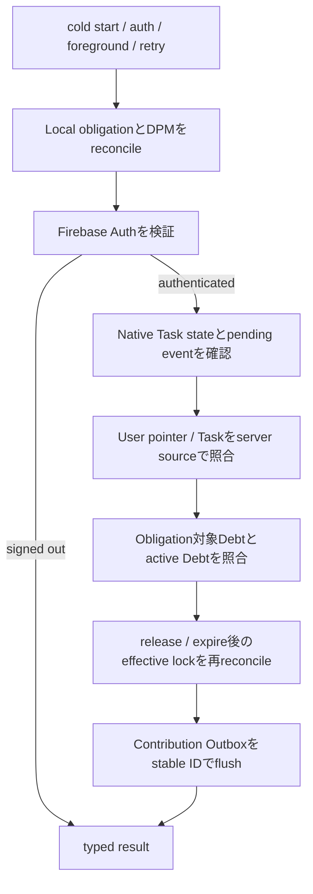

# Recovery / Reconciliation設計

## 1. 目的

Phase 10は新しい業務機能を追加せず、Firestore、Android local state、Android OSの実状態を既存のstable IDへ収束させる。Recoveryは各Featureの正規Repository / transaction / native commandを再利用し、別の書き込み経路や管理者権限を追加しない。

`RecoveryCoordinator`はapp scopeのApplication orchestrationであり、Feature固有の実装は次の境界へ委譲する。

- Auth: `RecoveryAuthGateway`
- Task / Debt server確認: `RecoveryRemoteStore`
- Task terminal更新: `TaskRepository`
- native Task Guard: `NativeTaskGuard`
- App Lock: `AppLockRepository`
- Debt期限更新: `DebtRepository`
- Contribution再送: `SubmitContribution`

## 2. Authority matrix

| State | Authority | Derived / cache | Recovery trigger | Reconciliation |
|---|---|---|---|---|
| 認証session | Firebase Auth token検証 | Riverpod auth state | cold start、auth change、manual retry | tokenをforce refresh。恒久無効だけsign outし、一時network errorではsessionを維持 |
| profile / group | Firestore | listener cache | auth/profile復元、listener再接続 | 既存listenerとRulesへ収束。Recoveryからcross-user readしない |
| active Task pointer | `users/{uid}.activeTaskSessionId` | Flutter route state | authenticated recovery | pointer対象Taskだけserver read |
| Task terminal state | Firestore Task transaction | `NativeTaskStore`、TaskGuard Service | cold start、foreground、boot後unlock | remote terminalならguard停止。runningならguard復元。deadline超過は正規success transaction |
| pending native failure | native event outboxのstable `eventId` | EventChannel delivery state | app起動、service再接続、既存2秒retry | Firestore terminal commit後だけack。terminal済みならackし、pending中はsuccess判定より優先 |
| lock obligation | native `LockObligationStore` | device-protected boot snapshot | app起動、deadline、boot、unlock、package変更、app replace | Debt terminalを確認してrelease。missing / unreadable Debtではfail-closed |
| package suspension | Android DPM実状態 + MICHIZURE-owned set | effective obligation union | native reconcile trigger | desired不足を再suspendし、ownedかつdesired外だけunsuspend |
| Debt status | Firestore | group / failed-user listener | app起動、listener再接続、deadline | overdue activeは正規expire transaction。completed / expiredだけobligation解除 |
| Contribution | Firestore immutable event + aggregate transaction | uid別local Outbox | app起動、auth復元、既存retry | same event IDを再送。confirmed / duplicate / terminal reject後だけlocal削除 |
| Squat camera session | process内session | なし | route enterだけ | process death後にCameraを自動再開しない。accepted済みrepだけOutboxから復元 |

## 3. Ordering

ローカルlockを先に照合するのは、認証・network障害を理由に既存の封印を解除しないためである。native pending failureがある場合はTask deadline successを先に確定せず、既存EventChannel / `TaskGuardController`へsame-ID deliveryを要求する。ContributionはDebt terminal確認後にflushし、terminal Debt向けpending eventを安全にrejectできる順序とする。

Coordinatorはsingle-flightであり、cold start、foreground、manual retryが重なっても同じFutureを共有する。Feature listenerと競合するContribution deliveryもevent ID単位のsingle-flightを共有し、本質的なexactly-onceは既存Firestore transactionとimmutable eventが保証する。

## 4. Trigger

### Flutter / Firebase

- app cold start: 全Coordinator sequence
- auth user change: authenticated user単位のsequence
- profile listener errorからdataへ復帰: listener reconnect sequence
- app foreground復帰: sequence
- UIの「再試行」: manual retry
- Task native outbox: app scope `TaskGuardController`の既存EventChannel + retry
- Debt terminal / expiration: app scope `DebtLockReleaseController`のsnapshot
- Contribution: app scope `ContributionController`のuid別Outbox retry

独自network pollingは追加しない。Firebase listenerの再配信、auth state、foreground、既存のbounded retryをtriggerにする。

### Android native

`LockReconcileReceiver`は次を受ける。

- `LOCKED_BOOT_COMPLETED`
- `BOOT_COMPLETED`
- `USER_UNLOCKED`
- `MY_PACKAGE_REPLACED`
- `PACKAGE_ADDED`
- `PACKAGE_REMOVED`
- `PACKAGE_REPLACED`
- lock deadline alarm

lock reconcileとTask Guard recoveryは独立して`runCatching`し、一方の破損で他方を止めない。Task contextはcredential-protectedなので、Task Guardはuser unlock前には開始しない。pending terminal eventがあればguardを再開せず、Flutter側の正規deliveryまで保持する。

## 5. Auth recovery

`FirebaseAuth.currentUser`の存在だけでvalidとみなさず、ID tokenをforce refreshする。

cold startではFirebaseのlocal auth eventをそのまま`authStateProvider`のauthenticated dataとして公開しない。`getIdTokenResult(true)`相当の検証が`authenticated`を返した後だけProfileを起点とするFirestore listenerを開始する。検証中はrouteをloadingに保ち、一時network failureはtyped errorとして再試行可能にする。

- `invalid-user-token`
- `invalid-refresh-token`
- `user-token-expired`
- `token-expired`
- `user-disabled`
- `user-not-found`

だけを恒久credential invalidとして安全にsign outする。`network-request-failed`や分類不能な一時障害ではlogoutせず`degraded`とする。sign outはnative lock obligation、owned suspension、Task native outboxを削除しない。

Androidの`firebase_auth 6.5.6`ではAuth Emulatorの`INVALID_REFRESH_TOKEN`が、Dart上で`FirebaseAuthException`（`FirebaseException`派生）、`code=unknown`、角括弧付き`INVALID_REFRESH_TOKEN` protocol markerを含むmessageとして伝播する。`firebase_auth_platform_interface 9.0.5`のAndroid message parserは末尾`" ]"`を除去するため、実環境では閉じ括弧が欠落した完全marker shapeも観測された。公開されたtyped codeを第一に分類し、`plugin=firebase_auth`かつ`code=unknown`の場合だけ、完全な角括弧markerまたはこのSDK固有の末尾欠落shapeを構造的に抽出して互換fallbackとする。`exception.toString()`や部分一致する一般メッセージは認証破棄の根拠にしない。

Profile listenerの`UNAUTHENTICATED`は、即時logoutではなくsingle-flight Auth再検証のsignalとする。tokenがvalidならlistenerの通常再接続または明示的な再試行へ戻し、恒久無効ならFirebase Authをsign outする。auth stateがnullへ変わることでProfile、Group、Task、Debt、Contribution providerの依存が切れ、旧UIDのsubscriptionをdisposeしてLogin routeへ収束する。

## 6. Task / native event

- remote running + native guardなし: `NativeTaskGuard.start(task)`を冪等実行
- remote terminal + stale guard: guard停止
- pointerあり + Task missing / malformed:新しいTaskを推測せず`actionRequired`
- deadline超過: `TaskRepository.succeedTask`の正規transaction後にguard停止
- pending native event: deadline successより優先し、EventChannel再配送を待つ
- terminal Task向けpending event:既存handlerがterminalを確認後ackし、Task/Debtを再作成しない

Native boot recoveryはTask snapshotがありpending eventがない場合だけForeground Serviceを開始する。snapshotなしならstale serviceを停止する。通常のprocess recreation、app再起動、boot後unlockを対象とする。

## 7. App Lock / Debt

credential-protected `lock_obligations`を完全stateのauthorityとし、更新ごとにactive obligationとowned suspensionだけをdevice-protected `boot_lock_snapshot`へmirrorする。unlock前boot receiverはこの最小snapshotでDPM desired stateを復元する。installed app inventory、UsageEvents、Task本文、user情報は複製しない。

credential storeが破損してもvalidなboot snapshotがあれば復元し、credential側を修復する。両方が空または破損ならtyped `nativeStateCorrupt`として扱い、全消去しない。codecはversion 1を維持し、未知versionを黙って変換しない。

`LockCoordinator`は次を行う。

1. 全active obligationのpackage unionをdesired stateとして計算
2. DPM / PackageManagerから対象packageのactual stateを取得
3. desiredだがunsuspendedを再suspend
4. desired外でMICHIZURE-ownedのpackageだけunsuspend
5. uninstall済みpackageをowned setから除外し、obligationは期限内保持
6. reinstall broadcastで再照合し、active obligationがあれば再suspend
7. partial failureをobligationのdegraded stateへ保持し、次回再試行

他DPCがsuspendしたpackageをowned setへ追加せず、MICHIZUREは解除しない。Device Owner喪失時は`actionRequired`であり、obligationは削除しない。

Firestore Debtはobligation IDごとのdirect getだけを行う。completed / expiredはreleaseするが、missing Debtやremote unavailableは解除しない。active Debtに対応するobligationがlocalにない場合も、package snapshotをFirestoreから推測せず`actionRequired`とする。

## 8. Contribution / Squat

Outboxはuid、Debt ID、stable event ID、delta 1、最小metadataだけを保持する。

- event存在 / local pending: duplicate dispositionをconfirmedとして削除
- eventなし / Debt active: same stable IDでtransaction retry
- Debt terminal: rejectedとしてlocal削除
- offline / unknown: pendingを維持

`SubmitContribution`はuser単位のflushとevent単位のdeliveryをsingle-flightにし、通常ControllerとRecoveryが同時に動いてもRepository呼び出しを共有する。Firestore transactionがDebt、summary、immutable eventを最終authorityとして二重計上を防ぐ。

Camera sessionは自動再開しない。process deathでCameraX / ML Kit resourceはOSとActivity lifecycleにより破棄され、ユーザーがDebtを再選択して新sessionを開始する。native accepted repがDartへ届いた時点でOutboxへ先行保存されるため、保存済みeventだけが再送対象となる。

## 9. Typed statusとUI

`RecoveryReport`はtrigger、phase、issue、action、read/write概算を持つ。

- `ready`: 全対象が収束
- `degraded`: offline / pending等。利用可能なFeatureは継続
- `actionRequired`: login、Device Owner、欠損remote state等のユーザー対応が必要
- `failed`: malformed identity等の安全に継続できない不整合

app-wide overlayは復旧中の進捗と、安全な診断code、再試行だけを表示する。Firebase / DPM exception message、package名、token、document本文は表示・logしない。一つのFeature失敗で他Featureのrecoveryを中断しない。

## 10. Read / write cost

server sourceを使うのは現在pointerとrecovery対象だけで、履歴全件を走査しない。

| 状態 | 概算 |
|---|---|
| signed out | Firestore 0 read / 0 write |
| authenticated、Taskなし、obligationなし | user pointer 1 + active Debt query最小1 = 約2 reads |
| running Task | 上記 + Task 1 read |
| lock obligation N件 | 上記 + Debt direct get N reads |
| overdue Task success | transaction既存実装の約3 reads / 2 writes |
| overdue Debt expire | 1 Debtあたり約2 reads / 1 write |
| pending Contribution | 1 eventあたり約3 reads、accepted時3 writes |

active Debt queryはfailed user + active status + limit 20であり、group全DebtやContribution履歴をRecoveryのために取得しない。

## 11. Guarantee boundary

- Activity recreation、通常process kill、`adb install -r`、boot後user unlock、package add/remove/replaceは対象。
- `am force-stop`後はAndroidがappをstopped stateに置くため、broadcast / serviceの自動復元を保証しない。DPMによる既存suspensionはOS側に残るが、Task Guardの再開とremote reconciliationはユーザーがMICHIZUREを再起動した時に行う。
- app data clear、Device Owner解除、AVD wipe、root / patched clientは対象外。
- offline中にremote確認できないlockは期限内fail-closed。絶対期限到達時のlocal releaseと、online復帰後のFirestore expire transactionへ収束する。
- client wall clock改ざん、改変clientによるdetector偽装は既存MVP trust boundaryのまま。
