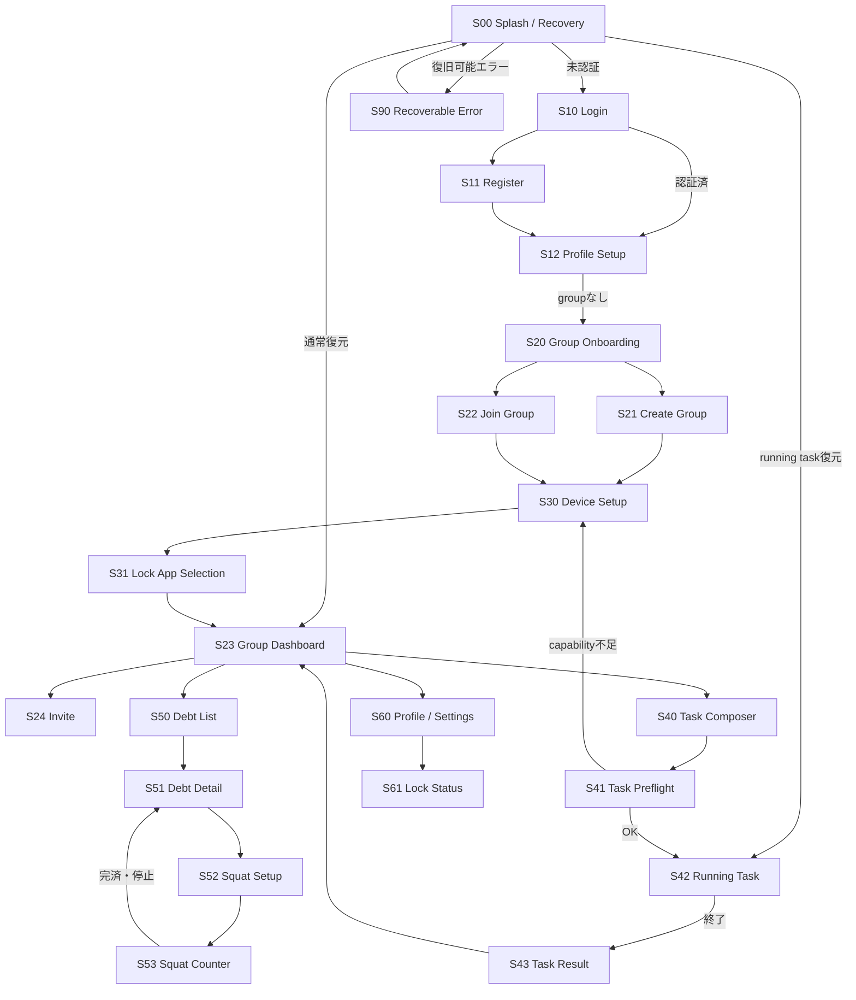
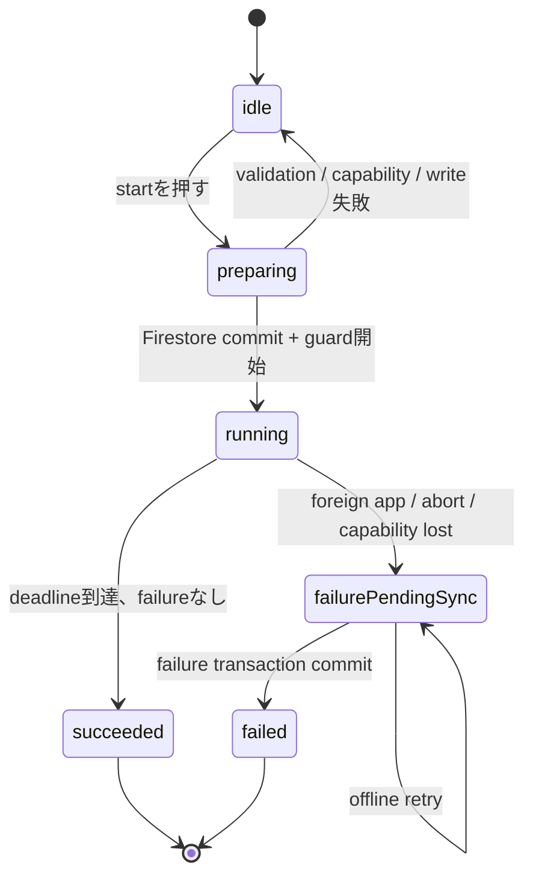
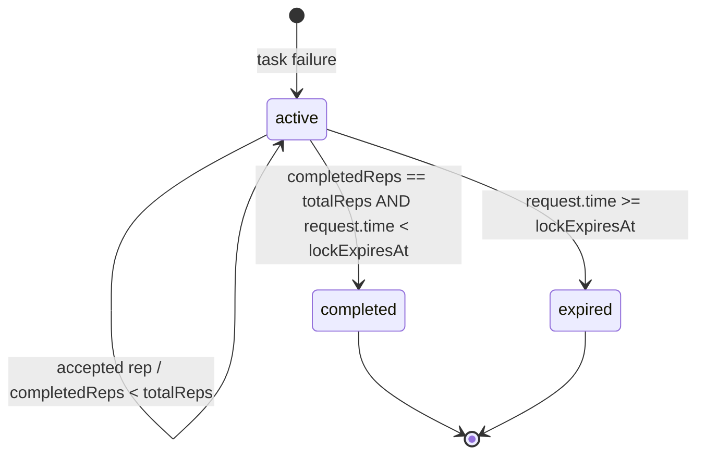
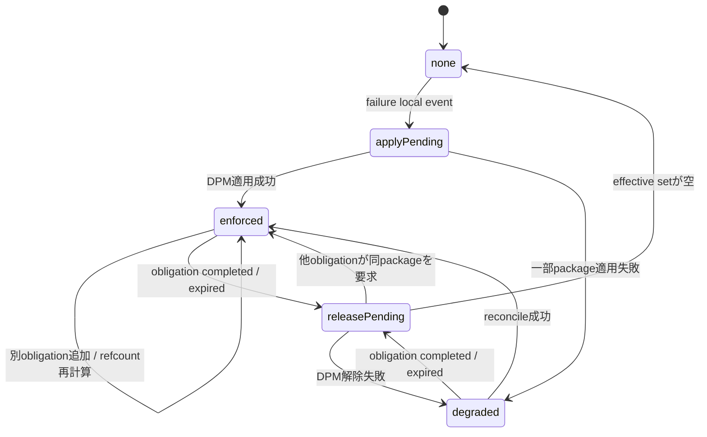
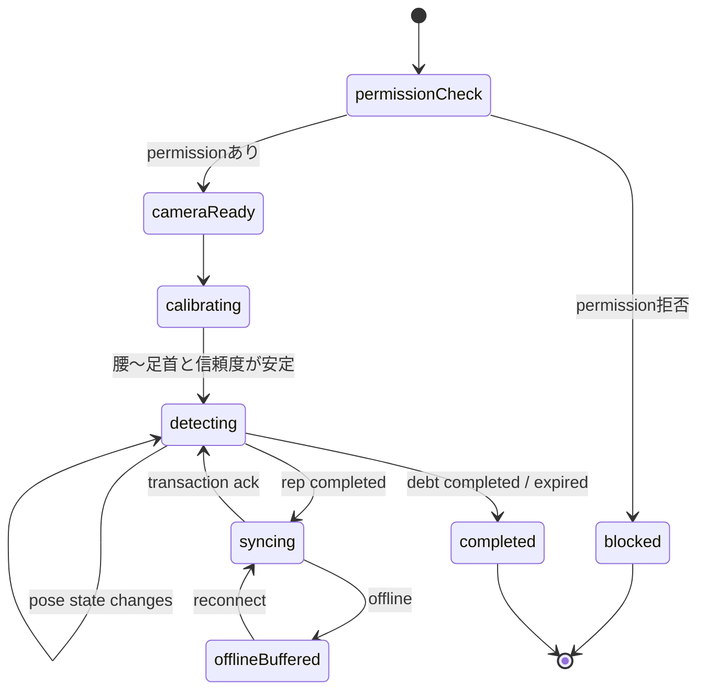

# 画面・状態遷移設計

## 1. 画面一覧

| ID | 画面 | 主な役割 |
|---|---|---|
| S00 | Splash / Recovery | auth、running Task、lock、outboxを復元 |
| S10 | Login | email/password login |
| S11 | Register | user登録 |
| S12 | Profile Setup | 表示名登録 |
| S20 | Group Onboarding | group作成または招待参加 |
| S21 | Create Group | group名入力 |
| S22 | Join Group | invite code入力 |
| S23 | Group Dashboard | members、active debts、invite |
| S24 | Invite | code表示・再発行・失効 |
| S30 | Device Setup | Device Owner、Usage Access、通知等のpreflight |
| S31 | Lock App Selection | lock可能アプリの選択 |
| S40 | Task Composer | 内容と時間入力 |
| S41 | Task Preflight | capabilityとnetwork確認 |
| S42 | Running Task | countdown、監視状態、中断 |
| S43 | Task Result | success / failure、作成Debt |
| S50 | Debt List | active / completed / expired |
| S51 | Debt Detail | 残回数、member別Contribution |
| S52 | Squat Setup | Debt確認、camera permission、撮影ガイド |
| S53 | Squat Counter | preview、姿勢state、検出/確定rep |
| S60 | Profile / Settings | profile、logout、device status |
| S61 | Lock Status | obligation別期限とeffective packages |
| S90 | Recoverable Error | offline、権限不足、再試行 |

## 2. 画面遷移

## 3. Task状態遷移

Firestoreへ保存する状態は `running`, `succeeded`, `failed`。`idle`, `preparing`, `failurePendingSync` はローカル状態である。

不変条件:

- terminalから別状態へ戻さない。
- `succeeded` と `failed` は同時に成立しない。
- deadlineとforeign eventが競合した場合、native event timestampがdeadline未満ならfailure、以上ならsuccess。
- Kotlinはローカルterminal eventを一度だけ決定し、Dartはそのeventを冪等に永続化する。

## 4. Debt状態遷移

`completed` と `expired` はterminal。deadline後のrep transactionは拒否する。期限と最後のrepが競合した場合はFirestore transactionとRulesの `request.time` で決定する。

## 5. ローカルLock状態

LockはDebt statusと同じenumにしない。CloudのDebtと端末OS policyは独立した収束対象であり、`Debt completed` でもDPM解除失敗ならLock画面に復旧エラーを表示する。

## 6. Squat画面状態

## 7. 画面別listener

| 画面 | listener | 上限 |
|---|---|---|
| app shell | `users/{uid}` | 1 doc |
| Group Dashboard | group、members、active debts | 1 + 40 + limit 20 |
| Running Task | user doc内pointer、task doc | userはapp shellと共有 + 1 |
| Debt Detail | debt、contributions | 1 + 40 |
| Lock Status | failedUserのactive debts | limit 20 + local state |
| Squat Counter | selected debt、contributions | 1 + 40 |

画面を離れたら不要listenerをdetachする。Debt Listのcompleted/expired履歴はrealtimeにせずページングgetを使う。

## 8. UXの重要表示

- Task開始前に「別アプリへ移動すると失敗」「画面OFFは失敗ではない」を明示する。
- Device Owner端末であることと管理権限の強さを説明する。
- lock対象ごとに「封印可能 / OS保護のため不可」を示す。
- Squat画面は膝角度の数値より「腰から足首を映す」「もう少し深く」「ゆっくり立つ」を優先する。
- offline時はローカル検出数とFirestore確定数を分ける。
- Debt完済でも他Debtによる封印が残る場合、「Debt A完済、Debt Bのため封印継続」と表示する。
- Rules拒否や競合を単なる「通信エラー」とせず、再読込で最新状態を提示する。
