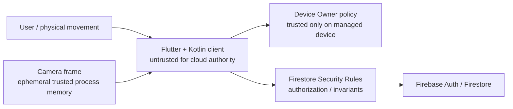

# セキュリティ・プライバシー設計

## 1. Security goals

- group外ユーザーにprofile、member、Task、Debtを公開しない。
- client writeでgroup人数、Debt量、aggregate、terminal stateを任意変更させない。
- カメラframe、pose画像、installed package inventoryを端末外へ出さない。
- 複数Debtの解除ミスで封印対象を早期解除しない。
- debug capability、Firebase Emulator、App Check debug tokenをProductionへ混入させない。
- 完全に防げない不正を「防げる」と表現しない。

## 2. Trust boundary

Rulesが信頼できるのは `request.auth`, `request.time`, existing/after documentsとrequest shapeである。次は信頼できない。

- clientが申告するdetectorType
- client wall clock
- clientがTask Guardを止めていないという申告
- clientが実際のスクワットを観測したという申告
- root / patched OS上のDevicePolicyManager結果

Phase 2のgroup作成・参加・退出・所有者移譲は、user/group/member/inviteのbefore/after-stateをRulesで結び、1ユーザー1groupと最大40人をclient UIに依存せず検証する。raw invite tokenはFirestoreへ保存しない。一方、raw tokenを受領した認証済みユーザーは期限内なら参加できるため、tokenはbearer credentialであり、転送された相手の本人性や招待受領者まではMVPで保証しない。

Phase 4のTask開始はTask documentと`users.activeTaskSessionId`、手動失敗はTask・user pointer・same-ID DebtをtransactionとRules after-stateで結ぶ。`request.time`でclient時刻の近傍とsuccess deadlineを検証するが、clientが内容・duration・手動failureを正直に送ることや、端末時計を±60秒の範囲で操作しないことまでは証明しない。Cloud FunctionsなしのMVPではこのtrust boundaryを受容し、Productionではtrusted backend、App Check / device attestation、server-issued start leaseを検討する。

Phase 5のTask GuardはUsageEvents履歴をKotlin process内だけで短時間評価する。native outboxは`eventId`、Task ID、terminal種別、発生時刻、reasonだけを保存し、foreground package名、class名、履歴、インストール済み一覧をDart・Firestore・analytics・Production logへ渡さない。Rulesはnative eventの真正性を検証できないため、patched clientがfailure reasonを偽装できる点はMVP trust boundaryである。

Phase 6はFirestoreでTask failureとsame-ID Debtが確定した後、Task開始時のnative package snapshotからDebt ID別obligationを作る。package一覧、DPMの失敗package名、owned suspensionはlocal DataStoreだけに保存し、Platform Channelは件数とtyped codeだけを返す。offline中はPhase 5 outboxを保持するが、cloud確定前にはlockしないため、network断中の即時強制は今回の要件選択では保証しない。

CameraXの`ImageProxy`はRGBA Bitmapへのcopy完了直後にcloseし、MediaPipe用`MPImage` / Bitmapはresult・error・stopの各pathでreleaseする。landmark、One-Euro Filter state、hip/knee gap、hip drop、FSM stateはsession memoryだけに保持する。Native→Dart契約はquality、FSM state、stable rep identity、集約latencyだけをfield allowlistで受け付け、frame、bitmap、landmark、skeleton座標の追加fieldを拒否する。Firestoreへ渡るのはPhase 8で定義済みの1 rep Contributionだけである。

Phase 10のdevice-protected boot snapshotにはactive lock obligationのstable ID、Task ID、選択済みpackage snapshot、絶対/elapsed期限、boot count、MICHIZURE-owned suspensionだけを保存する。全installed-app inventory、UsageEvents、Task本文、Auth情報、Camera / pose dataは複製しない。Recoveryは既存Rules対象のowner pointer、Task、Debtだけをserver sourceで読み、Rulesやwrite権限を広げない。Authの一時network failureではlogoutせず、恒久invalid credentialだけをtyped codeでsign outする。logoutはlock stateの削除理由にしない。

## 3. Threat model

| Threat | MVP対策 | 残余リスク / Production |
|---|---|---|
| 他group data取得 | membership Rules + scoped query | Rules bugをemulator test |
| memberCount改ざん | group/member/user atomic validation | Rules複雑性 |
| Debt量改ざん | Task/group snapshotと式をRules検証 | failure自体はclient生成 |
| aggregate二重加算 | deterministic event + transaction | 大量の一意fake event |
| total超過 | read-modify transaction + Rules | contention時のUX |
| deadline改ざん | request.time近傍と固定duration | Task native時刻はclient |
| Task Guard kill | local recovery / fail-closed | force-stop、DO解除、root |
| package早期解除 | obligation refcount + reconcile | app data消去、root |
| installed apps漏洩 | local only、ログ禁止 | OS backup方針要確認 |
| camera漏洩 | no capture/storage/network path | crash dump / third-party SDK禁止 |
| invite推測 | 128-bit raw token + SHA-256 ID | token受領者による共有 |
| debug build悪用 | flavor分離、Production rules拒否 | demo projectは非Production |
| quota exhaustion | limit、listener lifecycle、App Check | authenticated abuseはbackend rate limitが必要 |

## 4. Authentication / authorization

- email/passwordのcredentialをアプリで保存しない。Firebase Auth SDKへ委譲する。
- email verificationはハッカソンMVPで任意、Productionではgroup参加前に必須化を検討する。
- password resetはFirebase標準flowを使う。
- logoutしてもnative lock obligationは削除しない。
- UIのrole表示は認可ではない。全操作をRulesで再検証する。
- owner/member roleはgroup member docだけをauthorityとする。

## 5. App Check

MVP:

- Local Emulator SuiteではApp Check enforcementを使用しない。
- live debug projectではFlutter App Check debug providerを使い、tokenを各開発者がFirebase Consoleへ個別登録する。
- debug tokenをcommit、chat、screenshotへ含めない。

Production:

- Android Play Integrity providerを有効化し、Firestore/Auth対応範囲でenforcementする。
- enforcement前にmetricsを観測して正規clientをblockしないことを確認する。
- App Checkは認証やRulesの代替ではなく、改変clientを完全には防がない。

## 6. データ分類

| Data | 分類 | 保存場所 | 保持 |
|---|---|---|---|
| uid、displayName | user data | Firebase | account lifetime |
| email/password | authentication data | Firebase Auth | Firebase policy |
| group membership | social graph | Firestore | group/account lifetime |
| Task content | potentially sensitive | Firestore、本人readのみ | MVP indefinite |
| failed user / Debt | group-visible behavior | Firestore | MVP indefinite |
| Contribution summary / immutable event | group-visible fitness count / operational metadata | Firestore | MVP indefinite |
| pending Contribution event | operational metadata（uid、Debt ID、event ID、1 rep、時刻） | Android local DataStore | server ack / terminal rejectまで |
| installed package names | sensitive app inventory | native local only | selection / obligation lifetime |
| foreground UsageEvents | sensitive usage history | Kotlin process memory only | polling windowの判定完了まで |
| pending Task terminal event | operational metadata | native local DataStore | Firestore ackまで |
| camera frame | highly sensitive | process memory only | frame処理完了まで |
| pose landmarks | biometric-adjacent derived data | process memory only | state updateまで |
| aggregate gap/drop/state | ephemeral fitness telemetry | memory、debug test only | session |
| crash logs | operational | local / approved crash service | package/frameをredact |

Task内容をgroup memberへ公開しない。groupにはfailure userとDebtだけを表示する。

Contribution Eventへ保存するのはuid、Debt配下のevent identity、1 rep、detector version、最小時刻だけである。画像、動画、landmark、package名、Usage history、Task内容は保存しない。Rulesはcurrent group member本人の正規transactionだけを許可するが、改変clientが`detectorType=mlkit`を名乗ることまではMVPで防止できない。ProductionではApp Checkに加えてtrusted attestation / server-side verificationを検討する。

## 7. Camera privacy controls

- CameraX `ImageProxy` はMediaPipe投入前のRGBA copy完了時に必ずcloseし、`MPImage`はasync callback完了までだけ保持する。
- screenshot、recording、frame file、thumbnailを実装しない。
- raw landmark配列をFirestore、analytics、crash reportへ送らない。
- OpenAI API、Cloud Storage、custom endpointへの画像network pathを作らない。
- Squat画面に端末内処理と非保存を明示する。
- debug prerecorded inputはrepository内のtest fixtureだけにし、実ユーザー撮影データをfixture化しない。
- Productionの画面録画対策としてSquat Activity / windowへの`FLAG_SECURE`をprivacy UXと両立するか検討する。

## 8. Installed app privacy

- package inventoryはPlay policy上もsensitive dataとして扱う。
- `LauncherApps`から得たlaunchable app catalogをnetworkへ送らない。debug / releaseとも`QUERY_ALL_PACKAGES`は宣言しない。
- FirestoreのDebtにはpackage名やカテゴリを持たせない。
- local DataStoreはapp sandboxに置き、Phase 3で`android:allowBackup="false"`としてcloud / device backup対象外にする。
- ログは件数と結果codeだけにし、package名を出す場合はローカルdebug buildに限定する。
- Production Play配布でもscoped launcher visibilityを維持する。将来broad visibilityが必要になった場合だけ、用途とPlay policyを別途審査する。

## 9. Secret / configuration policy

commit禁止:

- service account JSON
- private key、OAuth client secret
- App Check debug token
- Firebase CLI login token
- signing keystore / password
- `.env`、`.env.*` の実値
- live projectのCI secret

Firebase `apiKey`, `google-services.json`, `firebase_options.dart` の識別子は単独でserver secretではないが、環境混線を避けるため次のrepository policyを採用する。

- `demo-*` Emulator用の非機密config / exampleだけ追跡可能。
- liveの `google-services.json` と生成configはgitignoreし、ローカルまたはCIで注入する。
- API keyには利用可能なAPI restrictionを設定する。
- configが漏れてもRules / App Checkでdataを守る。

`.env.example` はkey名とdummy値だけを持ち、secret値を含めない。

## 10. Logging

structured logに許可:

- opaque task/debt/event IDの短縮hash
- state transition名
- duration、latency bucket
- error code
- count（package名なし）

禁止:

- auth token、email、invite raw token
- Task content
- package name / installed inventory
- bitmap、ImageProxy、landmark全列
- full Firestore document
- App Check debug token

Productionではlog retention、access role、削除手順を定義する。

## 11. Lock safety

- obligationをDebt ID別に保存し、単純boolean lockを使わない。
- apply / releaseのDPM戻り値にある失敗package一覧を必ず処理する。
- effective setとの差分以外をunsuspendしない。
- MICHIZURE自身とOS必須packageをsuspendしないhard-coded denylist + dynamic capability checkを持つ。
- logout、app update、Activity終了を解除条件にしない。
- deadline後はネットワークなしでも解除するが、同一bootはelapsed clockを併用して壁時計巻き戻しを検出する。
- rollback不能なDevice Owner操作やfactory resetをアプリから行わない。

## 12. Incident responseの最低線

- Firebase Rulesを即時denyへ戻せる手順を用意する。
- invite token漏洩はrevokeして再発行する。
- App Check debug token漏洩はConsoleからrevokeする。
- config誤投入はbuild flavor / project IDを起動時に検査して停止する。
- lock解除不能時はMICHIZURE内の診断画面と、デモ端末をfactory resetする運用手順を用意する。
- camera dataが保存・送信された疑いがあれば該当build配布停止、ログ/SDK経路調査、データ削除を優先する。

## 13. Production gap

- trusted backendとdevice attestationを組み合わせても「正しいスクワット」の完全証明は難しい。
- deletion/export/consent/privacy policyが未実装。
- DPCの強い管理権限に対する明示consentと組織管理責任が必要。
- rooted device、ADB access、custom ROM、runtime instrumentationへの耐性はMVP外。
- Play policy審査は技術実現性とは別のrelease gateである。

## 14. 公式資料

- [App Check debug provider for Flutter](https://firebase.google.com/docs/app-check/flutter/debug-provider)
- [Android package visibility](https://developer.android.com/training/package-visibility)
- [Google Play QUERY_ALL_PACKAGES policy](https://support.google.com/googleplay/android-developer/answer/10158779)
- [Firebase Security Rules conditions](https://firebase.google.com/docs/firestore/security/rules-conditions)
