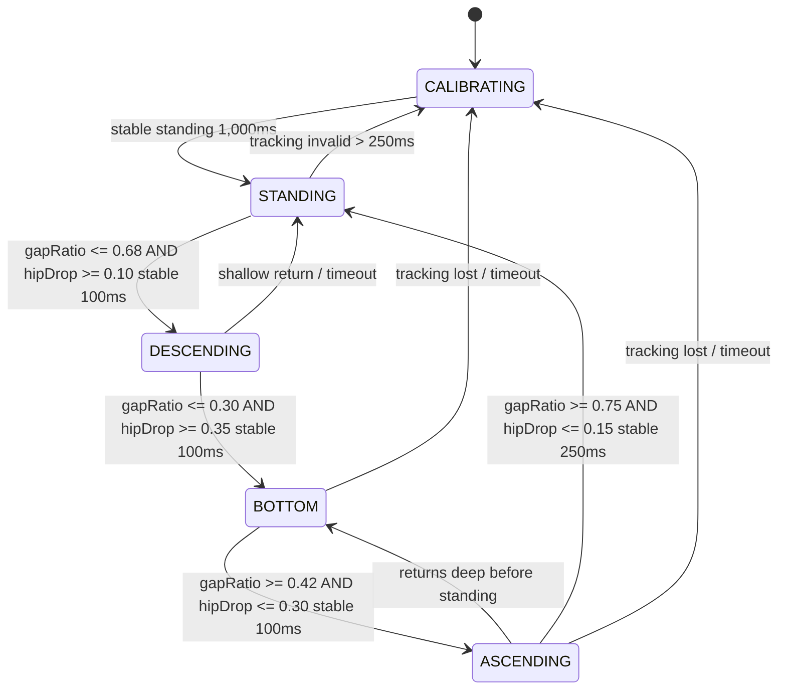

# スクワット判定設計

## 1. 結論

CameraX `Preview` + `ImageAnalysis`、MediaPipe Pose Landmarker Liteの`LIVE_STREAM`、One-Euro Filter、Kotlinの決定的な状態機械を使用する。SDK移行の判断とartifact metadataは[ADR 0005](adr/0005-mediapipe-pose-landmarker.md)をauthorityとする。

```text
STANDING
  → DESCENDING
  → BOTTOM
  → ASCENDING
  → STANDING
  = 1 accepted local rep candidate
```

MediaPipeは33ランドマークを返すが、スクワットという意味やrep数は返さない。MVPのProduction判定は、同じ側のhip / kneeから求めたstanding gapに対するgap ratioとhip drop、安定時間、ヒステリシスを使用する。単一frameだけではcountしない。

OpenAI APIは使用しない。MediaPipe Lite modelをassetへ同梱して完全に端末内で推論し、runtime downloadや画像外部送信を行わない。

## 2. Processing pipeline

```mermaid
flowchart LR
    Camera["CameraX Preview + ImageAnalysis"]
    Frame["Throttled latest RGBA ImageProxy"]
    ML["MediaPipe Pose Landmarker Lite<br/>LIVE_STREAM"]
    Quality["Landmark Quality Gate"]
    Filter["One-Euro Filter"]
    Feature["Hip/knee gap ratio + hip drop"]
    FSM["Squat FSM"]
    Event["repCompleted event"]
    Flutter["Flutter UI / Contribution use case"]
    Firestore["Firestore transaction"]

    Camera --> Frame --> ML --> Quality --> Filter --> Feature --> FSM --> Event --> Flutter --> Firestore
    Frame -. close after Bitmap copy .-> Camera
```



frame、bitmap、landmark全列はPlatform Channelへ流さない。KotlinからDartへ送るのは低頻度のquality/state/rep eventだけ。

## 3. CameraX構成

| Setting | MVP |
|---|---|
| Camera | front camera preferred、rear fallback |
| Orientation | portrait |
| Image format | `RGBA_8888` |
| Analysis resolution | 480×640前後をrequest、deviceの選択結果を許容 |
| Backpressure | `STRATEGY_KEEP_ONLY_LATEST` |
| Queue | 実質1、古いframeをdrop |
| Lifecycle | Squat画面のnative lifecycle ownerへbind |
| Preview | 3:4 Flutter `AspectRatio`内のnative `SquatCameraContainer` |
| Analyzer thread | single dedicated executor |

Analyzerは重いBitmap copy前にGPU 15 FPS / CPU 10 FPSへthrottleし、1 frame推論中に次frameをqueueへ積まない。skip / success / failureのすべてのpathで`ImageProxy.close()`し、MPImageとBitmapはasync callbackまでpending 1件だけ保持する。

Flutterはportrait 3:4の`AndroidView`を1つだけ保持する。Native側は同一`FrameLayout`のmatch-parent childとして`PreviewView`と`SquatGuideOverlayView`を重ね、`PreviewView.ScaleType.FIT_CENTER`、`ImplementationMode.COMPATIBLE`を使用する。PreviewとAnalysisは同じCameraX `ViewPort`へbindする。overlay点は`ImageProxyTransformFactory`と`CoordinateTransform`でAnalysis座標から`PreviewView.outputTransform`へ写し、front previewのmirrorをViewer座標にだけ適用する。解剖学的left/rightは推論入力の定義を維持する。

みぞおちから膝下までが十分なpixel数を占める撮影ガイドを表示し、少し横向きの姿勢を案内する。顔、肩、腕、足首、全身高はProduction quality gateの必須条件ではない。MediaPipe公式model cardはfull-body cropを推奨しhead非表示をout-of-scopeとしているため、この部分画角での成立率は実camera manual gateで必ず測定し、未測定の性能を達成済みとしない。

## 4. MediaPipe構成

- `com.google.mediapipe:tasks-vision:1.0.0`
- `pose_landmarker_lite.task`をuncompressed assetとして同梱
- `RunningMode.LIVE_STREAM`
- `numPoses=1`
- `outputSegmentationMasks=false`
- GPU delegate優先、初期化失敗時はCPUへ1回だけfallback
- normalized x/y、`visibility`、`presence`をadapterでhip / kneeと任意のankleへ縮約
- world landmarkはMVPの必須判定へ使わない

LandmarkerはCamera sessionごとに1 instanceだけ生成する。初期化と`detectAsync`は同じ専用single threadで行い、frameごとにCoroutineやLandmarkerを作らない。

## 5. Landmark

Pose SDK adapterはSDK固有型を次のmodel-independent表現へ縮約する。

```text
LowerBodyPose
  left:  hip / knee / optional ankle
  right: hip / knee / optional ankle
  confidence / timestamp / frame size
```

片側featureに必須なのは同じ側のhip / kneeだけである。ankleはdebug観測用の補助情報であり、顔・肩・腕・足首がなくても通過できる。左右それぞれについてqualityを計算する。

```text
landmarkConfidence = min(visibility, presence)
sideConfidence = min(hip, knee landmarkConfidence)
```

使用side:

1. 左右両方がthreshold以上ならconfidenceが高い側
2. 片側だけならその側
3. 両側とも不足ならtracking invalid

左右の一方だけに急に切り替わらないよう、current sideへ500msのstickinessとconfidence差0.10のswitch marginを持たせる。

## 6. Feature

calibrationで同じ側のhip / knee縦間隔をstanding baselineにする。画像yは下方向。

```text
standingGap = standingKneeY - standingHipY
gapRatio = (currentKneeY - currentHipY) / standingGap
hipDrop = (currentHipY - baselineHipY) / standingGap
```

`gapRatio <= 0.30`はhip / knee bandの重なりに近い深さ、`hipDrop >= 0.35`は腰がbaselineから十分下降したことを表す。BOTTOMには両方が必要であり、前屈のようにhipだけ下がる動作や、gapだけ縮むnoiseでは進まない。

Production必須条件からknee angle、angular velocity、hip velocity、shoulder、full-body heightを外す。これらを再導入する場合は、実Cameraで必要性を確認してからversioned configとtestを更新する。timestampは同一pipelineの`SystemClock.elapsedRealtimeNanos()`から単調増加msを作り、wall clockや未確認のCameraX timestamp timebaseと混在させない。

## 7. Smoothing

左右それぞれのhip / kneeと任意のankle x/yへOne-Euro Filterを適用してからfeatureを計算する。初期値は`minCutoff=1.0`、`beta=0.02`、`derivativeCutoff=1.0`で、固定FPSを仮定せずtimestamp差を使う。左右は独立filterとし、side切替で別脚の履歴を混ぜない。pose loss、逆順timestamp、500ms超gap、session終了ではresetする。

FSM側でEMAを重ねず、calibration median、時間条件とhysteresisをdebounce authorityにする。設定値は`SquatDetectorConfig mediapipe-lite-hip-knee-v4`へ集約する。

## 8. Quality gate

初期値:

| Check | Threshold |
|---|---:|
| essential landmark likelihood | `>= 0.65` |
| valid side | 左右いずれかの同じ側のhip / kneeがvalid |
| calibration standing gap | frame高に対して`>= 0.12` |
| side stickiness | `500ms`、switch confidence margin `0.10` |
| frame gap | `<= 250ms` |
| invalid tracking grace | `<= 250ms` |
| calibration stable time | `>= 1,000ms` |

quality warning:

- `noPoseDetected`
- `hipUnavailable`
- `kneeUnavailable`
- `lowLightOrConfidence`
- `holdStillToCalibrate`
- `cameraUnavailable`

`numPoses=1`であるため、複数人が写ると対象が切り替わり得る。撮影範囲には1人だけ入り、みぞおちから膝下までを映すことを必須ガイドにする。

tracking invalidが250ms以内ならFSMをfreezeし、250msを超えたら進行中repを破棄して`CALIBRATING`へ戻す。

## 9. Calibration

開始時に安定立位を1秒以上保持する。

calibration条件:

- hip / knee gapがframe高の12%以上
- hip y drift / standing gapが3%以内
- gap drift / standing gapが10%以内
- quality gate pass
- 同じsideで複数sampleが安定

保存するsession-local baseline:

- standing hip y median
- standing hip / knee gap median
- selected side preference

画像やraw landmarksは保存しない。calibrationはSquat sessionを閉じたら破棄する。

## 10. 状態機械



### 10.1 Initial thresholds

| Transition | Condition |
|---|---|
| standing enter | gap ratio `>=0.75`、hip drop `<=0.15`、stable 250ms |
| standing exit | gap ratio `<=0.68`、hip drop `>=0.10`、stable 100ms |
| bottom enter | gap ratio `<=0.30`、hip drop `>=0.35`、stable 100ms |
| bottom exit | gap ratio `>=0.42`、hip drop `<=0.30`、stable 100ms |
| full rep duration | 800〜6,000ms |
| descending minimum | 200ms |
| ascending minimum | 200ms |
| range of motion | gap compression `>=0.65`かつmaximum hip drop `>=0.35` |
| refractory | count後500ms |

閾値間のgapがヒステリシスである。例: bottomはgap ratio 0.30以下で入り、0.42以上かつhip drop 0.30以下になるまで出ない。境界付近のjitterでstateが往復しない。

これらは初期値であり、合成テスト、複数体格・撮影角度の実機testからversioned configとして調整する。ユーザー別に無制限な自動学習はMVPで行わない。

## 11. 1 repの確定条件

ASCENDINGからSTANDINGへ戻る時点で、次をすべて満たせばlocal repを1増やす。

- このcycleがSTANDINGから開始
- DESCENDINGとBOTTOMを順に通過
- minimum bottom depthを満たす
- gap compression >= 0.65
- maximum hip drop >= 0.35
- total duration 800〜6,000ms
- descending / ascending各200ms以上
- tracking invalidの連続が250ms以下
- cycleのvalid frame ratio >= 80%
- 前回countから500ms以上

満たさなければstateはSTANDINGへ戻るがcountしない。quality reasonをUIへ送る。

## 12. 誤検出対策

| 誤検出 | 対策 |
|---|---|
| 各frameをcount | 状態cycle完了時だけcount |
| 膝の小さなbounce | bottom gap + hip drop + ROM |
| bottom付近のjitter | hysteresis、BOTTOMから直接countしない |
| 立位付近の揺れ | stable 250ms、refractory |
| 急なlandmark teleport | One-Euro、frame gap、invalid rep |
| 一瞬の遮蔽 | 250ms grace |
| 長い遮蔽 | rep破棄、recalibrate |
| しゃがんだ状態から開始 | stable standing calibration必須 |
| 椅子へ座る | gap / hip drop / tempo / ROMで低減。完全防止はMVP外 |
| 前屈 | gap compressionとhip dropのANDで除外 |
| 別人へtracking switch | 1人ガイド、body scale/center discontinuityでrep破棄 |
| 左右side switch | confidence hysteresis / stickiness |
| 低FPS | frame gap gate、時間条件、latest frame |

## 13. Detector contract

Dart Domain port:

```dart
abstract interface class SquatDetector {
  Stream<SquatDetectorEvent> get events;
  Future<void> start(SquatDetectorSession session);
  Future<void> stop();
}
```

Event概念:

```text
CalibrationChanged
PoseQualityChanged
SquatStateChanged
RepCompleted
DetectorFailed
```

`RepCompleted`:

```text
eventId
squatSessionId
sequence
detectorType
detectorVersion
frameObservedElapsedMs
uiEmittedElapsedMs
```

画像、package、landmark列を含めない。

## 14. Debt Contribution連携

1. Squat session開始時にDebt IDと現在remainingを固定表示する。
2. native repごとにDart outboxへdeterministic eventを追加する。
3. 同一ユーザーのeventをsequence順にFirestore transactionへ送る。
4. transaction ackが1ならconfirmed repを増やす。
5. 既存event、Debt完済、期限切れならack 0としてpendingを解消する。
6. Debt snapshotがcompleted / expiredならdetectorをstopする。

offline:

- detectionは現在cacheのremainingまで継続可能。
- `confirmed + pending >= cached remaining` でpauseし、同期を促す。
- 他memberが先に完済していれば再接続時に余剰eventはaccepted 0。
- pendingを完済表示に含めない。

## 15. Debug / Emulator input

3段階のsourceをDIする。

| Source | Build | 用途 |
|---|---|---|
| `CameraMediaPipePoseSource` | debug / release | 本番CameraX + MediaPipe Lite |
| `SyntheticLandmarkPoseSource` | debug / testのみ | production FSMへ決定的landmark列 |
| `FakeSquatDetector` | debug / testのみ | end-to-endデモでbutton / timer rep |

安全策:

- `BuildConfig.DEBUG` とdebug source setでcompile分離
- release variantからclass / route / channel commandを除外
- Contribution `detectorType=fake_debug`
- production Rulesはfake_debug拒否
- fakeを有効にすると画面へ常時DEBUG banner
- production state machine codeをFakeのために分岐させない

Emulator cameraの選択:

1. host webcam passthrough
2. Extended ControlsのVirtual Scene
3. synthetic landmark source
4. high-level FakeSquatDetector

pre-recorded人動画をappへ組み込む案は、再生→CameraX inputの経路が複雑でcodec差もあるためMVPの第一選択にしない。必要ならandroidTest assetだけでoffline testし、実ユーザー動画を使用しない。

## 16. Latency budget

目標: CameraX frame timestampからUI resultまでp95 500ms。

| Stage | p95 budget |
|---|---:|
| Camera delivery / throttle | 50ms |
| MediaPipe inference | 100ms |
| feature + FSM | 30ms |
| rep EventChannel + Riverpod UI | 120ms |
| margin | 100ms |
| **Total** | **400ms** |

Firestore確定は別metric。UIはlocal detected repを500ms以内に表示し、confirmed stateを別表示する。

計測:

- analyzer受信、前処理開始、MediaPipe投入 / callbackの`elapsedRealtimeNanos`
- FSM emit elapsed
- Dart receiveはNativeとは別clock domainとして記録
- first rendered frame callback

PIIやlandmarkをmetricへ含めない。Emulatorはhardware acceleration / host負荷に左右されるため、Fake pathだけで性能達成と主張せず、実機またはwebcam pathでも測定する。

## 17. Performance controls

- `STRATEGY_KEEP_ONLY_LATEST`
- in-flight MediaPipe requestは1つ
- Lite bundle + `LIVE_STREAM`
- 低めのanalysis resolution
- overlay renderingをanalysis FPSから間引く
- JPEG encode/decodeは行わず、公式sampleと同じRGBA→ARGB Bitmap copyを1回だけ行う
- landmarkをDartへ送らない
- analyzer executorをUI threadから分離
- detectorをSquat画面外でclose
- thermal / slow frameをdiagnostic warning

## 18. Test strategy

### Pure Kotlin unit

synthetic feature sequence:

- valid slow / normal / fast squat
- boundary gap jitter
- shallow squat
- double bounce at bottom
- tracking loss 100ms / 300ms
- start at bottom
- too-fast 500ms / too-slow 7s
- left/right confidence switch
- timestamp gap / out-of-order
- 100 cyclesでexact count

### Analyzer integration

- fake Pose object / landmark adapter
- rotation、front mirror
- ImageProxy close on success/failure
- latest-frame backpressure
- detector error recovery

### Instrumentation

- Camera permission
- PlatformView lifecycle
- synthetic sourceがreleaseで選択不可
- EventChannel reconnect
- p95 instrumentation

### Field evaluation

明示consentを得たローカルtestで、画像保存せずcount結果だけを手動ground truthと比較する。

- 体格、服装、照明
- front / slight side angle
- camera distance
- slow / normal tempo
- partial occlusion

評価:

- rep precision / recall
- double-count rate
- false-positive reps per minute
- p50/p95 latency
- calibration success rate

## 19. Known limitations

- 2D angleはcamera angleで変化する。
- MediaPipeのGPU delegate可否と実測latencyは端末・driverに依存する。
- 1人だけを検出する。
- 椅子への着座等、同じ関節軌跡を完全には区別できない。
- client内判定は改変appからspoof可能。
- Emulator camera性能は実機を代表しない。

Productionで精度不足が確認された場合、まずon-deviceの個人calibration、feature改善、TFLite分類器を検討する。画像外部送信やOpenAI APIは要件変更とprivacy reviewなしに提案しない。

## 20. 公式資料

- [MediaPipe Pose Landmarker overview](https://developers.google.com/edge/mediapipe/solutions/vision/pose_landmarker/index)
- [MediaPipe Pose Landmarker Android](https://developers.google.com/edge/mediapipe/solutions/vision/pose_landmarker/android)
- [BlazePose GHUM 3D model card](https://storage.googleapis.com/mediapipe-assets/Model%20Card%20BlazePose%20GHUM%203D.pdf)
- [CameraX image analysis](https://developer.android.com/media/camera/camerax/analyze)
- [ImageAnalysis analyzer lifecycle](https://developer.android.com/reference/androidx/camera/core/ImageAnalysis.Analyzer)

## 21. Phase 9実装結果

- CameraX `1.6.1`のfront優先 / rear fallback、`Preview` + `ImageAnalysis`、480×640近傍、`STRATEGY_KEEP_ONLY_LATEST`を採用した。
- MediaPipe Tasks Vision `1.0.0`と公式Pose Landmarker Lite bundleを使用する。
- analyzerは専用single executor、事前FPS gate、pending 1件を使い、skip、result、error、stopの全経路でImageProxy / MPImageをreleaseする。
- `SquatDetectorConfig.VERSION = mediapipe-lite-hip-knee-v4`にthresholdとOne-Euro parameterを集約した。adapter、filter、特徴量、calibration、FSMはCamera APIから分離したpure Kotlinである。
- `squat_control/v1`、`squat_events/v1`、`pose_preview/v1`を実装した。Dart adapterはtype別field allowlistを検証し、画像・landmarkに相当するextra fieldを拒否する。
- session IDは18 random bytesのhex、repはnativeのmonotonic sequenceを使用し、Firestore event IDはPhase 8の`${uid}_${squatSessionId}_${sequence}`へ変換する。
- route離脱、ユーザー終了、terminal Debtではnative sessionを停止する。background / foregroundはCameraXのActivity lifecycle bindingへ従う。
- debug source setだけに数値の`SyntheticLandmarkPoseSource`を置く。release Kotlin compile graphには含めず、Production UIにfake commandやsource selectorを追加しない。

実カメラ精度とp95は撮影環境に依存するため、Emulatorの合成系列だけで達成を主張しない。Event payloadの`analysisLatencyMs`とnative sessionの直近300 sample p95により、webcamまたは実機で計測する。

## 22. 最終デモ修正: lower-body input

最初のlower-body修正では旧全身quality gateを外したが、実CameraではML Kitのframe投入頻度、平滑化遅延、画面全体のdiagnostics rebuildが残り、実用的にstateが進まなかった。Production pose SDKをMediaPipe Liteへ移し、解析FPSとFlutter event頻度を明示的に分離した。

修正後のdata flow:

```text
CameraX RGBA ImageAnalysis
  -> MediaPipe Pose Landmarker Lite
  -> MediaPipePoseAdapter
  -> LowerBodyPose (hip / knee必須、ankle任意)
  -> One-Euro Filter
  -> PoseFeatureExtractor
  -> SquatStateMachine
```

- ProductionはMediaPipe Pose Landmarker Liteのみを実行し、ML Kit Pose dependencyは含めない。
- 公式model cardの制約から、顔なしlower-body frameでのpose成立率はhost webcamまたは物理端末のmanual gateで測る。
- Native camera viewはportrait 3:4の1つの`FrameLayout`へPreviewとguideを重ねる。Flutterは1つの`AndroidView`だけを保持し、diagnostics更新で再生成しない。
- PreviewとAnalysisを同じCameraX `ViewPort`へbindし、native hip / knee bandだけをCameraX `CoordinateTransform`でPreview座標へ変換して最大10 FPSで描画する。
- Production quality gateは同じ側のhip / kneeだけを必須とし、no pose、hip missing、knee missing、confidence不足を区別する。
- calibrationのstanding hip / knee gapをauthorityに、gap ratioとhip dropのANDでBOTTOMを判断する。angle、velocity、ankle、shoulder、full-body heightはProduction必須条件にしない。
- debug buildだけ、200msに1回以下でpose有無、tracking status、選択side、左右hip/knee/ankle confidence、normalized gap、normalized hip drop、FSM state、reject reason、latency、accepted/rejected countをUIへ送る。
- debug diagnosticsに画像、frame、landmark座標は含めない。releaseではnative event生成とFlutter cardの双方を無効化する。
- synthetic testは顔・肩なし、片側のみ、欠損、confidence不足、浅い屈伸、jitter、bounce、pose loss、duplicate frame、1回および10回の正常cycleを検証する。

host webcamのmanual gateではPreview / guide bounds、pose detected rate、hip / knee confidence、calibration成立、正常3回exact count、浅い3回reject、latency sample数 / p50 / p95 / maxを記録する。測定前はp95 500ms達成や部分画角の実Camera精度を完了扱いにしない。
