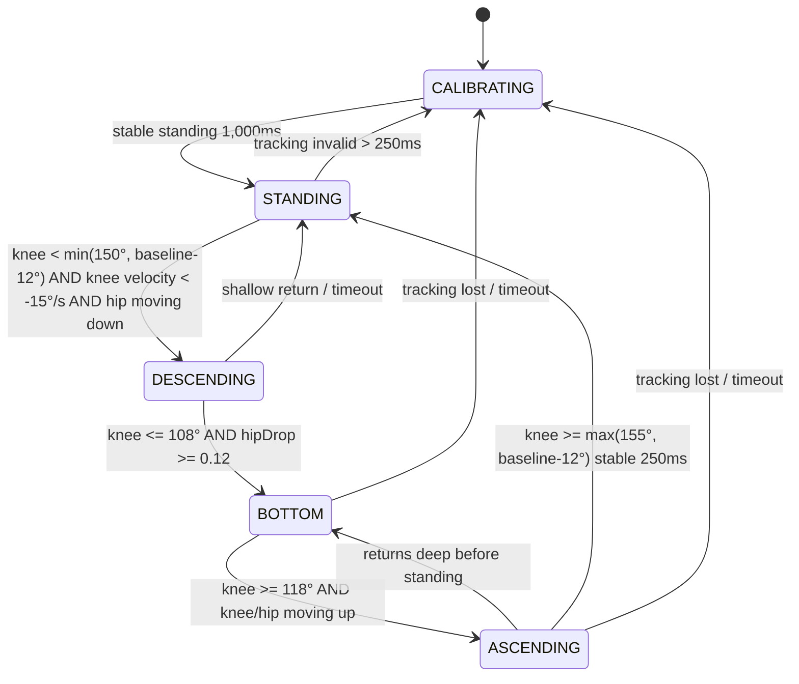

# スクワット判定設計

## 1. 結論

CameraX `Preview` + `ImageAnalysis`、ML Kit Pose Detection base SDKの`STREAM_MODE`、Kotlinの決定的な状態機械を使用する。

```text
STANDING
  → DESCENDING
  → BOTTOM
  → ASCENDING
  → STANDING
  = 1 accepted local rep candidate
```

ML Kitは33ランドマークを返すが、スクワットという意味やrep数は返さない。膝・股関節角度、hip drop、速度、信頼度、安定時間、ヒステリシスからアプリが判定する。

OpenAI APIは使用しない。端末内ML Kitで必要なランドマークとリアルタイム性能が得られ、外部送信はprivacy、latency、cost要件に反する。

## 2. Processing pipeline

```mermaid
flowchart LR
    Camera["CameraX Preview + ImageAnalysis"]
    Frame["Latest YUV ImageProxy"]
    ML["ML Kit Pose Detector<br/>STREAM_MODE"]
    Quality["Landmark Quality Gate"]
    Feature["Angle / velocity / hip-drop features"]
    Smooth["Median + EMA smoothing"]
    FSM["Squat FSM"]
    Event["repCompleted event"]
    Flutter["Flutter UI / Contribution use case"]
    Firestore["Firestore transaction"]

    Camera --> Frame --> ML --> Quality --> Feature --> Smooth --> FSM --> Event --> Flutter --> Firestore
    ML -. close in completion .-> Frame
```



frame、bitmap、landmark全列はPlatform Channelへ流さない。KotlinからDartへ送るのは低頻度のquality/state/rep eventだけ。

## 3. CameraX構成

| Setting | MVP |
|---|---|
| Camera | front camera preferred、rear fallback |
| Orientation | portrait |
| Image format | `YUV_420_888` |
| Analysis resolution | 480×640前後をrequest、deviceの選択結果を許容 |
| Backpressure | `STRATEGY_KEEP_ONLY_LATEST` |
| Queue | 実質1、古いframeをdrop |
| Lifecycle | Squat画面のnative lifecycle ownerへbind |
| Preview | PlatformView / native PreviewView |
| Analyzer thread | single dedicated executor |

Analyzerは1 frame処理中に次frameをML Kitへ重複投入しない。success / failure / completionのすべてのpathで`ImageProxy.close()`する。

腰から足首までが十分なpixel数を占める撮影ガイドを表示し、少し横向きの姿勢を案内する。高解像度化よりlatest frameの低遅延を優先する。ML Kit公式資料上はpose初期検出に顔が写ることを推奨しているため、「顔なし・下半身だけ」の成立率は実camera manual gateで必ず測定し、未測定の性能を達成済みとしない。

## 4. ML Kit構成

- base `pose-detection` SDK
- `PoseDetectorOptions.STREAM_MODE`
- bundled model
- 1人だけを対象
- `inFrameLikelihood`をconfidenceとして利用
- x/yを主に使い、experimentalなzはMVPの必須判定に使わない

accurate SDKは座標精度が必要な場合の比較対象だが、MVPのp95 500msとEmulator動作を優先してbaseを採用する。beta APIのためdependency updateごとにcompatibility testを実行する。

## 5. Landmark

Pose SDK adapterはSDK固有型を次のmodel-independent表現へ縮約する。

```text
LowerBodyPose
  left:  hip / knee / ankle
  right: hip / knee / ankle
  confidence / timestamp / frame size
```

片側featureに必要なのはhip / knee / ankleだけで、顔・肩・腕は必須にしない。左右それぞれについてqualityを計算する。

```text
sideConfidence =
  min(hip, knee, ankle inFrameLikelihood)
```

使用side:

1. 左右両方がthreshold以上ならconfidenceが高い側
2. 片側だけならその側
3. 両側とも不足ならtracking invalid

左右の一方だけに急に切り替わらないよう、current sideへ500msのstickinessとconfidence差0.10のswitch marginを持たせる。

## 6. Feature

### 6.1 2D joint angle

3点 `A - B - C` のB角度:

```text
u = A - B
v = C - B
angle = acos(clamp(dot(u,v) / (|u||v|), -1, 1)) × 180 / π
```

- knee angle: `hip - knee - ankle`

直立に近いほど180°、屈曲するほど小さくなる。zero-length vectorはinvalid。

### 6.2 Normalized hip drop

calibration時のstanding hip yとleg lengthを基準にする。画像yは下方向。

```text
legLength = distance(hip, knee) + distance(knee, ankle)
hipDropRatio = (currentHipY - standingHipY) / legLength
```

camera距離に依存するpixel値ではなくratioにする。hipDropだけでcountせず、knee angle、膝角速度、腰の上下速度とAND条件にする。

### 6.3 Angular velocity

```text
kneeVelocity = (kneeAngleNow - kneeAnglePrevious) / deltaSeconds
hipVelocity = ((hipYNow - hipYPrevious) / legLength) / deltaSeconds
```

- negative: descending
- positive: ascending

timestampはCameraX frameのmonotonic timestampを使い、wall clockを使わない。極端なframe gapではvelocityを無効化する。

### 6.4 Range of motion

1 rep中の `maxKneeAngle - minKneeAngle` を保持する。最低45°を初期値とし、浅い上下動を除外する。

## 7. Smoothing

raw landmarkに対して過剰な遅延を生まない2段階処理:

1. 直近5 valid sampleのmedianでspikeを除去
2. angle / hipDropへEMA、初期 `alpha = 0.35`

state transitionの時間条件もdebounceになるため、重いKalman filterはMVPで導入しない。設定値は`SquatDetectorConfig squat-lower-body-v2`として一箇所に集約し、magic numberを散在させない。

## 8. Quality gate

初期値:

| Check | Threshold |
|---|---:|
| essential landmark likelihood | `>= 0.65` |
| valid side | 左右いずれかのhip/knee/ankleすべてvalid |
| leg size | `(hip-knee + knee-ankle) / frame height >= 0.22` |
| side stickiness | `500ms`、switch confidence margin `0.10` |
| frame gap | `<= 250ms` |
| invalid tracking grace | `<= 250ms` |
| calibration stable time | `>= 1,000ms` |

quality warning:

- `moveFartherBack`
- `moveCloser`
- `showLowerBody`
- `lowLightOrConfidence`
- `holdStillToCalibrate`
- `cameraUnavailable`

ML Kitは1人だけを返す。複数人が写ると対象が切り替わり得るため、撮影範囲には1人だけ入り、腰から足首までを映すことを必須ガイドにする。

tracking invalidが250ms以内ならFSMをfreezeし、復帰時にvelocity historyをresetする。250msを超えたら進行中repを破棄して`CALIBRATING`へ戻す。

## 9. Calibration

開始時に安定立位を1秒以上保持する。

calibration条件:

- knee angle >= 155°
- hip yの分散が小さい
- knee angleの変動が8°以内
- quality gate pass
- 左右side selectionが安定

保存するsession-local baseline:

- standing knee angle median
- standing hip y
- leg length
- selected side preference

画像やraw landmarksは保存しない。calibrationはSquat sessionを閉じたら破棄する。

## 10. 状態機械



### 10.1 Initial thresholds

| Transition | Condition |
|---|---|
| standing enter | knee `>= max(155°, baseline-12°)`, stable 250ms |
| standing exit | knee `< min(150°, baseline-12°)`, knee velocity `<-15°/s`, normalized hip velocity `>0.02/s` |
| bottom enter | knee `<=108°`, hip drop `>=0.12`, minimum 100ms |
| bottom exit | knee `>=118°`, knee velocity `>15°/s`, normalized hip velocity `<-0.02/s` |
| full rep duration | 800〜6,000ms |
| descending minimum | 200ms |
| ascending minimum | 200ms |
| range of motion | knee angle change `>=45°` |
| refractory | count後500ms |

閾値間のgapがヒステリシスである。例: bottomは108°以下で入り、118°以上になるまで出ない。境界付近のjitterでstateが往復しない。

これらは初期値であり、合成テスト、複数体格・撮影角度の実機testからversioned configとして調整する。ユーザー別に無制限な自動学習はMVPで行わない。

## 11. 1 repの確定条件

ASCENDINGからSTANDINGへ戻る時点で、次をすべて満たせばlocal repを1増やす。

- このcycleがSTANDINGから開始
- DESCENDINGとBOTTOMを順に通過
- minimum bottom depthを満たす
- range of motion >= 45°
- total duration 800〜6,000ms
- descending / ascending各200ms以上
- tracking invalidの連続が250ms以下
- cycleのvalid frame ratio >= 80%
- 前回countから500ms以上

満たさなければstateはSTANDINGへ戻るがcountしない。quality reasonをUIへ送る。

## 12. 誤検出対策

| 誤検出 | 対策 |
|---|---|
| 各frameをcount | 状態cycle完了時だけcount |
| 膝の小さなbounce | bottom depth + ROM |
| bottom付近のjitter | hysteresis、BOTTOMから直接countしない |
| 立位付近の揺れ | stable 250ms、refractory |
| 急なlandmark teleport | median、velocity sanity、invalid rep |
| 一瞬の遮蔽 | 250ms grace、velocity reset |
| 長い遮蔽 | rep破棄、recalibrate |
| しゃがんだ状態から開始 | stable standing calibration必須 |
| 椅子へ座る | knee angle / hip drop / tempo / ROMで低減。完全防止はMVP外 |
| カメラに近づく | normalized hip drop、body size gate |
| 別人へtracking switch | 1人ガイド、body scale/center discontinuityでrep破棄 |
| 左右side switch | confidence hysteresis / stickiness |
| 低FPS | frame gap gate、時間条件、latest frame |

## 13. Detector contract

Dart Domain port:

```dart
abstract interface class SquatDetector {
  Stream<SquatDetectorEvent> get events;
  Future<void> start(SquatDetectorSession session);
  Future<void> stop();
}
```

Event概念:

```text
CalibrationChanged
PoseQualityChanged
SquatStateChanged
RepCompleted
DetectorFailed
```

`RepCompleted`:

```text
eventId
squatSessionId
sequence
detectorType
detectorVersion
frameObservedElapsedMs
uiEmittedElapsedMs
```

画像、package、landmark列を含めない。

## 14. Debt Contribution連携

1. Squat session開始時にDebt IDと現在remainingを固定表示する。
2. native repごとにDart outboxへdeterministic eventを追加する。
3. 同一ユーザーのeventをsequence順にFirestore transactionへ送る。
4. transaction ackが1ならconfirmed repを増やす。
5. 既存event、Debt完済、期限切れならack 0としてpendingを解消する。
6. Debt snapshotがcompleted / expiredならdetectorをstopする。

offline:

- detectionは現在cacheのremainingまで継続可能。
- `confirmed + pending >= cached remaining` でpauseし、同期を促す。
- 他memberが先に完済していれば再接続時に余剰eventはaccepted 0。
- pendingを完済表示に含めない。

## 15. Debug / Emulator input

3段階のsourceをDIする。

| Source | Build | 用途 |
|---|---|---|
| `CameraMlKitPoseSource` | debug / release | 本番CameraX + ML Kit |
| `SyntheticLandmarkPoseSource` | debug / testのみ | production FSMへ決定的landmark列 |
| `FakeSquatDetector` | debug / testのみ | end-to-endデモでbutton / timer rep |

安全策:

- `BuildConfig.DEBUG` とdebug source setでcompile分離
- release variantからclass / route / channel commandを除外
- Contribution `detectorType=fake_debug`
- production Rulesはfake_debug拒否
- fakeを有効にすると画面へ常時DEBUG banner
- production state machine codeをFakeのために分岐させない

Emulator cameraの選択:

1. host webcam passthrough
2. Extended ControlsのVirtual Scene
3. synthetic landmark source
4. high-level FakeSquatDetector

pre-recorded人動画をappへ組み込む案は、再生→CameraX inputの経路が複雑でcodec差もあるためMVPの第一選択にしない。必要ならandroidTest assetだけでoffline testし、実ユーザー動画を使用しない。

## 16. Latency budget

目標: CameraX frame timestampからUI resultまでp95 500ms。

| Stage | p95 budget |
|---|---:|
| Camera delivery / queue | 50ms |
| ML Kit inference | 250ms |
| feature + FSM | 20ms |
| EventChannel + Riverpod UI | 80ms |
| margin | 100ms |
| **Total** | **500ms** |

Firestore確定は別metric。UIはlocal detected repを500ms以内に表示し、confirmed stateを別表示する。

計測:

- CameraX `ImageInfo.timestamp`
- ML start/end elapsed
- FSM emit elapsed
- Dart receive elapsed
- first rendered frame callback

PIIやlandmarkをmetricへ含めない。Emulatorはhardware acceleration / host負荷に左右されるため、Fake pathだけで性能達成と主張せず、実機またはwebcam pathでも測定する。

## 17. Performance controls

- `STRATEGY_KEEP_ONLY_LATEST`
- in-flight ML requestは1つ
- base SDK + stream mode
- 低めのanalysis resolution
- overlay renderingをanalysis FPSから間引く
- bitmap conversionをしない
- landmarkをDartへ送らない
- analyzer executorをUI threadから分離
- detectorをSquat画面外でclose
- thermal / slow frameをdiagnostic warning

## 18. Test strategy

### Pure Kotlin unit

synthetic feature sequence:

- valid slow / normal / fast squat
- boundary angle jitter
- shallow squat
- double bounce at bottom
- tracking loss 100ms / 300ms
- start at bottom
- too-fast 500ms / too-slow 7s
- left/right confidence switch
- timestamp gap / out-of-order
- 100 cyclesでexact count

### Analyzer integration

- fake Pose object / landmark adapter
- rotation、front mirror
- ImageProxy close on success/failure
- latest-frame backpressure
- detector error recovery

### Instrumentation

- Camera permission
- PlatformView lifecycle
- synthetic sourceがreleaseで選択不可
- EventChannel reconnect
- p95 instrumentation

### Field evaluation

明示consentを得たローカルtestで、画像保存せずcount結果だけを手動ground truthと比較する。

- 体格、服装、照明
- front / slight side angle
- camera distance
- slow / normal tempo
- partial occlusion

評価:

- rep precision / recall
- double-count rate
- false-positive reps per minute
- p50/p95 latency
- calibration success rate

## 19. Known limitations

- 2D angleはcamera angleで変化する。
- ML Kit Pose DetectionはbetaでSLA / backward compatibility保証がない。
- 1人だけを検出する。
- 椅子への着座等、同じ関節軌跡を完全には区別できない。
- client内判定は改変appからspoof可能。
- Emulator camera性能は実機を代表しない。

Productionで精度不足が確認された場合、まずon-deviceの個人calibration、feature改善、TFLite分類器を検討する。画像外部送信やOpenAI APIは要件変更とprivacy reviewなしに提案しない。

## 20. 公式資料

- [ML Kit Pose Detection overview](https://developers.google.com/ml-kit/vision/pose-detection)
- [ML Kit Pose Detection Android](https://developers.google.com/ml-kit/vision/pose-detection/android)
- [ML Kit pose classification options](https://developers.google.com/ml-kit/vision/pose-detection/classifying-poses)
- [CameraX image analysis](https://developer.android.com/media/camera/camerax/analyze)
- [ImageAnalysis analyzer lifecycle](https://developer.android.com/reference/androidx/camera/core/ImageAnalysis.Analyzer)

## 21. Phase 9実装結果

- CameraX `1.6.1`のfront優先 / rear fallback、`Preview` + `ImageAnalysis`、480×640近傍、`STRATEGY_KEEP_ONLY_LATEST`を採用した。
- ML Kit base `pose-detection:18.0.0-beta5`をbundled `STREAM_MODE`で使用する。
- analyzerは専用single executorと1件だけの`FrameLease`を使い、null image、ML成功、ML失敗、重複投入の全経路で`ImageProxy`を一度だけcloseする。
- `SquatDetectorConfig.VERSION = squat-lower-body-v2`に本書のthresholdを集約した。特徴量、median/EMA、calibration、FSMはCamera APIから分離したpure Kotlinである。
- `squat_control/v1`、`squat_events/v1`、`pose_preview/v1`を実装した。Dart adapterはtype別field allowlistを検証し、画像・landmarkに相当するextra fieldを拒否する。
- session IDは18 random bytesのhex、repはnativeのmonotonic sequenceを使用し、Firestore event IDはPhase 8の`${uid}_${squatSessionId}_${sequence}`へ変換する。
- route離脱、ユーザー終了、terminal Debtではnative sessionを停止する。background / foregroundはCameraXのActivity lifecycle bindingへ従う。
- debug source setだけに数値の`SyntheticLandmarkPoseSource`を置く。release Kotlin compile graphには含めず、Production UIにfake commandやsource selectorを追加しない。

実カメラ精度とp95は撮影環境に依存するため、Emulatorの合成系列だけで達成を主張しない。Event payloadの`analysisLatencyMs`とnative sessionの直近300 sample p95により、webcamまたは実機で計測する。

## 22. 最終デモ修正: lower-body input

実Cameraでpreviewは動くがstateが進まない原因は、旧ML Kit adapterとquality gateが左右各sideにshoulder / hip / knee / ankleを要求し、feature extractorも`shoulder - hip - knee`のhip angleとshoulder-to-ankleの全身scaleを必要としていたことだった。腰から足首だけを映したframeは、ML Kitがlandmarkを返してもfeature入力前にinvalidになっていた。

修正後のdata flow:

```text
CameraX + ML Kit Pose
  -> MlKitPoseAdapter
  -> LowerBodyPose (hip / knee / ankleのみ)
  -> PoseFeatureExtractor
  -> SquatStateMachine
```

- Production pose SDKは引き続きML Kit `pose-detection:18.0.0-beta5` STREAM_MODEを使う。MoveNet Thunderは同一人物・同一camera条件で比較できておらず、未測定の優位性を根拠にdependency / modelを切り替えない。
- ML Kit公式資料はpose検出時に顔が写ることを推奨している。このためadapter後段の全身必須バグは解消したが、顔なしlower-body frameでのpose成立率はhost webcamまたは物理端末のmanual gateで測る。
- debug buildだけ、200msに1回以下でpose有無、選択side、左右hip/knee/ankle confidence、knee angle、normalized hip drop、knee/hip velocity、FSM state、reject reason、latency、accepted/rejected countをUIへ送る。
- debug diagnosticsに画像、frame、landmark座標は含めない。releaseではnative event生成とFlutter cardの双方を無効化する。
- synthetic testは顔・肩なし、片側のみ、欠損、confidence不足、浅い屈伸、jitter、bounce、pose loss、duplicate frame、1回および10回の正常cycleを検証する。

host webcamのmanual gateではpose detected rate、各lower-body landmark confidence、latency sample数 / p50 / p95 / maxを記録する。測定前はp95 500ms達成やlower-body実Camera精度を完了扱いにしない。
