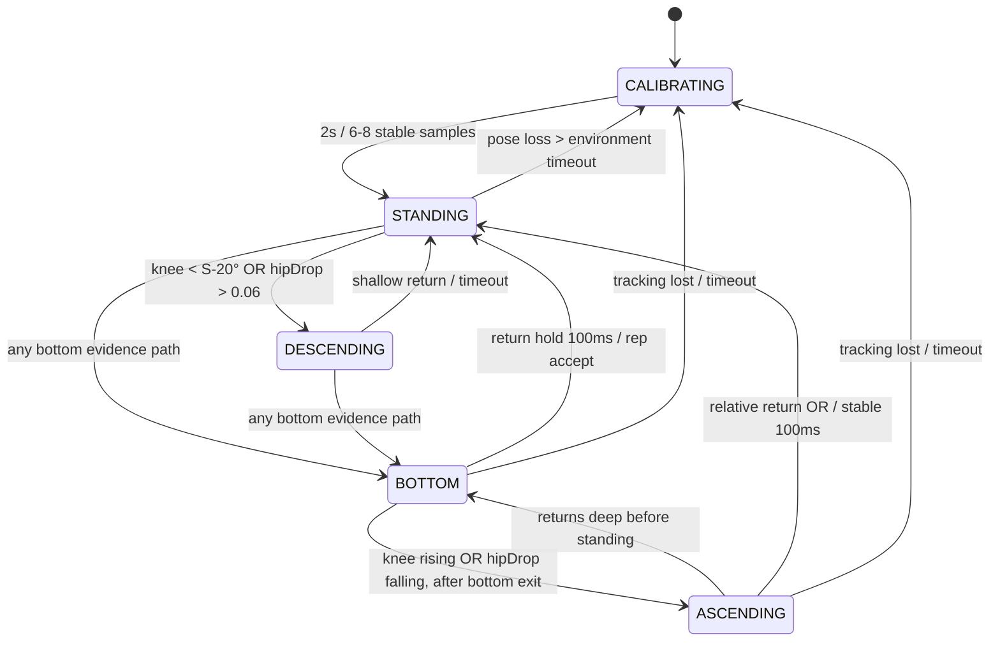

# スクワット判定設計

## 1. 結論

CameraX `Preview` + `ImageAnalysis`、MediaPipe Pose Landmarker Liteの`LIVE_STREAM`、One-Euro Filter、Kotlinの決定的な状態機械を使用する。SDK移行の判断とartifact metadataは[ADR 0005](adr/0005-mediapipe-pose-landmarker.md)をauthorityとする。

```text
STANDING
  → DESCENDING
  → BOTTOM
  → ASCENDING
  → STANDING
  = 1 accepted local rep candidate
```

MediaPipeは33ランドマークを返すが、スクワットという意味やrep数は返さない。膝角度、hip drop、速度、信頼度、安定時間、ヒステリシスからアプリが判定する。

OpenAI APIは使用しない。MediaPipe Lite modelをassetへ同梱して完全に端末内で推論し、runtime downloadや画像外部送信を行わない。

## 2. Processing pipeline

```mermaid
flowchart LR
    Camera["CameraX Preview + ImageAnalysis"]
    Frame["Throttled latest RGBA ImageProxy"]
    ML["MediaPipe Pose Landmarker Lite<br/>LIVE_STREAM"]
    Quality["Landmark Quality Gate"]
    Filter["One-Euro Filter"]
    Feature["Angle / velocity / hip-drop features"]
    FSM["Squat FSM"]
    Event["repCompleted event"]
    Flutter["Flutter UI / Contribution use case"]
    Firestore["Firestore transaction"]

    Camera --> Frame --> ML --> Quality --> Filter --> Feature --> FSM --> Event --> Flutter --> Firestore
    Frame -. close on drop or after accepted preprocessing .-> Camera
```



frame、bitmap、landmark全列はPlatform Channelへ流さない。KotlinからDartへ送るのは低頻度のquality/state/rep eventだけ。

## 3. CameraX構成

| Setting | MVP |
|---|---|
| Camera | front camera preferred、rear fallback |
| Orientation | portrait |
| Image format | `RGBA_8888` |
| Analysis resolution | 320×240をrequest、256×192、320×180、近傍の低解像度4:3、640×480の順でfallback |
| Backpressure | `STRATEGY_KEEP_ONLY_LATEST` |
| Queue | 実質1、古いframeをdrop |
| Lifecycle | Squat画面のnative lifecycle ownerへbind |
| Preview | portrait 3:4 PlatformView / native FrameLayout（PreviewView + guide） |
| Analyzer thread | single dedicated executor |

Previewはactive cameraが報告したrangeから`[30,30]`、lower bound 15以上、`[15,30]`相当の順に選び、該当rangeがなければCameraX defaultへ委ねる。未対応rangeは強制しない。デモ環境で確認したPreview streamは1280×960で、Previewへ解像度overrideは追加しない。Analyzer入口はtimestamp、busy、FPSの順でBitmap変換前に判定し、物理GPU 10 FPS / 物理CPU 8 FPS / Emulator CPU 4 FPSへthrottleする。`STRATEGY_KEEP_ONLY_LATEST`を維持し、MediaPipe callbackまではsingle in-flightとして次frameをbusy dropする。invalid / busy / throttle / success / failureのすべてのpathで`ImageProxy.close()`する。`detectAsync`がinputを同期packet化して戻った後にinput `MPImage` / Bitmapをcloseし、callbackまで保持するのは画像を含まないtimestamp・transform・latency metadataだけである。

`RGBA_8888`はplaneの`rowStride` / `pixelStride=4` / buffer長を検証し、CameraXのstride-aware `ImageProxy.toBitmap()`で変換する。`width * height * 4`の密なbufferを仮定したcopy、JPEG encode/decode、Preview surfaceからのcaptureは行わない。`rotationDegrees`はMediaPipe投入前にBitmapへ適用し、overlayはImageAnalysisの`OutputTransform`からPreviewView座標へ変換する。

Native `FrameLayout`の同一boundsへ`PreviewView`と`SquatGuideOverlayView`を重ねる。`COMPATIBLE` / `FIT_CENTER`とCameraX transform APIで座標を合わせ、FlutterはAndroidViewを診断更新ごとに再生成しない。胸の下から足首までが十分なpixel数を占める撮影ガイドを表示し、カメラへ斜め30〜45度または横向きを案内する。高解像度化よりlatest frameの低遅延を優先する。

## 4. MediaPipe構成

- `com.google.mediapipe:tasks-vision:1.0.0`
- `pose_landmarker_lite.task`をuncompressed assetとして同梱
- `RunningMode.LIVE_STREAM`
- `numPoses=1`
- `outputSegmentationMasks=false`
- 物理端末はGPU delegate優先、初期化失敗時はCPUへ1回だけfallback
- Android Emulator（generic / sdk / ranchu / goldfish等）はGLES互換性差を避けCPU固定
- GPUへ5件以上submit後、2秒以上callbackが0件ならruntime failureとし、LandmarkerをcloseしてCPUへ1回だけ再初期化
- CPUでも同条件でcallbackがない場合はtyped failure。fallback loopは行わない
- normalized x/y、`visibility`、`presence`をadapterで必要な6 landmarksへ縮約
- world landmarkはMVPの必須判定へ使わない

LandmarkerはCamera sessionごとに1 instanceだけ生成する。初期化と`detectAsync`は同じ専用single threadで行い、frameごとにCoroutineやLandmarkerを作らない。

## 5. Landmark

Pose SDK adapterはSDK固有型を次のmodel-independent表現へ縮約する。

```text
LowerBodyPose
  left:  hip / knee / ankle
  right: hip / knee / ankle
  confidence / timestamp / frame size
```

片側featureに必要なのはhip / knee / ankleだけで、顔・肩・腕は必須にしない。左右それぞれについてqualityを計算する。

```text
landmarkConfidence = min(visibility, presence)
sideConfidence = min(hip, knee, ankle landmarkConfidence)
```

使用side:

1. 左右両方がthreshold以上ならconfidenceが高い側
2. 片側だけならその側
3. 両側とも不足ならtracking invalid

左右の一方だけに急に切り替わらないよう、current sideへ500msのstickinessとconfidence差0.10のswitch marginを持たせる。

## 6. Feature

### 6.1 2D joint angle

3点 `A - B - C` のB角度:

```text
u = A - B
v = C - B
angle = acos(clamp(dot(u,v) / (|u||v|), -1, 1)) × 180 / π
```

- knee angle: `hip - knee - ankle`

直立に近いほど180°、屈曲するほど小さくなる。zero-length vectorはinvalid。

### 6.2 Normalized hip drop

calibration時のstanding hip yとleg lengthを基準にする。画像yは下方向。

```text
legLength = distance(hip, knee) + distance(knee, ankle)
hipDropRatio = (currentHipY - standingHipY) / legLength
```

camera距離に依存するpixel値ではなくratioにする。ProductionのBOTTOMはknee angle、hip drop、下降から上昇への反転をattempt全体で蓄積した3経路のOR条件にする。膝角速度と腰の上下速度はdebug診断だけに残し、低い解析FPSやfilter遅延で正常動作を拒否するauthorityにはしない。

### 6.3 Angular velocity

```text
kneeVelocity = (kneeAngleNow - kneeAnglePrevious) / deltaSeconds
hipVelocity = ((hipYNow - hipYPrevious) / legLength) / deltaSeconds
```

- negative: descending
- positive: ascending

timestampは同一pipelineの`SystemClock.elapsedRealtimeNanos()`から単調増加msを作り、wall clockや未確認のCameraX timestamp timebaseと混在させない。極端なframe gapではvelocityを無効化する。

### 6.4 Range of motion

1 attempt中の最小膝角度、最大hip drop、`S-minimumKneeAngle`、下降/上昇の観測有無、BOTTOM evidence scoreを保持する。浅い上下動は有効なBOTTOM経路が成立せず、`bottomReached=false`のまま立位へ戻るためcountしない。

## 7. Smoothing

左右それぞれのhip / knee / ankle x/yへOne-Euro Filterを適用してからfeatureを計算する。初期値は`minCutoff=1.0`、`beta=0.02`、`derivativeCutoff=1.0`で、固定FPSを仮定せずtimestamp差を使う。左右は独立filterとし、side切替で別脚の履歴を混ぜない。逆順timestampはrejectし、400ms超gapではfilterの値・微分履歴だけをre-armしてFSM phaseとattempt extremaを維持する。session終了、またはEmulator 4,000ms / physical 2,000msを超えるpose lossでは全状態をresetする。

FSM側でmedian / EMAを重ねず、attempt内のextremaと方向反転を低FPSのauthorityにする。設定値は`SquatDetectorConfig mediapipe-lite-multi-evidence-v8`へ集約する。

## 8. Quality gate

初期値:

| Check | Threshold |
|---|---:|
| essential landmark likelihood | `>= 0.65` |
| valid side | 左右いずれかのhip/knee/ankleすべてvalid |
| leg size | `(hip-knee + knee-ankle) / frame height >= 0.22` |
| side stickiness | `500ms`、switch confidence margin `0.10` |
| velocity continuity | gap `<=400ms`。超過時はvelocityのみ無効 |
| pose loss reset | valid poseなし Emulator `>4,000ms` / physical `>2,000ms` |
| calibration | 2秒観測、6〜8 sample、3秒timeout |

quality warning:

- `moveFartherBack`
- `moveCloser`
- `showLowerBody`
- `lowLightOrConfidence`
- `holdStillToCalibrate`
- `cameraUnavailable`

`numPoses=1`であるため、複数人が写ると対象が切り替わり得る。撮影範囲には1人だけ入り、胸の下から足首までを映すことを必須ガイドにする。

単一の長いcallback間隔ではphaseを失わない。400ms超gapではvelocityとOne-Euroの微分履歴をresetし、次のvalid sampleから角度・位置中心で再開する。usable poseがEmulatorで4,000ms、physicalで2,000msを超えて失われた場合だけ進行中repを破棄して`CALIBRATING`へ戻す。

## 9. Calibration

開始時に2秒程度の観測期間を取り、3秒以内に得た6〜8件の安定立位sampleからbaselineを作る。sampleは連続frameでなくてよく、一時的なcallback gapだけで全破棄しない。

calibration条件:

- knee angle >= 155°
- hip yの分散が小さい
- knee angleの変動が8°以内
- quality gate pass
- 左右side selectionが安定

保存するsession-local baseline:

- standing knee angle median
- standing hip y
- leg length
- baseline jitter（median absolute deviation）
- selected side preference

画像やraw landmarksは保存しない。calibrationはSquat sessionを閉じたら破棄する。

standing knee angleのmedianを`S`として、session-local thresholdを次のように導出する。

```text
standingEnterAngle = clamp(S - 25°, 135°, 165°)
standingRelaxedAngle = clamp(S - 32°, 130°, 158°)
descendingStartAngle = clamp(S - 20°, 135°, 160°)
bottomAngle = clamp(S - 24°, 135°, 150°)
returnStandingAngle = clamp(S - 28°, 130°, 155°)
returnStandingRelaxedAngle = clamp(S - 35°, 125°, 150°)
```

例えば`S=168°`では、strong standing / relaxed standing / descent / bottom / strong return / relaxed returnが`143° / 136° / 148° / 144° / 140° / 133°`となる。固定120°はProductionのBOTTOM authorityに使用しない。

## 10. 状態機械



### 10.1 Initial thresholds

| Transition | Condition |
|---|---|
| standing | knee `>=S-25°`、またはknee `>=S-32°`かつhip drop `<=0.15` |
| standing exit | knee `<descendingStartAngle` **または** hip drop `>0.06` |
| bottom A | knee bend `>=24°`、またはknee `<=clamp(S-24°,135°,150°)` |
| bottom B | knee bend `>=16°`かつhip drop `>=0.04` |
| bottom C | hip drop `>=0.08`、下降→上昇反転、knee bend `>=8°` |
| bottom exit | bottom到達後、knee増加またはhip drop減少。400ms超gap後はbottom位置からの退出でも再開 |
| rep return | knee `>=S-28°`、またはknee `>=S-35°`かつhip drop `<=0.18`かつ上昇観測、stable 100ms。strong条件は低FPSで1 sample可 |
| full rep duration | 400〜12,000ms |
| refractory | count後500ms |

BOTTOM evidence scoreはknee strong/medium/minimumを`3/2/1`、hip strong/mediumを`3/2`、下降上昇反転を`2`とし、同じsignalを重複加点しない。score 3以上かつ実変化があることに加え、A/B/Cいずれかの経路成立を必須にする。強い1 sampleまたはattempt extremaで確定し、BOTTOM保持時間を必須にしない。低FPSでは`STANDING→BOTTOM`、`DESCENDING→BOTTOM`、`BOTTOM→STANDING/REP_ACCEPT`を許可し、DESCENDING / ASCENDINGを各1 frame以上観測することを必須にしない。

これらは初期値であり、合成テスト、複数体格・撮影角度の実機testからversioned configとして調整する。ユーザー別に無制限な自動学習はMVPで行わない。

## 11. 1 repの確定条件

BOTTOM到達後に立位へ戻る時点で、次をすべて満たせばlocal repを1増やす。

- このcycleがSTANDINGから開始
- A/B/Cのいずれかを満たし、`bottomReached=true`
- relative returnのOR条件を100ms確認（strong 1 sampleを許容）
- total duration 400〜12,000ms
- usable pose lossがEmulator 4,000ms / physical 2,000msを超えていない
- 前回countから500ms以上
- 同じcycleで未加算

満たさなければstateはSTANDINGへ戻るがcountしない。quality reasonをUIへ送る。

## 12. 誤検出対策

| 誤検出 | 対策 |
|---|---|
| 各frameをcount | 状態cycle完了時だけcount |
| 膝の小さなbounce | `bottomReached`、refractory、sequence単位の1回加算 |
| hipだけ動く前屈 | 経路Cでもknee bend 10°以上と下降上昇反転を必須化 |
| 立位付近の揺れ | stable 250ms、refractory |
| 急なlandmark teleport | median、velocity sanity、invalid rep |
| 一瞬の遮蔽 / callback stall | phase維持、400ms超でvelocity reset |
| 長い遮蔽 | rep破棄、recalibrate |
| しゃがんだ状態から開始 | stable standing calibration必須 |
| 椅子へ座る | knee angle / hip drop / tempo / ROMで低減。完全防止はMVP外 |
| カメラに近づく | normalized hip drop、body size gate |
| 別人へtracking switch | 1人ガイド、body scale/center discontinuityでrep破棄 |
| 左右side switch | confidence hysteresis / stickiness |
| 低FPS | monotonic time条件、velocityとpose lossの別timeout、latest frame |

## 13. Detector contract

Dart Domain port:

```dart
abstract interface class SquatDetector {
  Stream<SquatDetectorEvent> get events;
  Future<void> start(SquatDetectorSession session);
  Future<void> stop();
}
```

Event概念:

```text
CalibrationChanged
PoseQualityChanged
SquatStateChanged
RepCompleted
DetectorFailed
```

`RepCompleted`:

```text
eventId
squatSessionId
sequence
detectorType
detectorVersion
frameObservedElapsedMs
uiEmittedElapsedMs
```

画像、package、landmark列を含めない。

## 14. Debt Contribution連携

1. Squat session開始時にDebt IDと現在remainingを固定表示する。
2. native repごとにDart outboxへdeterministic eventを追加する。
3. 同一ユーザーのeventをsequence順にFirestore transactionへ送る。
4. transaction ackが1ならconfirmed repを増やす。
5. 既存event、Debt完済、期限切れならack 0としてpendingを解消する。
6. Debt snapshotがcompleted / expiredならdetectorをstopする。

offline:

- detectionは現在cacheのremainingまで継続可能。
- `confirmed + pending >= cached remaining` でpauseし、同期を促す。
- 他memberが先に完済していれば再接続時に余剰eventはaccepted 0。
- pendingを完済表示に含めない。

## 15. Debug / Emulator input

3段階のsourceをDIする。

| Source | Build | 用途 |
|---|---|---|
| `CameraMediaPipePoseSource` | debug / release | 本番CameraX + MediaPipe Lite |
| `SyntheticLandmarkPoseSource` | debug / testのみ | production FSMへ決定的landmark列 |
| `FakeSquatDetector` | debug / testのみ | end-to-endデモでbutton / timer rep |
| `pose_fixture_generated.png` | debug assetのみ | MediaPipe CPU callback / pose / hip-knee-ankle smoke |

安全策:

- `BuildConfig.DEBUG` とdebug source setでcompile分離
- release variantからclass / route / channel commandを除外
- Contribution `detectorType=fake_debug`
- production Rulesはfake_debug拒否
- fakeを有効にすると画面へ常時DEBUG banner
- production state machine codeをFakeのために分岐させない
- debug Squat Labのthumbnailは初期状態OFF。明示ON時だけ、実際にImageAnalysisからMediaPipeへ渡す回転済みBitmapを1 FPS以下・幅120pxへ縮小してNative overlay内だけに表示する
- thumbnail、fixture、landmarkは保存・network送信しない

Squat Lab diagnosticsは最大4 FPSで、ImageAnalysis requested / actual resolution、analyzer / submit / callback / valid-pose FPS、preprocess / inference / native pipeline p50・p95、pre-throttle / busy drop、変換Bitmap数 / rotation Bitmap数、Calibration値、raw / filtered knee、attempt min knee / max hip drop / max knee bend、下降・上昇、BOTTOM score / path、phase、transition / reject / reset reason、frame dt、pose age、attempt durationを表示する。値の更新は`ValueNotifier`配下に限定し、AndroidViewやCamera sessionを再生成しない。debug Logcatは`SquatTrace`、`SquatRep`、`PosePerf`を使い、通常trace / performanceは最大5 FPS、rep / reject / resetはevent時に記録する。releaseでは出力しない。

既知画像fixtureは2026-07-31にこのrepositoryの診断専用として生成した架空人物画像で、実ユーザーや第三者撮影物を含まない。debug source setだけに置き、release APKへ同梱しない。

- file: `android/app/src/debug/assets/pose_fixture_generated.png`
- SHA-256: `0833e7f53cbaf9eb95868df78136d62f942dc72c447e67193d66514be25165b8`
- size: 345,772 bytes
- use: CPU `LIVE_STREAM`へ1枚だけ投入し、callback、pose数、hip / knee / ankleの利用可否だけを返す
- license: project-generated test fixture（repository内のテスト・診断用途）

Emulator cameraの選択:

1. host webcam passthrough
2. Extended ControlsのVirtual Scene
3. synthetic landmark source
4. high-level FakeSquatDetector

pre-recorded人動画をappへ組み込む案は、再生→CameraX inputの経路が複雑でcodec差もあるためMVPの第一選択にしない。必要ならandroidTest assetだけでoffline testし、実ユーザー動画を使用しない。

## 16. Latency budget

目標: CameraX frame timestampからUI resultまでp95 500ms。

| Stage | p95 budget |
|---|---:|
| Camera delivery / throttle | 50ms |
| MediaPipe inference | 100ms |
| feature + FSM | 30ms |
| rep EventChannel + Riverpod UI | 120ms |
| margin | 100ms |
| **Total** | **400ms** |

Firestore確定は別metric。UIはlocal detected repを500ms以内に表示し、confirmed stateを別表示する。

計測:

- analyzer受信、前処理開始、MediaPipe投入 / callbackの`elapsedRealtimeNanos`
- FSM emit elapsed
- Dart receiveはNativeとは別clock domainとして記録
- first rendered frame callback

PIIやlandmarkをmetricへ含めない。Emulatorはhardware acceleration / host負荷に左右されるため、Fake pathだけで性能達成と主張せず、実機またはwebcam pathでも測定する。

## 17. Performance controls

- `STRATEGY_KEEP_ONLY_LATEST`
- application側にunbounded queueを持たず、MediaPipe `LIVE_STREAM`のflow limitingで処理中は古いinputをdrop
- Lite bundle + `LIVE_STREAM`
- ImageAnalysisだけ320×240優先。Preview解像度は独立
- overlay renderingをanalysis FPSから間引く
- JPEG encode/decodeは行わず、CameraX `ImageProxy.toBitmap()`でRGBAのrow paddingを考慮してBitmapへ変換する
- landmarkをDartへ送らない
- analyzer executorをUI threadから分離
- detectorをSquat画面外でclose
- thermal / slow frameをdiagnostic warning

## 18. Test strategy

### Pure Kotlin unit

synthetic feature sequence:

- valid slow / normal / fast squat
- boundary angle jitter
- shallow squat
- double bounce at bottom
- tracking loss 100ms / 300ms
- start at bottom
- too-fast 500ms / too-slow 7s
- left/right confidence switch
- timestamp gap / out-of-order
- 100 cyclesでexact count

### Analyzer integration

- fake Pose object / landmark adapter
- rotation、front mirror
- ImageProxy close on success/failure
- latest-frame backpressure
- detector error recovery

### Instrumentation

- Camera permission
- PlatformView lifecycle
- synthetic sourceがreleaseで選択不可
- EventChannel reconnect
- p95 instrumentation

### Field evaluation

明示consentを得たローカルtestで、画像保存せずcount結果だけを手動ground truthと比較する。

- 体格、服装、照明
- front / slight side angle
- camera distance
- slow / normal tempo
- partial occlusion

評価:

- rep precision / recall
- double-count rate
- false-positive reps per minute
- p50/p95 latency
- calibration success rate

## 19. Known limitations

- 2D angleはcamera angleで変化する。
- MediaPipeのGPU delegate可否と実測latencyは端末・driverに依存する。
- 1人だけを検出する。
- 椅子への着座等、同じ関節軌跡を完全には区別できない。
- client内判定は改変appからspoof可能。
- Emulator camera性能は実機を代表しない。

Productionで精度不足が確認された場合、まずon-deviceの個人calibration、feature改善、TFLite分類器を検討する。画像外部送信やOpenAI APIは要件変更とprivacy reviewなしに提案しない。

## 20. 公式資料

- [MediaPipe Pose Landmarker overview](https://developers.google.com/edge/mediapipe/solutions/vision/pose_landmarker/index)
- [MediaPipe Pose Landmarker Android](https://developers.google.com/edge/mediapipe/solutions/vision/pose_landmarker/android)
- [BlazePose GHUM 3D model card](https://storage.googleapis.com/mediapipe-assets/Model%20Card%20BlazePose%20GHUM%203D.pdf)
- [CameraX image analysis](https://developer.android.com/media/camera/camerax/analyze)
- [ImageAnalysis analyzer lifecycle](https://developer.android.com/reference/androidx/camera/core/ImageAnalysis.Analyzer)

## 21. Phase 9実装結果

- CameraX `1.6.1`のfront優先 / rear fallback、独立した`Preview` + 320×240優先の`ImageAnalysis`、`STRATEGY_KEEP_ONLY_LATEST`を採用した。
- MediaPipe Tasks Vision `1.0.0`と公式Pose Landmarker Lite bundleを使用する。
- analyzerは専用single executor、事前FPS gate、pending 1件を使い、skip、result、error、stopの全経路でImageProxy / MPImageをreleaseする。
- `SquatDetectorConfig.VERSION = mediapipe-lite-multi-evidence-v8`に環境別解析FPS / pose-loss timeout、Calibration相対threshold、BOTTOM score、One-Euro parameterを集約した。adapter、filter、特徴量、calibration、FSMはCamera APIから分離したpure Kotlinである。
- `squat_control/v1`、`squat_events/v1`、`pose_preview/v1`を実装した。Dart adapterはtype別field allowlistを検証し、画像・landmarkに相当するextra fieldを拒否する。
- session IDは18 random bytesのhex、repはnativeのmonotonic sequenceを使用し、Firestore event IDはPhase 8の`${uid}_${squatSessionId}_${sequence}`へ変換する。
- route離脱、ユーザー終了、terminal Debtではnative sessionを停止する。background / foregroundはCameraXのActivity lifecycle bindingへ従う。
- debug source setだけに数値の`SyntheticLandmarkPoseSource`を置く。release Kotlin compile graphには含めず、Production UIにfake commandやsource selectorを追加しない。

実カメラ精度とp95は撮影環境に依存するため、Emulatorの合成系列だけで達成を主張しない。Event payloadの`analysisLatencyMs`とnative sessionの直近300 sample p95により、webcamまたは実機で計測する。

## 22. 最終デモ修正: lower-body input

最初のlower-body修正では旧全身quality gateを外したが、実CameraではML Kitのframe投入頻度、平滑化遅延、画面全体のdiagnostics rebuildが残り、実用的にstateが進まなかった。Production pose SDKをMediaPipe Liteへ移し、解析FPSとFlutter event頻度を明示的に分離した。

修正後のdata flow:

```text
CameraX RGBA ImageAnalysis
  -> MediaPipe Pose Landmarker Lite
  -> MediaPipePoseAdapter
  -> LowerBodyPose (hip / knee / ankleのみ)
  -> One-Euro Filter
  -> PoseFeatureExtractor
  -> SquatStateMachine
```

- ProductionはMediaPipe Pose Landmarker Liteのみを実行し、ML Kit Pose dependencyは含めない。
- 公式model cardの制約から、顔なしlower-body frameでのpose成立率はhost webcamまたは物理端末のmanual gateで測る。
- debug buildだけ、最大4 FPSでpose有無、選択side、calibrated standing knee、4つの相対threshold、raw/filtered knee angle、attempt最小膝角度、normalized / attempt最大hip drop、FSMの前後phase、transition/reject/reset reason、各confirmation時間、calibration sample数、input/submit/callback/valid-pose FPS、latency、accepted/rejected countを小さい専用Widgetへ送る。
- diagnosticsは`analyzerFrames`、`inferenceSubmitted`、`resultCallbacks`、pose有無別result数、error callback数、callback age、active delegate、safe error code、preprocess / inference latencyを持つ。submit後callbackが未到達の`awaitingResult`と、callback到達済みでpose 0件の`noPose`を分離する。
- Native overlayとFlutter guidanceは同じ`PosePipelineStatus`から生成し、callback未到達中に「landmarkを認識しました」と表示しない。
- debug diagnosticsに画像、frame、landmark座標は含めない。releaseではnative event生成とFlutter cardの双方を無効化する。
- synthetic testは顔・肩なし、片側のみ、欠損、confidence不足、浅い屈伸、jitter、bounce、pose loss、duplicate frame、1回および10回の正常cycleを検証する。

host webcamのmanual gateではpose detected rate、各lower-body landmark confidence、latency sample数 / p50 / p95 / maxを記録する。測定前はp95 500ms達成やlower-body実Camera精度を完了扱いにしない。

MediaPipe `1.0.0`でnon-square入力時に出ることがある`NORM_RECT without IMAGE_DIMENSIONS` warningを調査した。アプリはCameraXが320×240優先で選んだRGBA Bitmapを`MPImage`として渡し、回転後のwidth/heightでlandmarkを画像座標へ戻している。公開Tasks APIは`MPImage`と`ImageProcessingOptions`までで、内部graphの`NORM_RECT`へimage dimensionsを別途注入する口はない。warningは非表示化せず、overlayとFSMが同じ変換済みlandmarkを使うことをmanual gateで確認する。count停止の直接原因としてはwarningではなく、疎なsampleに対するBOTTOM signal同時条件と保持時間が残っていた。
